On our way up north to Dorrigo NSW, we stopped off in Bellingen and swam in one of the waterholes of the never never creek. The water was nice temperature and crystal clear.

There was also a fun little rope swing, even though it was pretty shallow in the waterhole it was still fun.

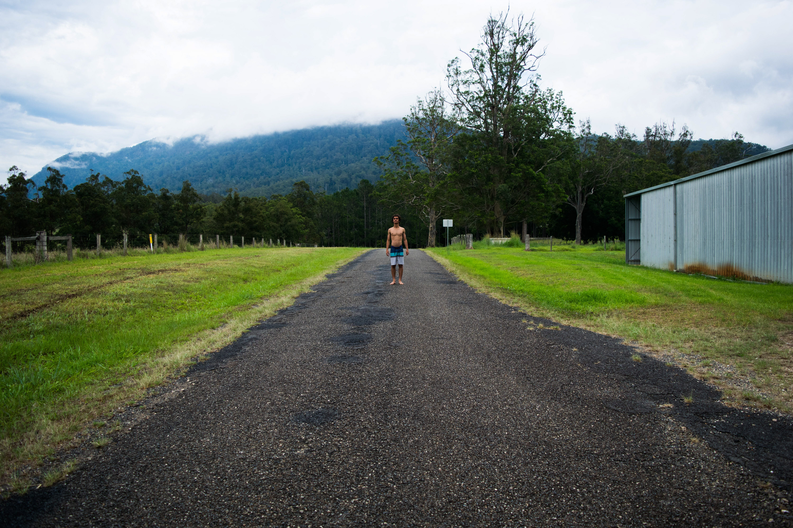

Me standing on the road before the waterhole. It was crazy how lush and green the area was. They definitely get a decent amount of rain.

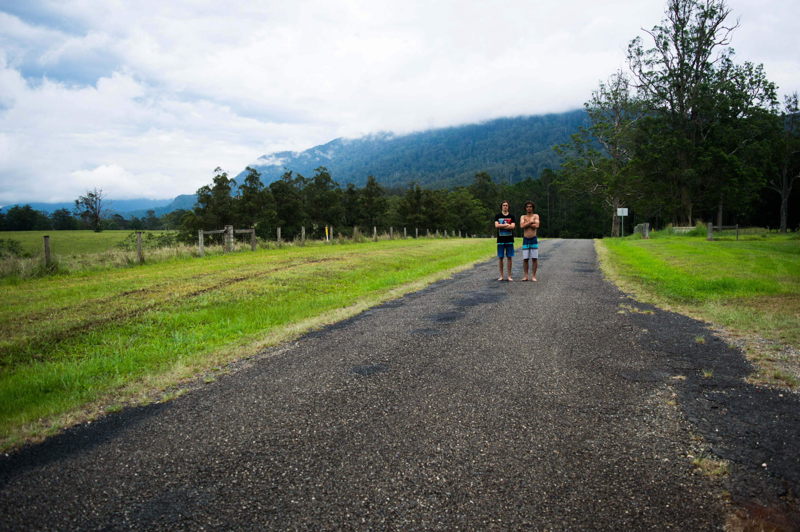

Aidan and I.

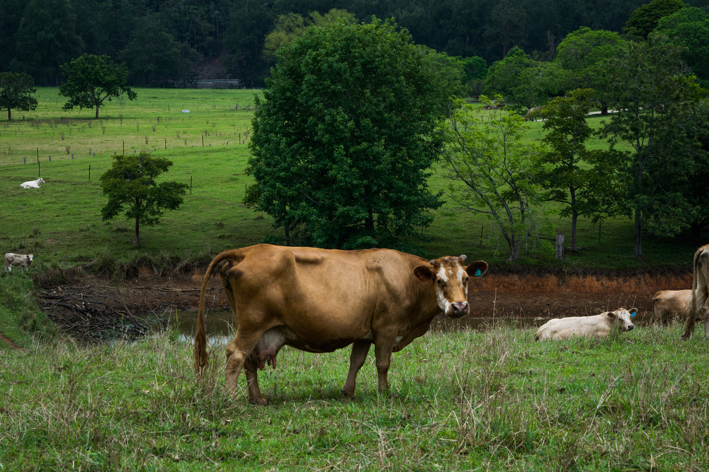

A cow on the side of the road looking ready to be milked.

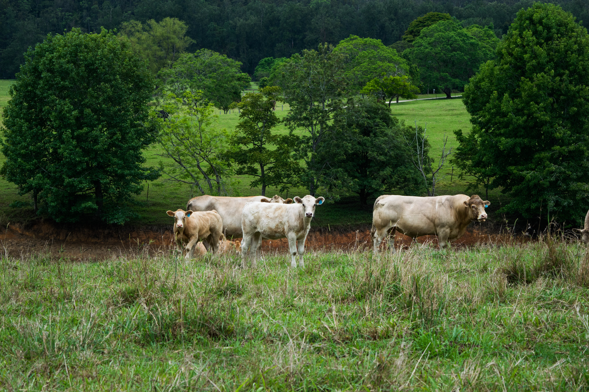

Some younger cows.

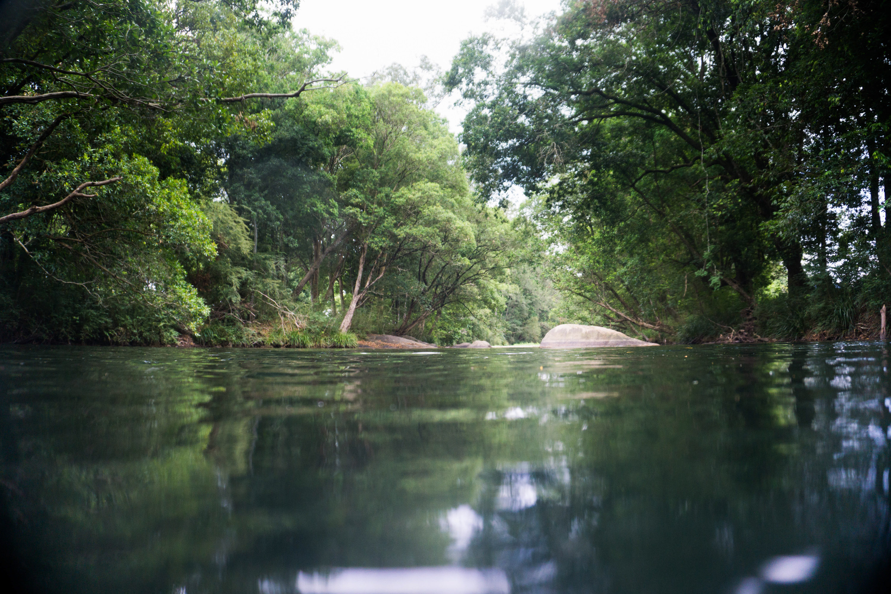

My first glimpse of the waterhole. Very lush.

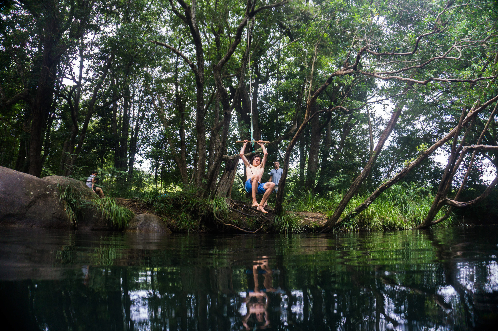

Aidan getting ready to get flung up.

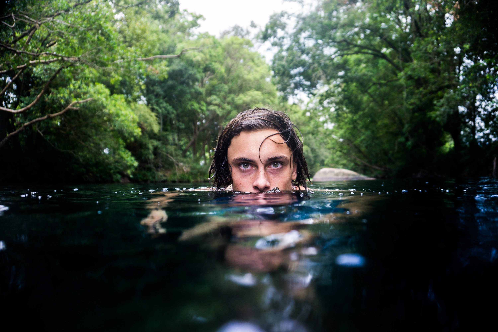

My favourite shot form the waterhole, mainly just because it's focused well haha.

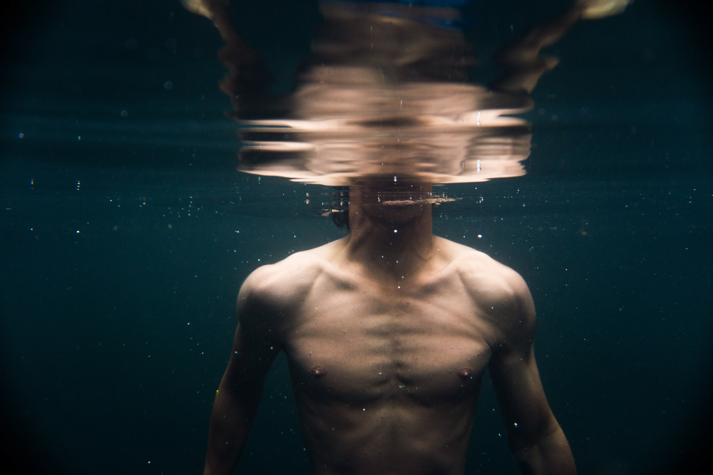

Underwater intricacies.

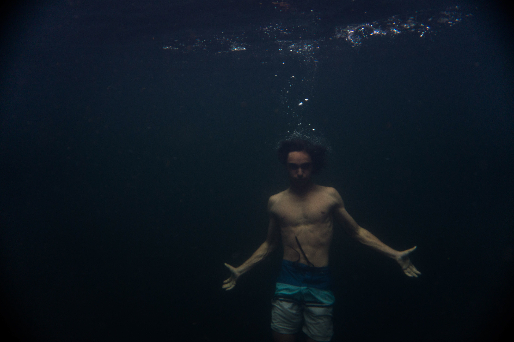

Definitely harder to float in this waterhole compared to the ocean. Was easy to just sink to the bottom.

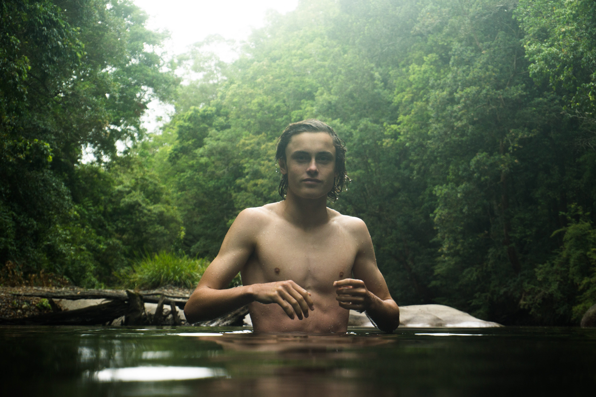

Weird glare on this image but still looks okay.

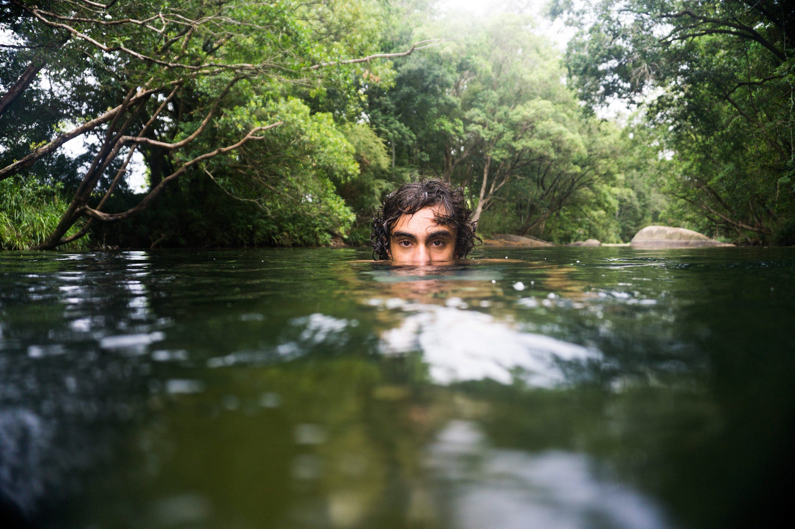

Another one of me, focused pretty well.