Trying to get to this surf spot on the east cost of Tasmania, we drove past this abandoned or just run down farm/storage place. There were some interesting american tractors as well as some classic cars.

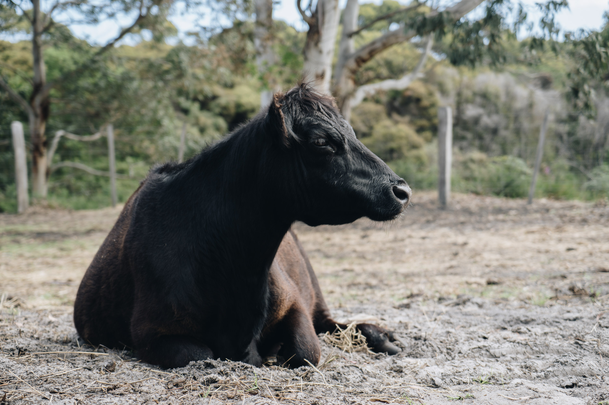

A cow lounging around in the sun on the drive towards the coast.

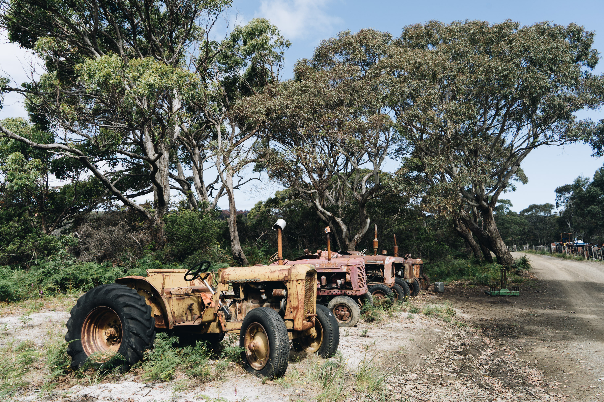

A line of retired tractors on the side of the driveway.

 I bet there would be some nice old diesels in those things that could still be good. Behind the trees in the background is the locked gate to the beach.

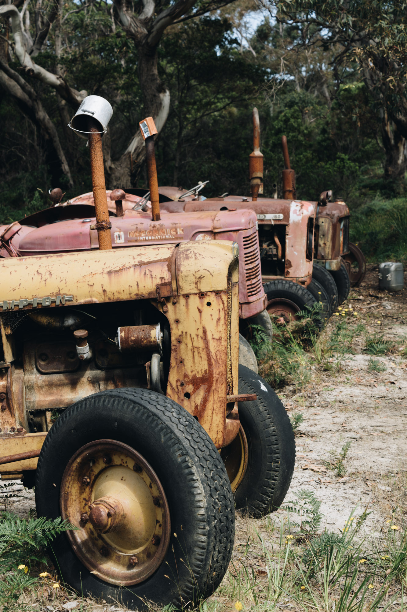

A closer view.

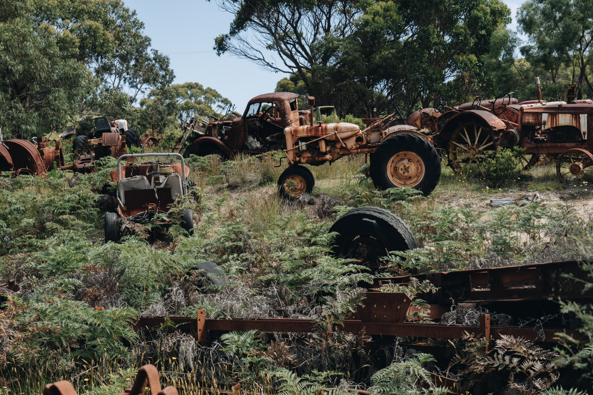

More tractors and odd assortments of cars in the property. 

Mostly all rusted out because how close they were to the beach (only 50m away from water).

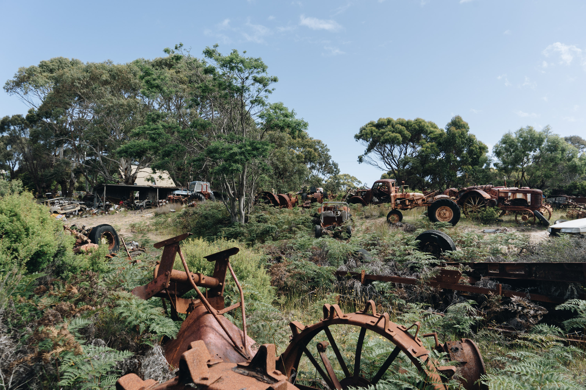

A more pulled back view. Can spot a Landcruiser 60 series in the left corner.

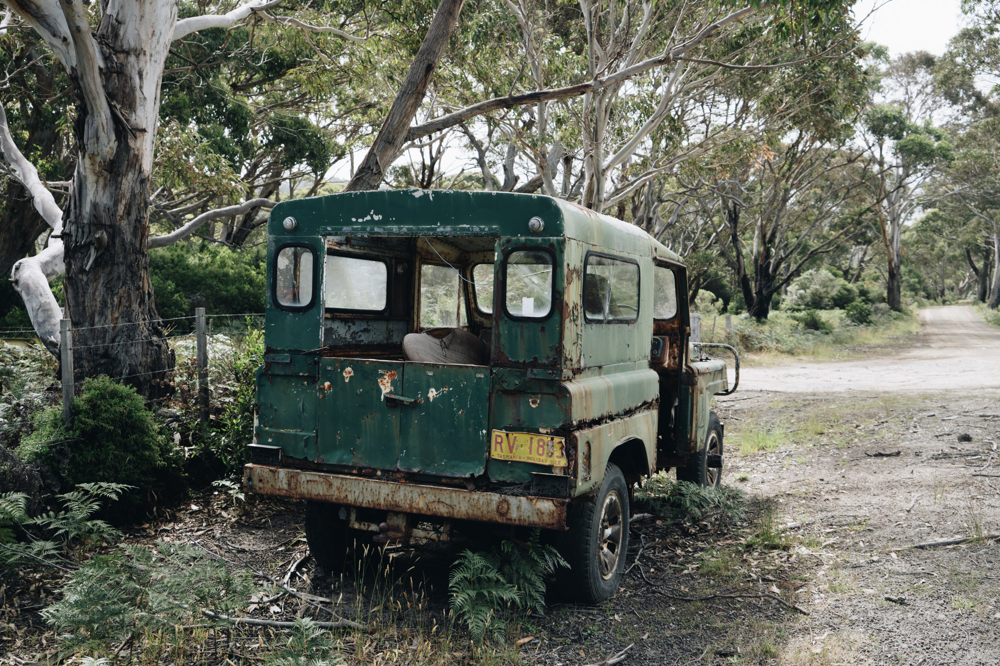

An LG60 patrol. One of the nicest cars ever made.

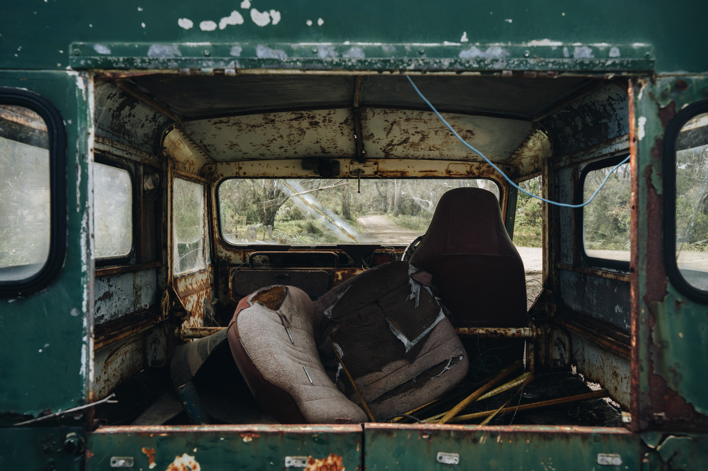

The interior was pretty fucked up; the rust had really eaten the car.

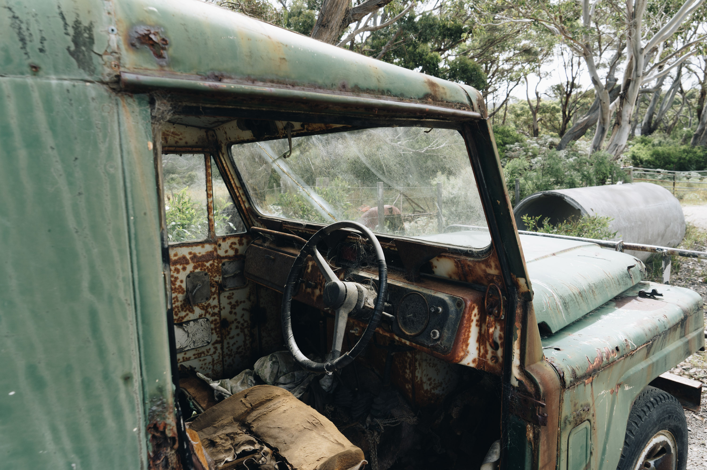

Steering wheel still intact. I wonder if it would start.

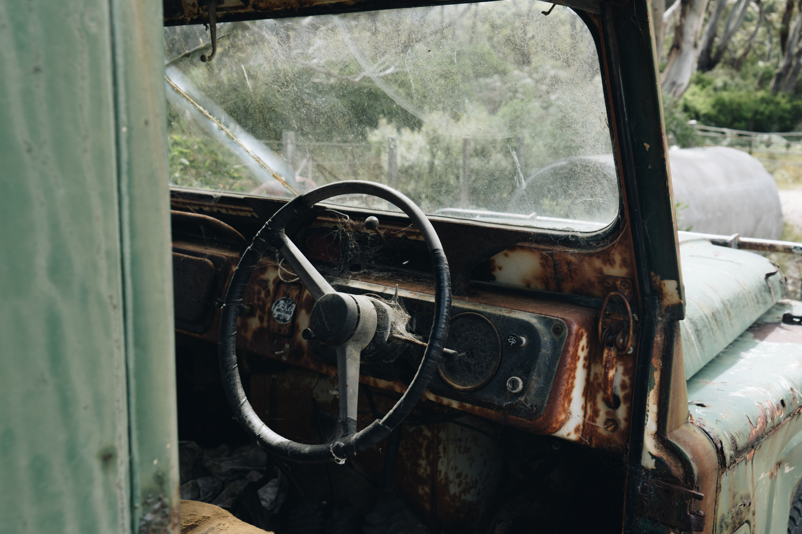

A closer view.

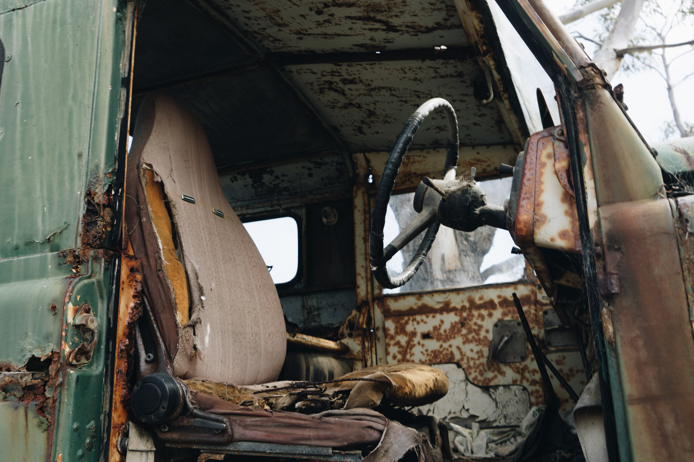

The seats were in very bad conditon.

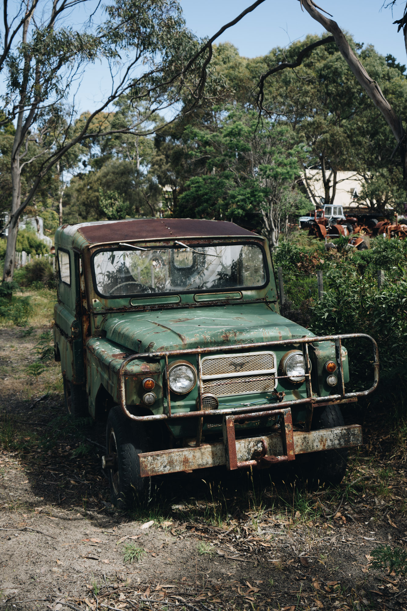

The front of the patrol.

