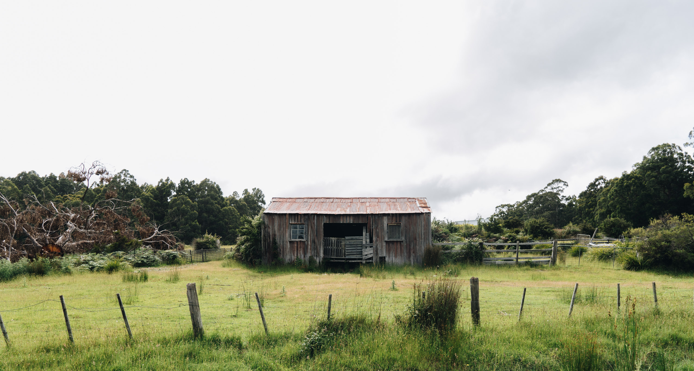
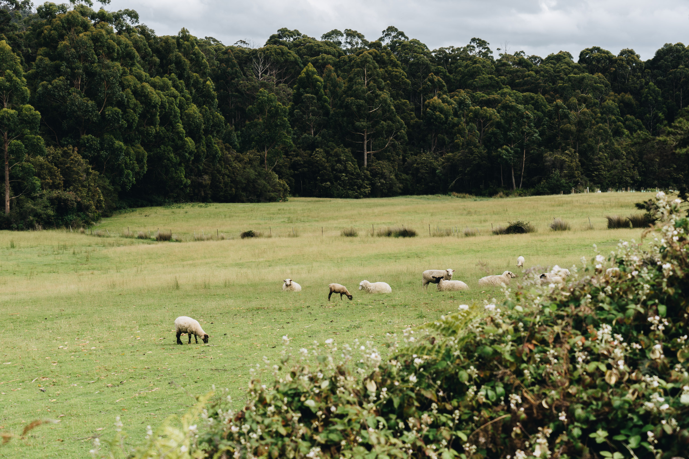
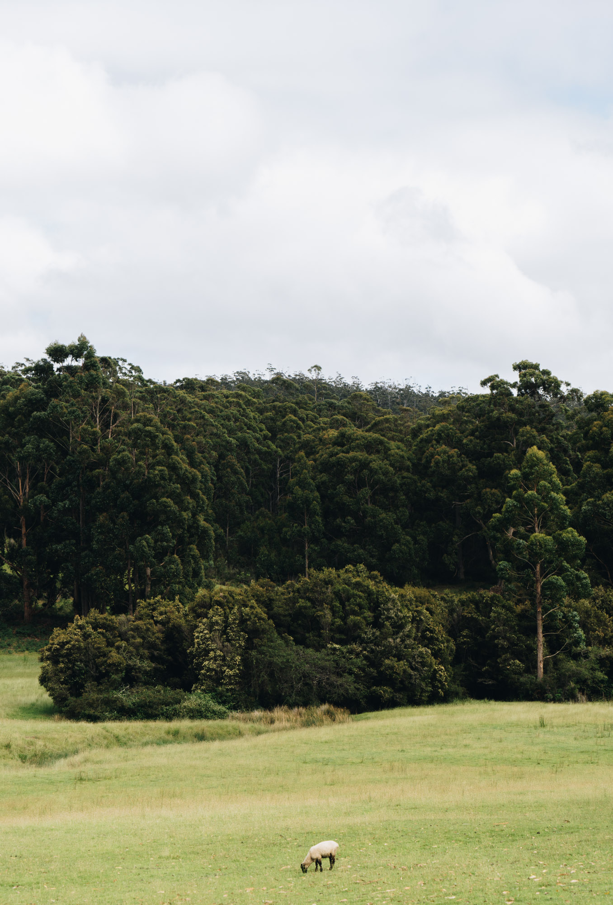
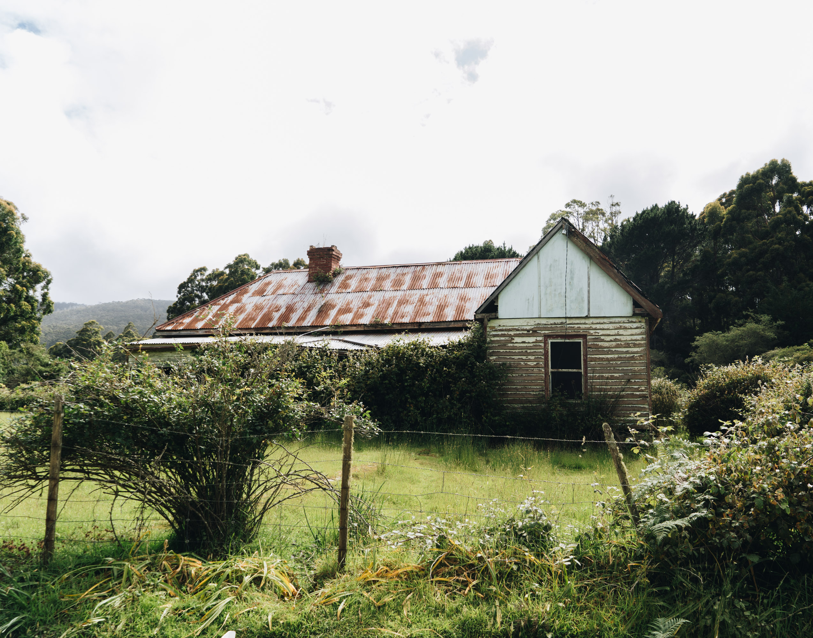
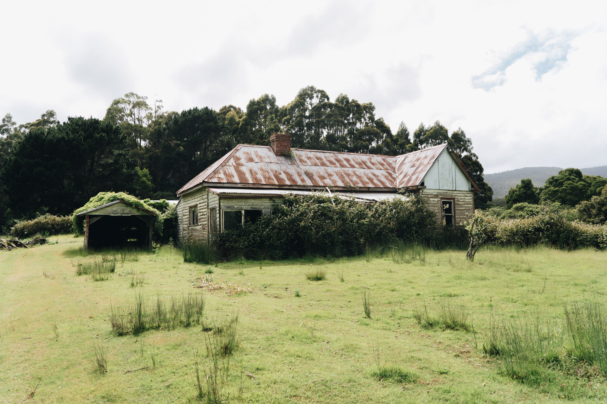
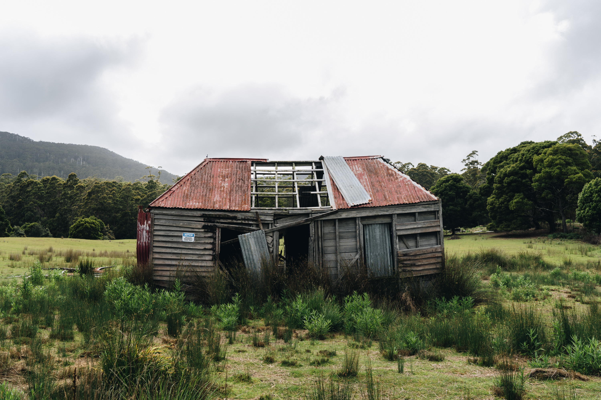
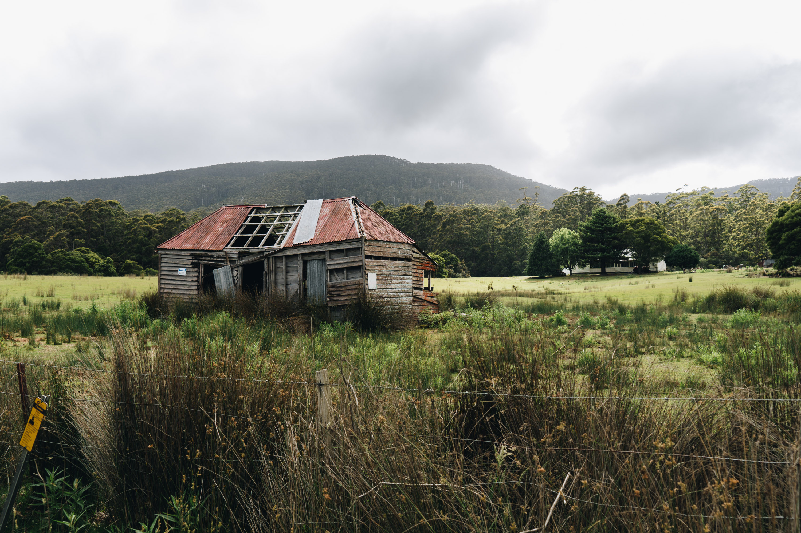

While driving to cloudy bay in Bruny island to go surfing. We stopped at a couple old wooden farmhouses that had been abandoned. They made for some pretty cool photographs with the green backdrop.

The first farmhouse I saw. Looks like it might have housed cattle.

Some cute sheep chilling on the side of the road.

A lonely sheep eating grass by itself.

A proper abandoned house. Looks like somebody might have lived in this one.

Another angle of the overgrown house.

A run down little shack. They left a little sign on it whch probably stops tourists from coming into the property over the fence.

The view from the road.
