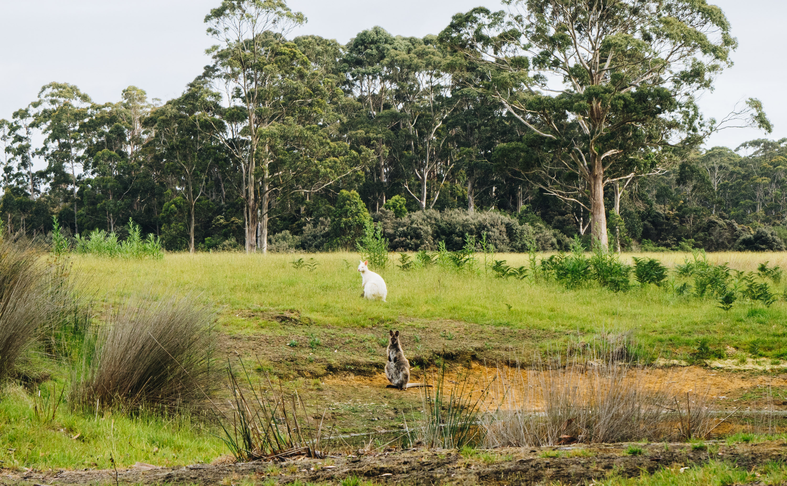
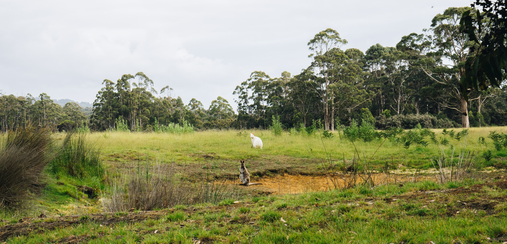
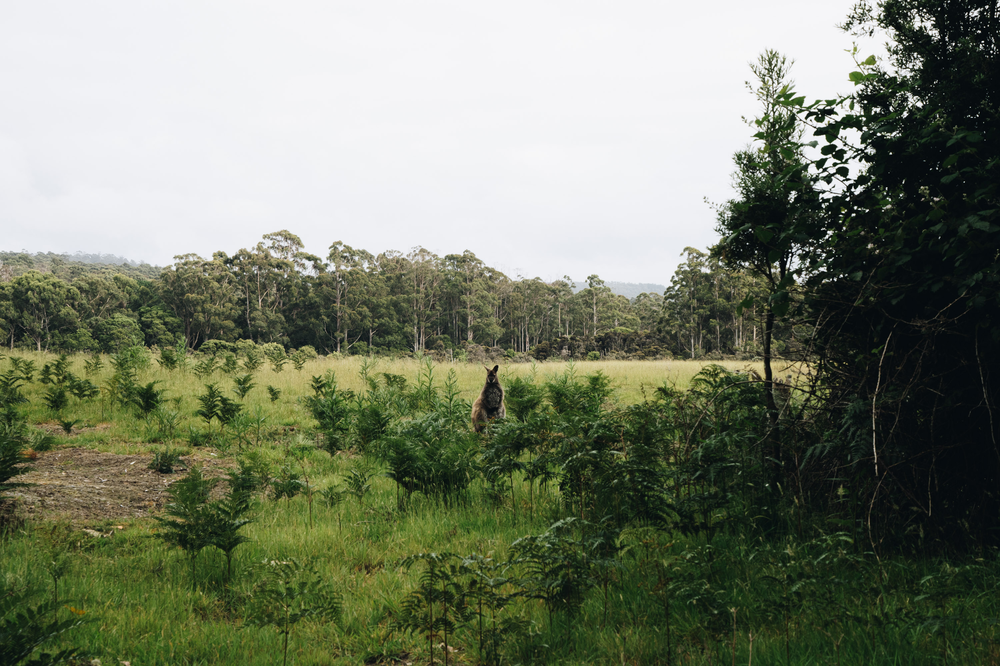
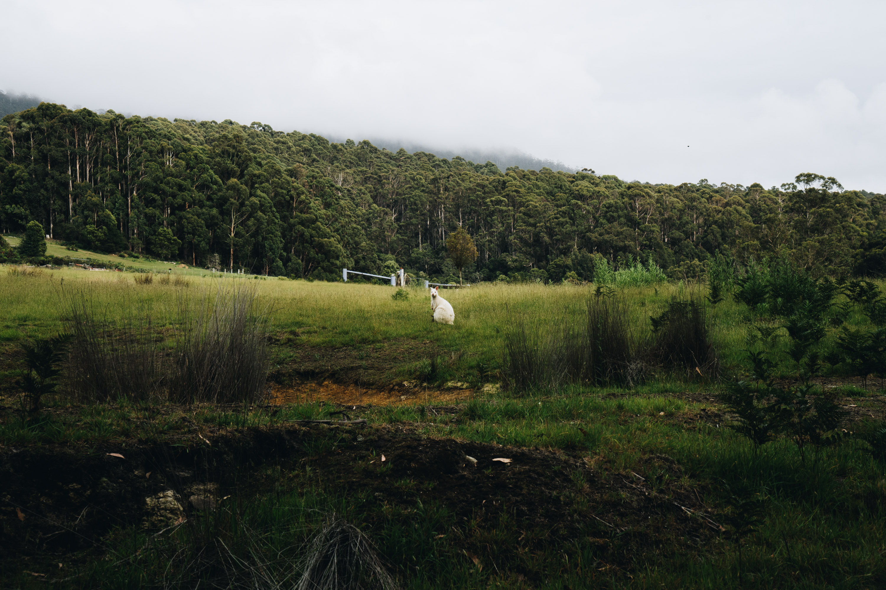

I had heard about the elusive albino wallabies on Bruny Island, so on our first afternoon there we went hunting so see if we could find any. 

After getting some pointers from the grocery store owner, we headed down near the picnic area and sure enough, bright as day there was a cute little albino wallaby with its brown friend.

About as cute as it gets. One of them is giving me an inquisitive stare.

A better angle. This time the white one is looking straight at me.

This one hopped over towards me, it's proportions were so funny. Definetely one of the chunkiest and well fed wallabies I've seen.

Lil fella chilling alone.