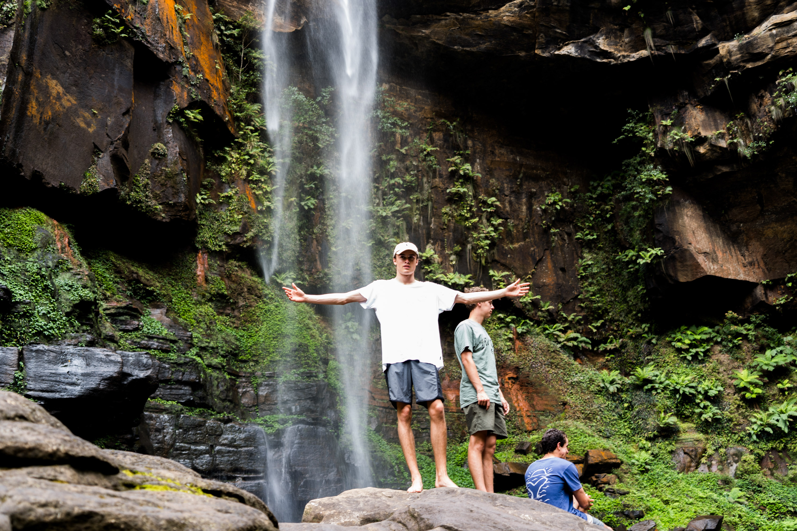
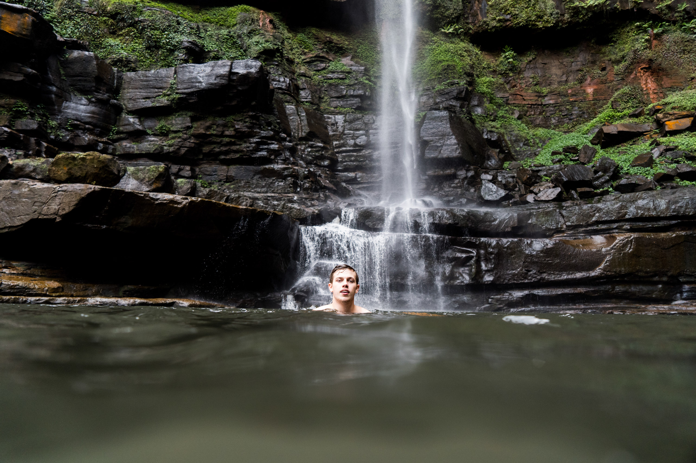
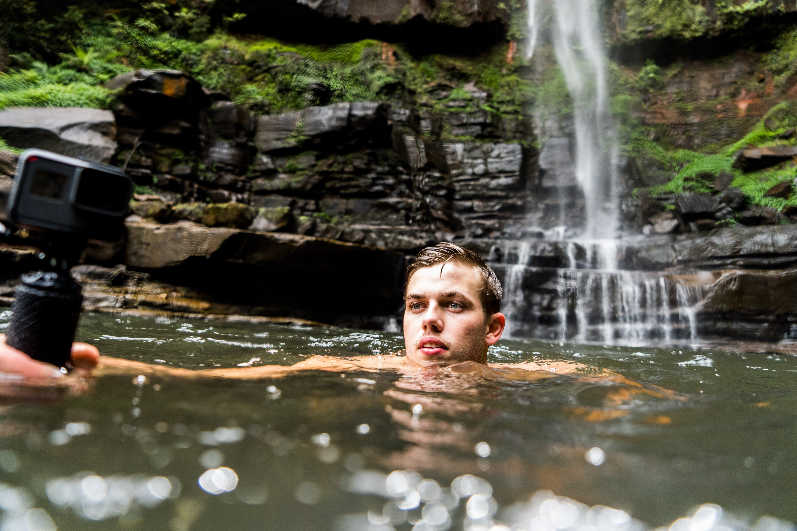

Our second last stop of the South Coast trip was Aidan's holiday house at Kangaroo Valley, so we decided to go to Belmore Falls. Belmore Falls is definitely synonymous to Kangaroo Valley and it's not hard to see why.

Freezing cold water, thick rainforest and views of the valley make this waterfall one of the best in NSW.

A water dragon lying on a tree tunk on the walk down, trying to get some sun through the dense scrub.

It's look says: Go away.

Liam in awe of what he's seeing.

The boys testing the water temperature and seeing how slippery the rocks really are. You've never felt real slippery unless you've been here.

Aidan with the jesus pose.

Everyone links arms for stability while getting an icy cold and sometimes painful natural shower.

Liam chilling on top of one of the rocks. I fell off the top of the rock behind him and it felt like I broke my shin.

Some candid heads checking out the flow.

All smiles.

Joe doing the jump rock.

The next frame.

Joe with his arms up.

Some nice detail of the cave.

This photo shows the water colour better. It's a weird shade of green, I would call it Sage.

Can still barely fit anything in the frame in portrait mode because of how big this place is!

Joe starting to think he wants to go in right about now.

Joe took a nice photo of me before he went in. Not sure what I'm doing with my face though.

Liam barely managing to float. It was quite funny.

An often unseen view of the valley across from the falls.

Ryan, a kid from wollongong who we met down at the falls.

He took a cool photo of me.

Josh standing on a big rock above the waterhole. His legs look unusually large in this one.

A close up of Ryan.
