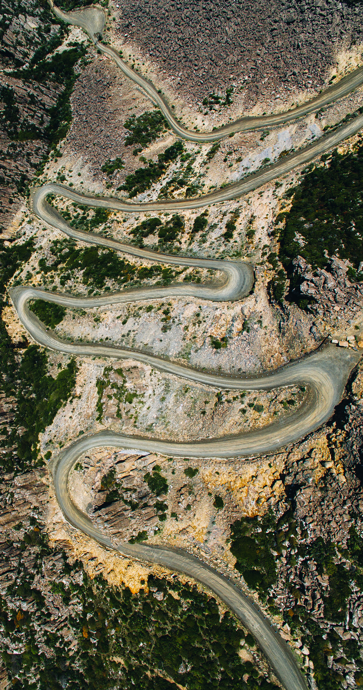

Here are some images from a day trip to Ben Lomond, where we walked to the cabins and the mountain summit and checked out Jacob's Ladder. The area kind of reminded me of a desert, but really rocky. Once you got onto the central plateau it was flat as a pancake.

A church in a small town called Mangana, close to our mountain cabin.

Some quirky looking houses for sure.

Jacob's Ladder.

Top down view of the road. It's interesting how you can't really see the elevation change in each loop of the road from the aerial angle.

Photos don't do it justice.

Would be a fun road to do some skids on if there wasnt a 100m drop below you.

The rocky cliffs of the Central Plateau.

The ladder from ground view.

SEVERE HAZARD AREA! Yeah thanks for letting us know when we're at the top!

Drone free national park my ass.

Some nice orange flowers.

The first of the alpine huts.

The second alpine hat, in pretty shabby condition, but you could still live in it.

Close up of the huts.

Walked up the hill against the wind to take this pic, almost slipped and broke my camera.

The central plateau, literally a rocky desert.

Probably no civilisation for 100km or more this way.

Looking back towards the ladder.

Inside the second alpine hut. A lot of weird things in there.

More orange bois.

A drone video from Jacob's Ladder.
`youtube: EK5GDG5G_ig`

A timelapse of some trail walking.
`youtube: CNy-YPPTjQo`

