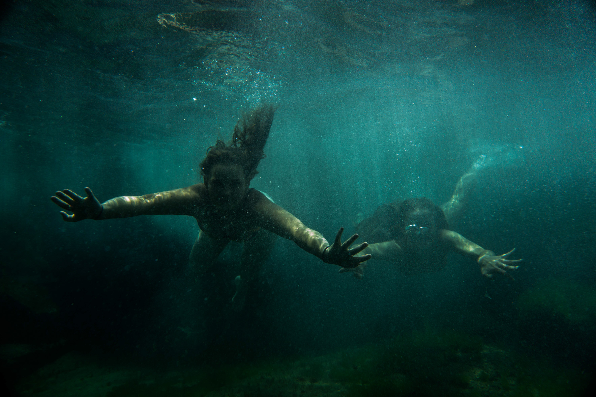

Blue fish point is a spot in North Head, Manly. I had seen photos of a cool little waterhole there, so Rob, Abbey, Emma and I decided we should try find it. The climb down the cliff on a chain was hard to find the first time, but it was fine.

A nice little cave on the walk towards the waterhole.

The water was insanely clear.

Very high cliff face.

Right before we were all about to jump in. It was so hot.

A portrait version showing the height of the cliff face.

Abbey jumped in and realised the water was not that warm. 

Emma with a funny stare at the camera and Abbey trying to get as high up on the rock as possible for some reason.

The clarity was just insane.

Underwater scenes. Once we started to stay in the water for a bit longer, it felt a bit warmer. It was still sketchy getting out though because there were urchine everywhere.

The next frame looked pretty cool, a bit more light.

Another one of me, focused pretty well.

Jump!

Brace for impact.

Rob's underwater shenanigans.

Peace.

The height of this cliff is just crazy in person.

I love this photo. It basically sums up this waterhole.