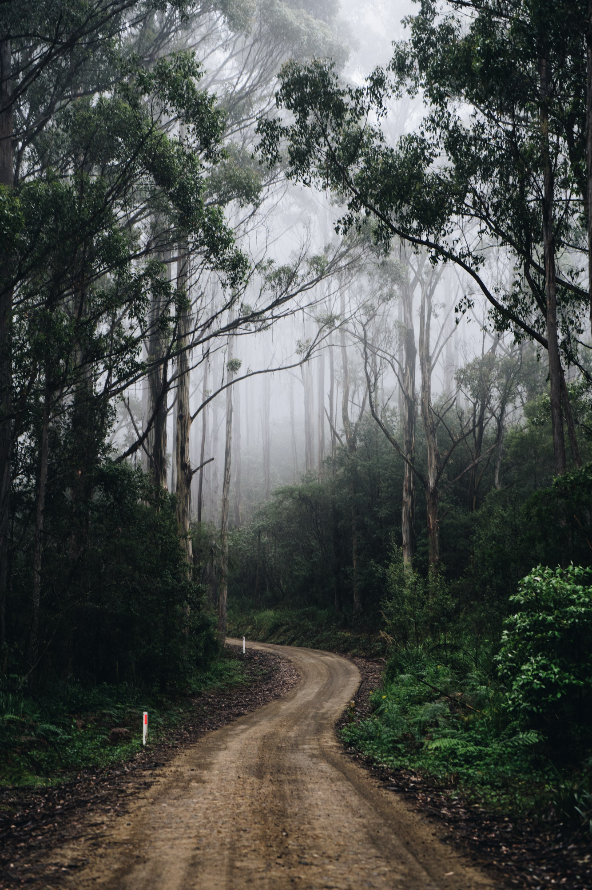
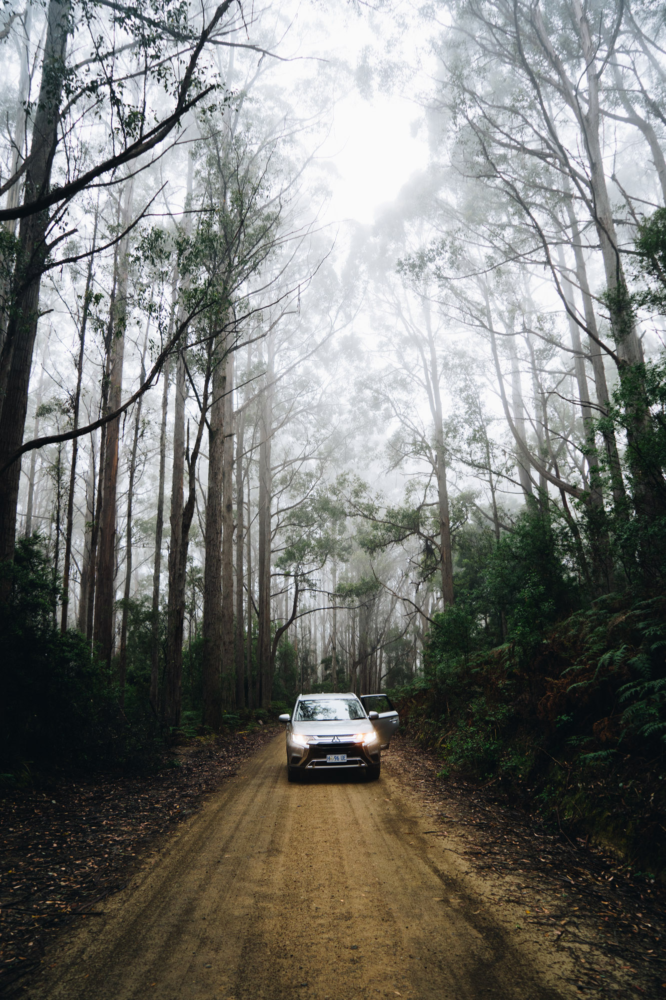
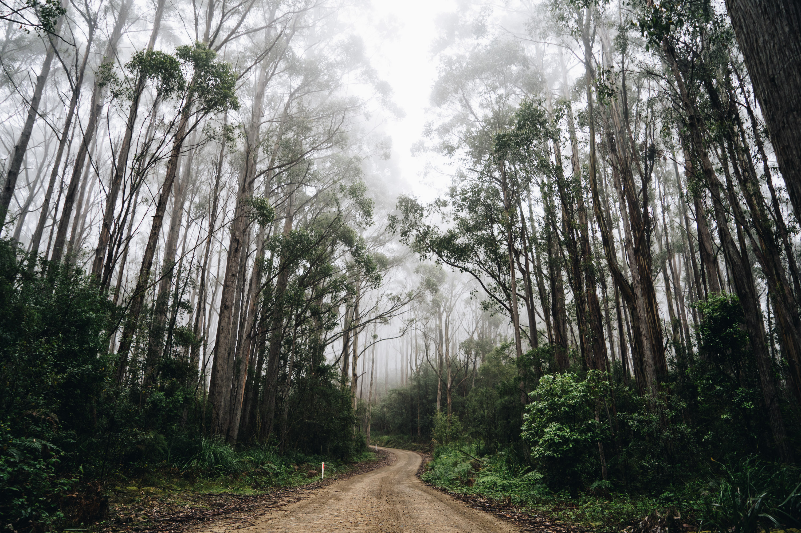
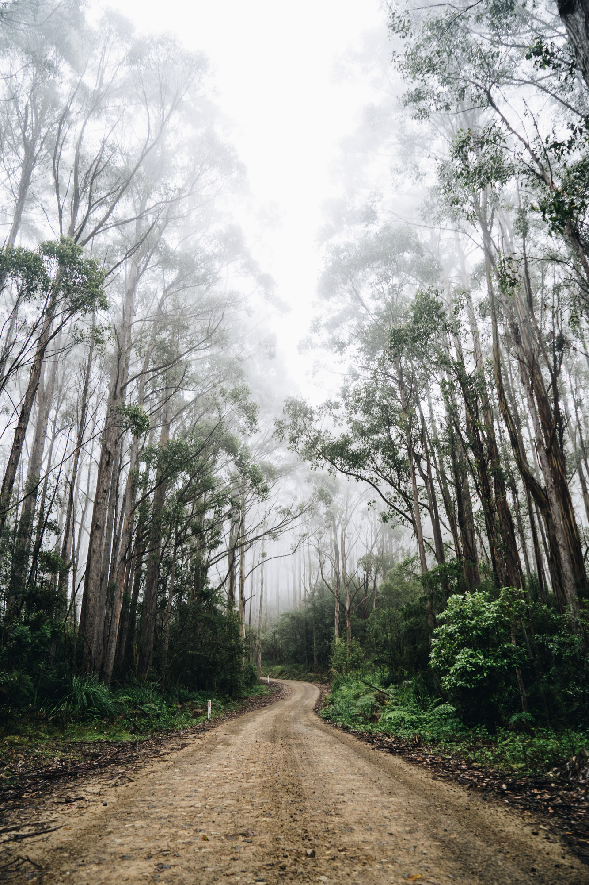
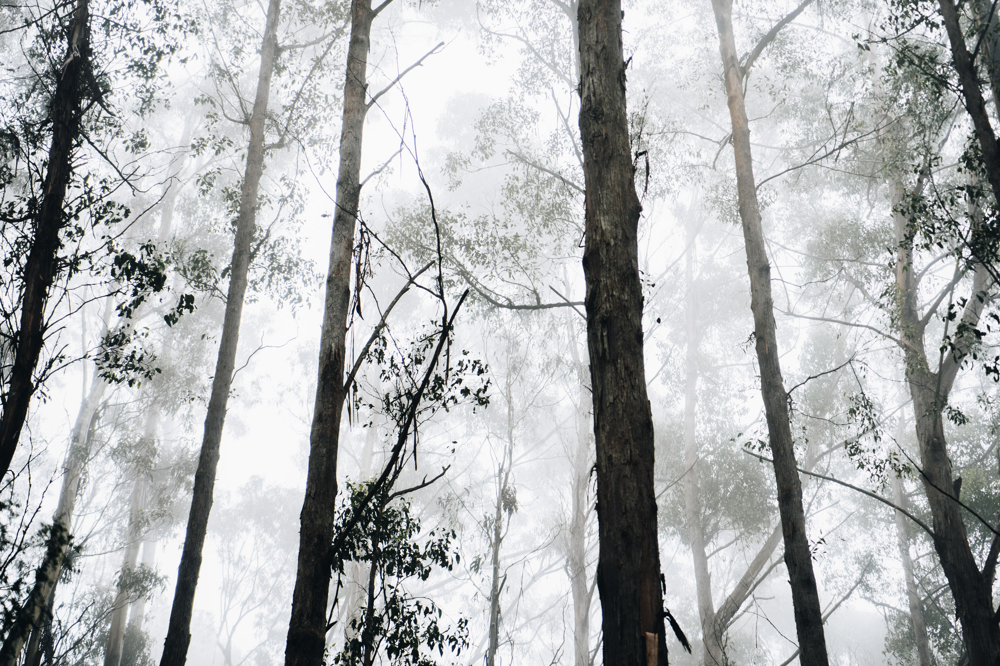
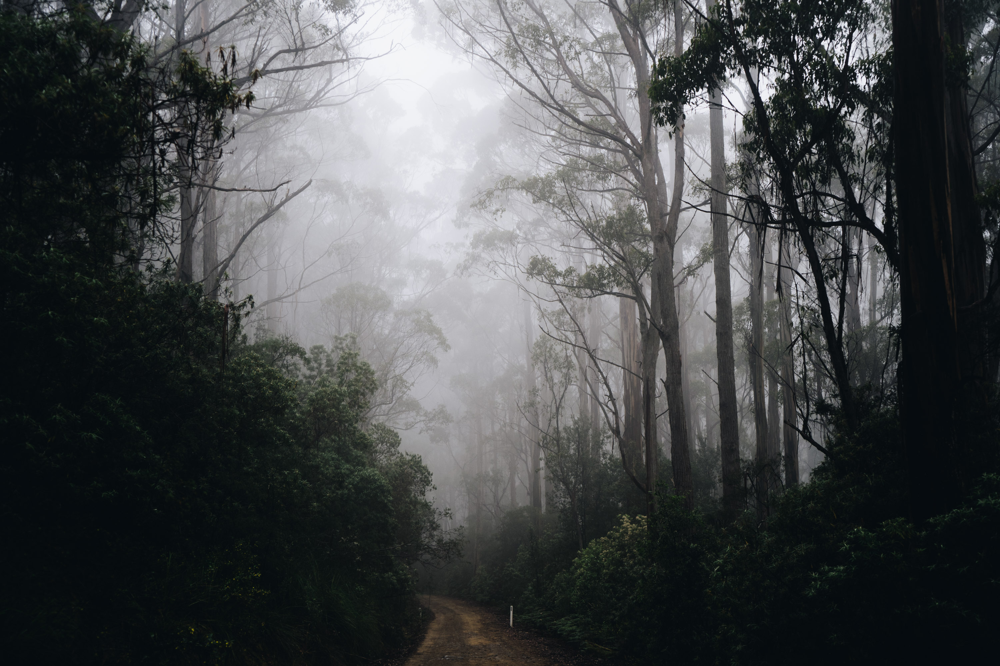
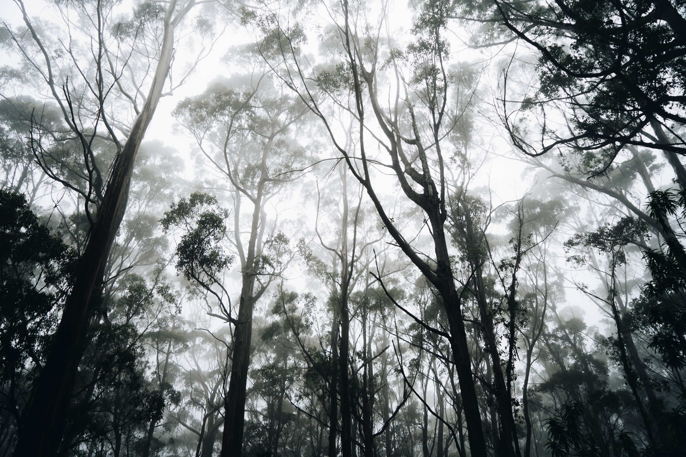

While exploring some of the dirt tracks in Bruny Island, a thick layer of fog set in and we were left with some surreal conditions for photography and forest driving in our Mitsubishi hire car.

I wish those little poles weren't in the image. The winding road adds some mystery to the shot.

The Mitsubishi or Its a bit shiti.

Wide view.

High view.

Close up of the trees and fog.

The fog was so heavy in this part of the track.

Almost smoky looking.