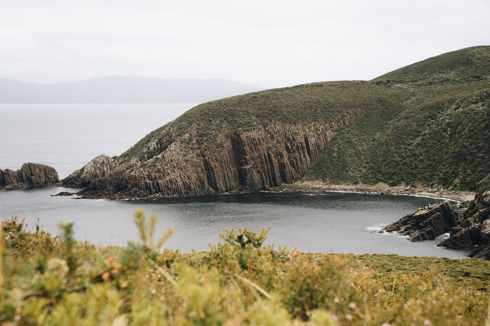
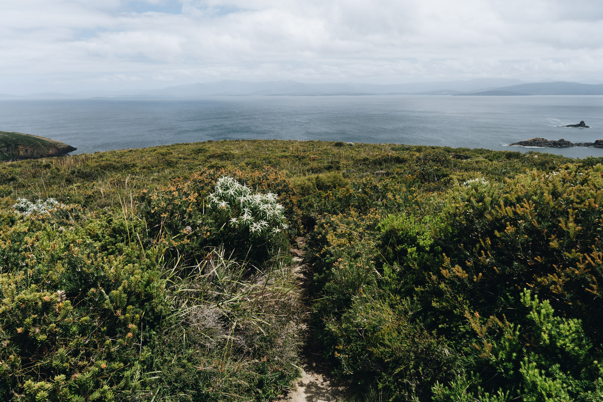
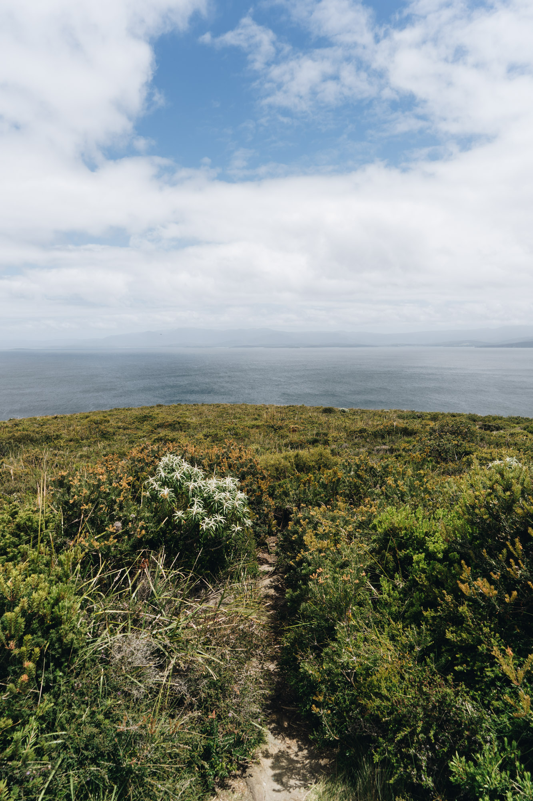
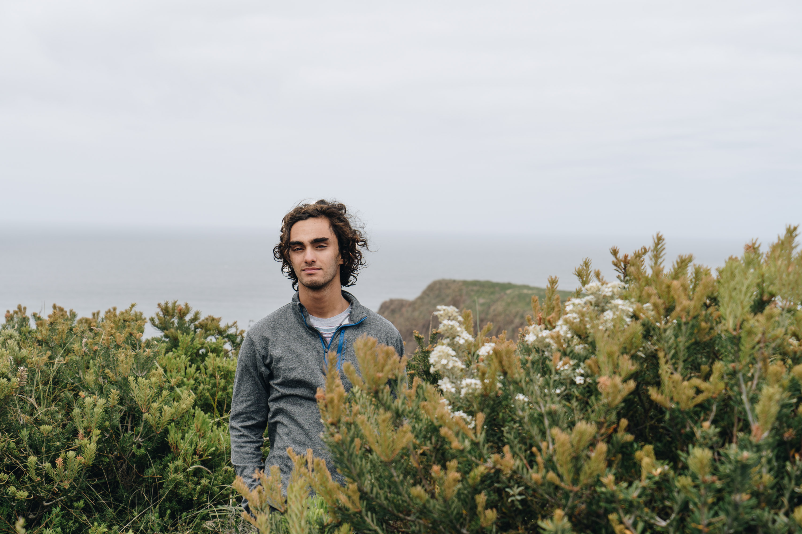
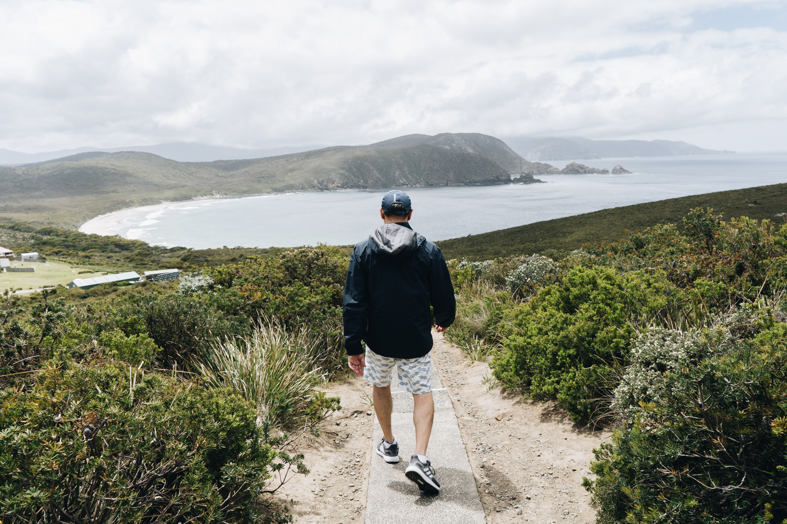
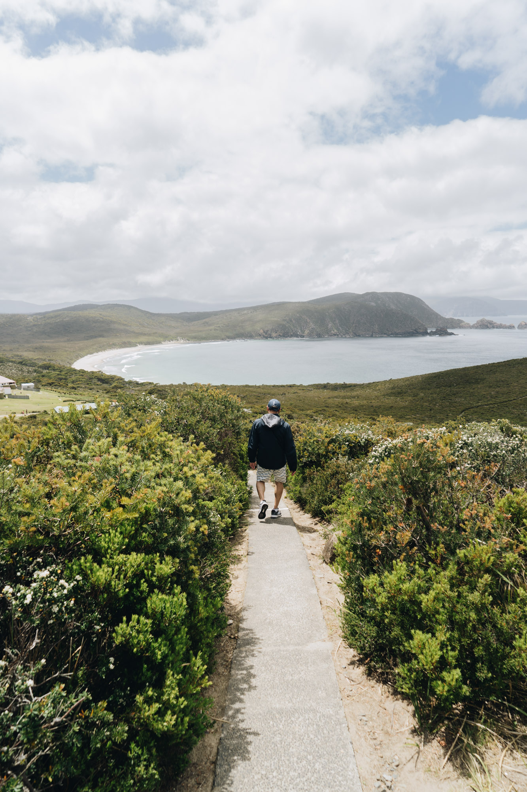

I wanted to fly my drone at the lighthouse but after seeing the strict no drone flying signs which seemed to be littered around Tassie, I decided not to.

Interesting rock formations with a steep, grassy gradient.

Lookout out at the mainland in the distance.

Some nice flowers.

My hair matted together from the previous day's Cloudy Bay surf.

Dad walking down the track back to the car.

A higher view.

