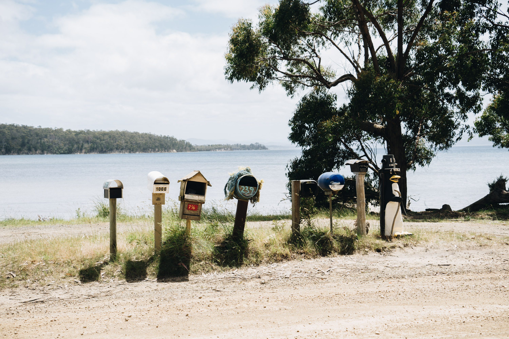

This post is just a collection of cool mailboxes I saw around Bruny Island, all totally unique. These gave me some inspiration for my future home.

The best mailbox I've ever seen, for sure. 

All these guys live down that sandy dirt road to the right.

Another view. The rust adds to the mailbox aesthetic.

Some more quirky mailboxes, right on the water.

Who woulda thought there'd be junk mail in the middle of nowhere?

