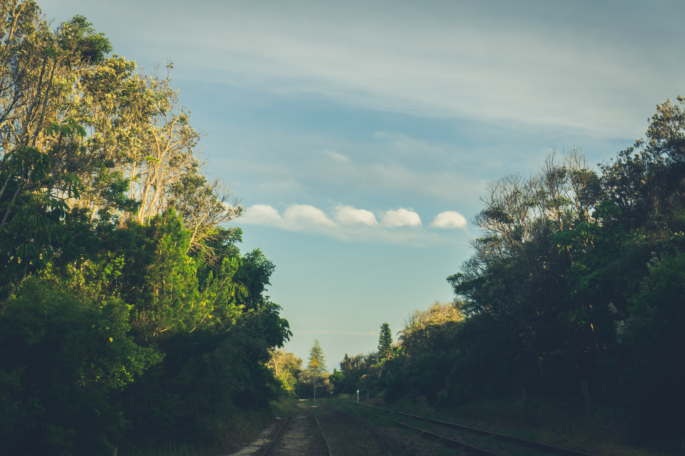
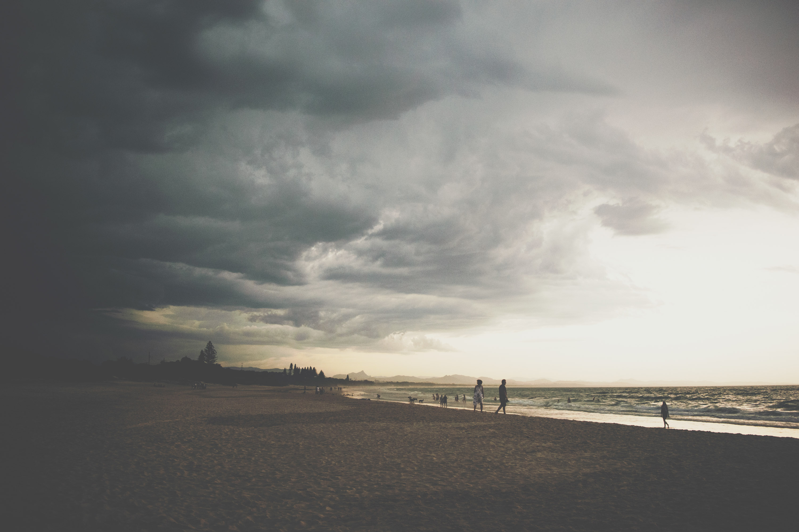
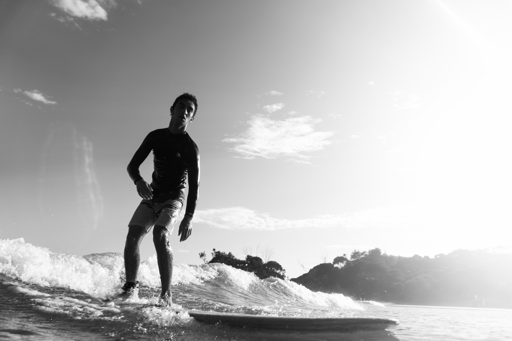
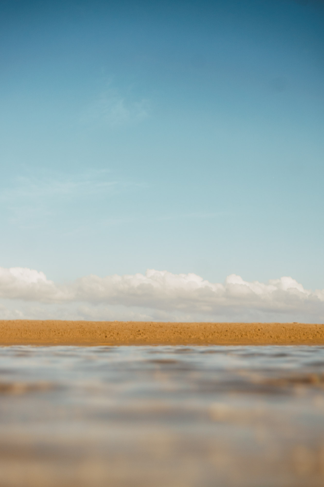
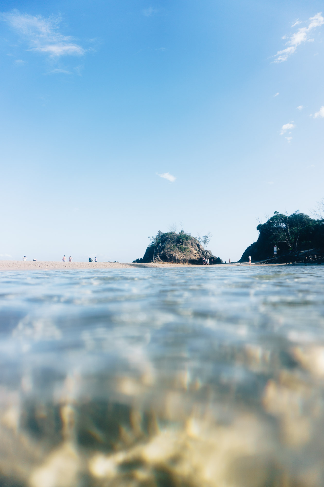
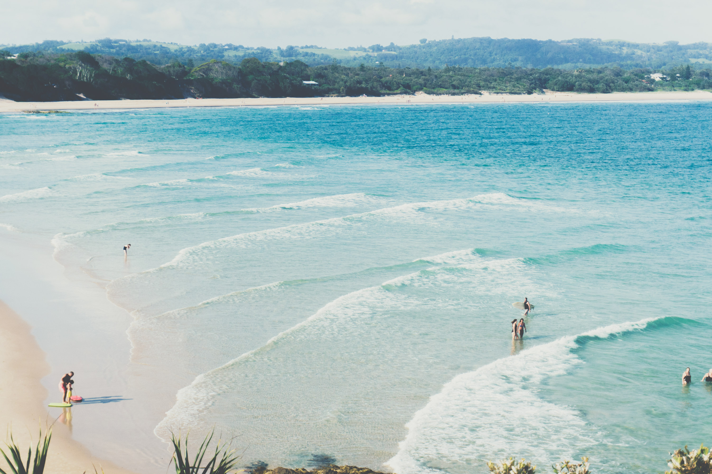

Here is a small collection of photos from Byron bay a couple of years ago. Excuse the colouring, I didn't really know how to edit photos back then.

Crossing the old train tracks to get to the beach and I found some Kevin Helmotz wave clouds.

A storm in front of the main beach on my first afternoon.

Another photo of the storm descending upon me. I had to run home after this.

Dads overexposed selfie at the pass.

Surfing my hollow wooden longboard at the pass.

Some of the smallest waves I've ever tried to surf but still fun.

A blurry little abstract photo in the low tide lagoon at the pass.

Another one of the pass lagoon.

The top of the lookout, looding back down at the pass and the valley beyond.

![]](./images/11.jpg)

Dad grandma and mum.

![]](./images/12.jpg)

Tallow beach in the afternoon sun.

![]](./images/13.jpg)

A closer shot. Shame there was no swell, the banks were pretty fun.

![]](./images/15.jpg)

The lookout at Minyon Falls. One of the most amazing places I have ever been.

![]](./images/16.jpg)

The bottom of the falls after the leech filled walk down and scramble over the rocks.

![]](./images/17.jpg)

Hopped in the water for a few photos, the water was nice temperature, not too cold or warm.

![]](./images/18.jpg)

Look closely and theres a guy under the waterfall.

![]](./images/19.jpg)

One of the most organic looking trees I've seen. Nature was slowly recycling this tree with moss and mycelical growth.

![]](./images/20.jpg)

The ferns on the bank of the repentance creek, a pretty special place.

![]](./images/21.jpg)

Repentance Creek. Perfect for a cool off from the mid 20s but humid weather.

![]](./images/23.jpg)

Another crazy looking tree.

