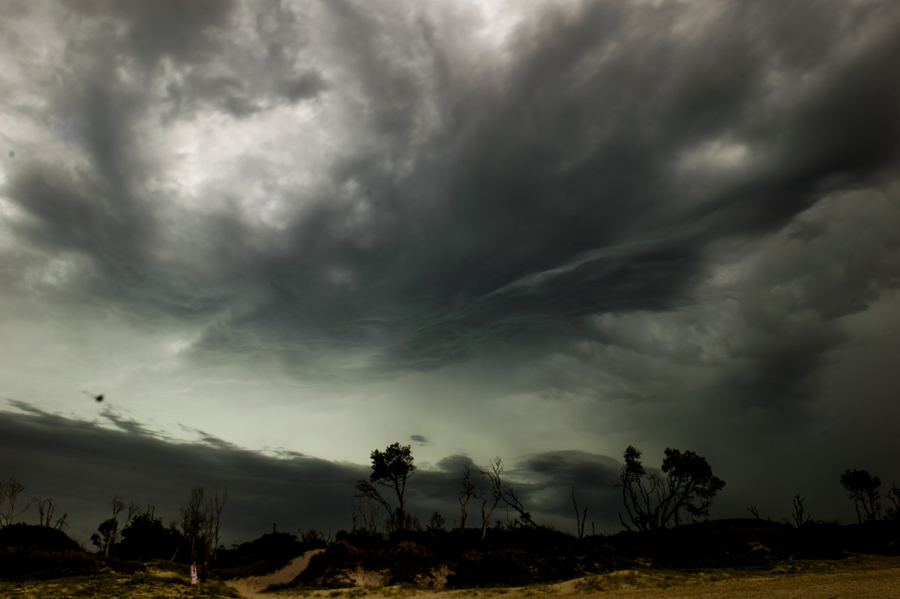

With cyclone Oma predicting huge swells and offshore winds for the Mid North Coast,Josh and I changed our minds about heading south and instead headed north to Crescent head for a weekend. We were gifted with pumping waves everyday, and big crowds and weather to battle with.

