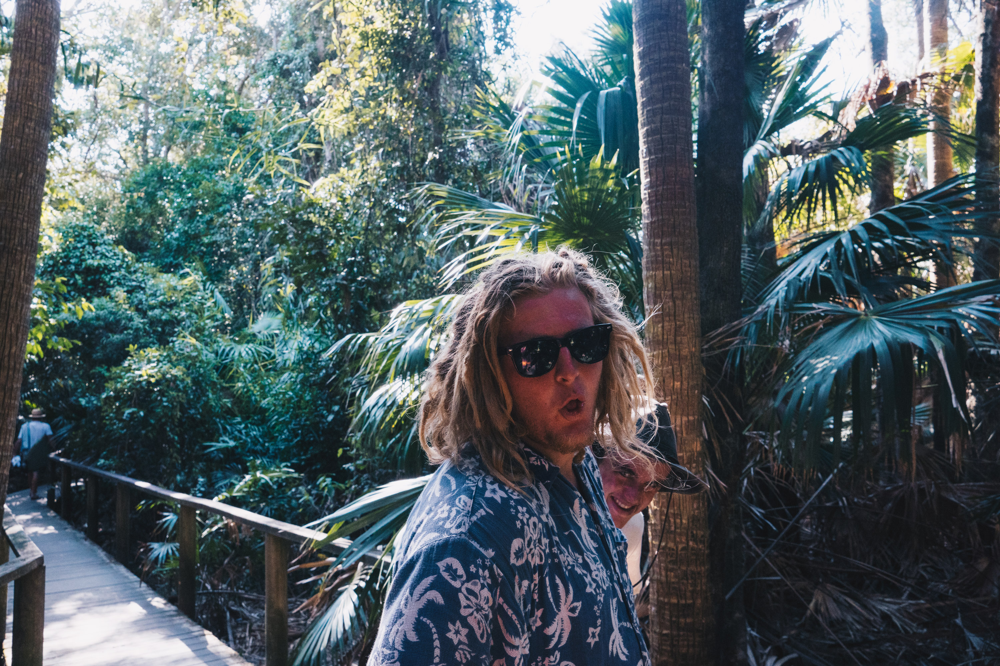

On our second afternoon of trying to find waves on the Mid-North coast, we scouted out Celito and Boomerang Beach, and ultimately ended up surfing very fun Boomerang.

Cheeky chiggers on the Celito boardwalk.

Grubs.

It was pretty much a rainforest. Apparently there is wild guava growing in the area.

Looking down the beach, having a 4x4 definitely is an advantage.

Snooza Cruza. Very cool setup.

Liam pondering his life decisions as we sit at 60km/hr in the old van.

The roads in the pacific palms aren't the smoothest.

Boomerand beach, looking south with Blueys behind it.

Few good waves, and unusually colder water.

Cropped view.

Bros.