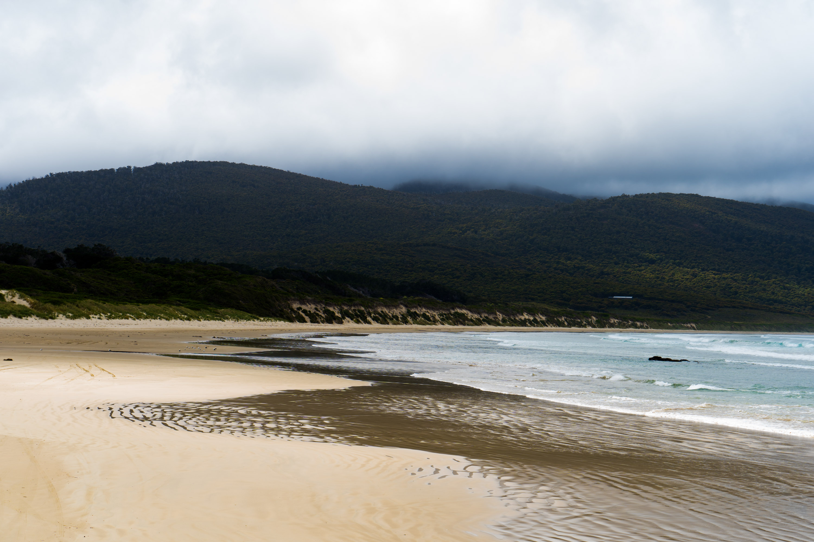
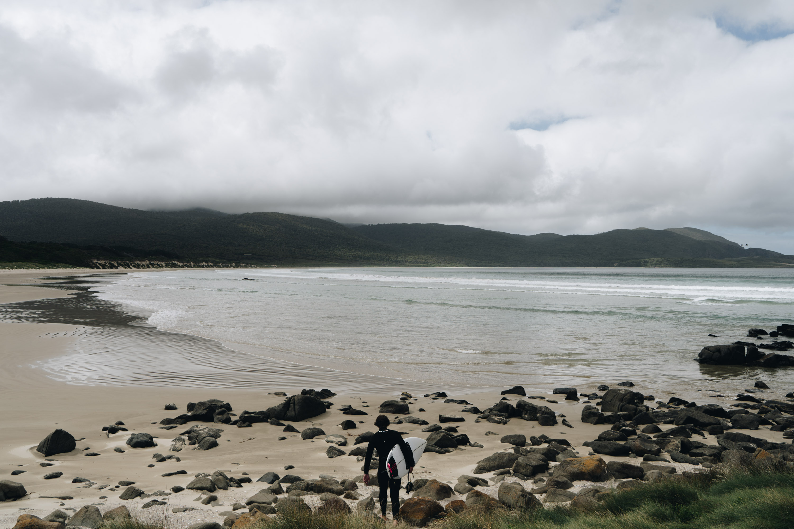
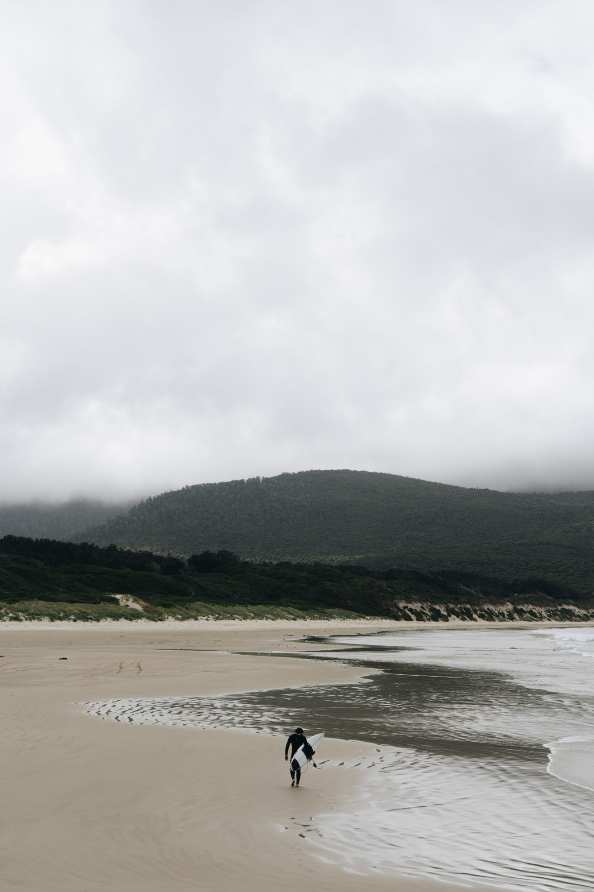
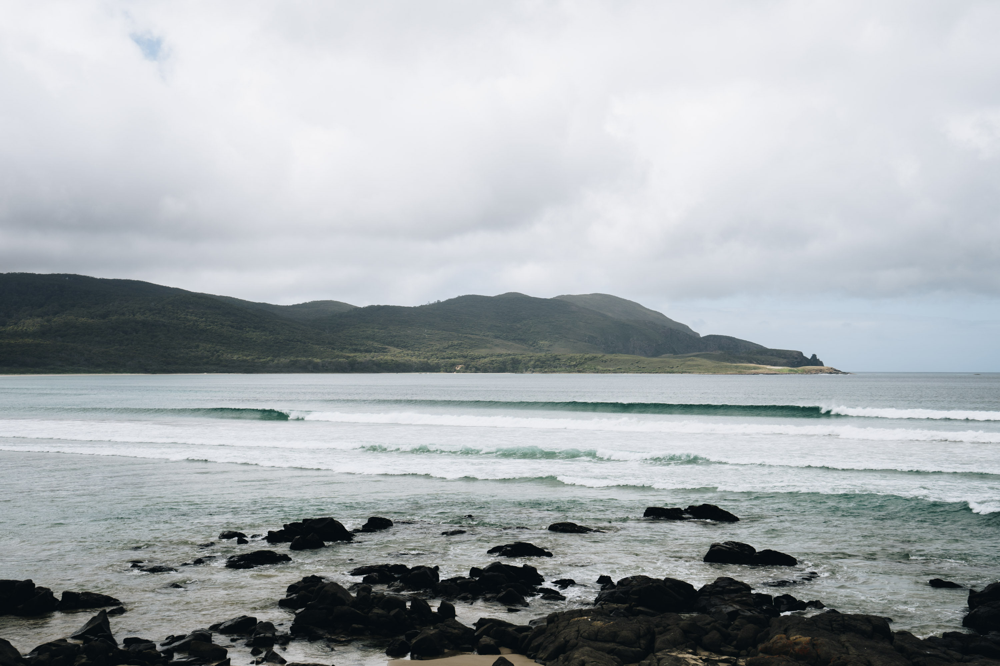
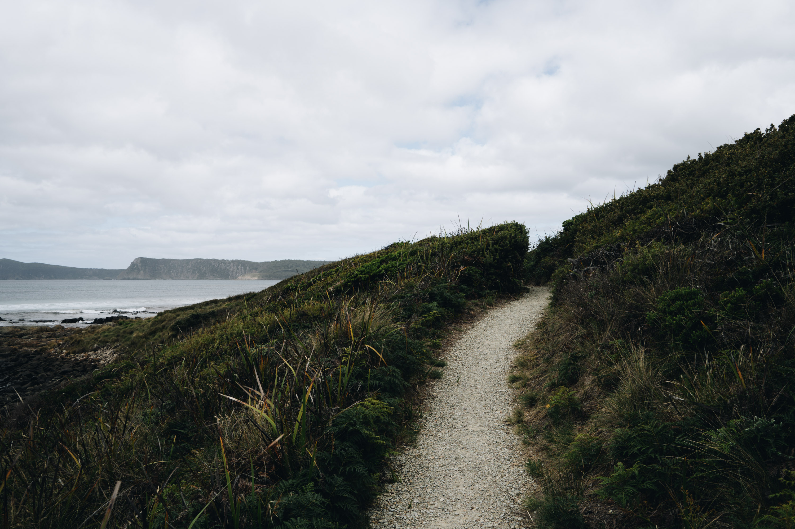
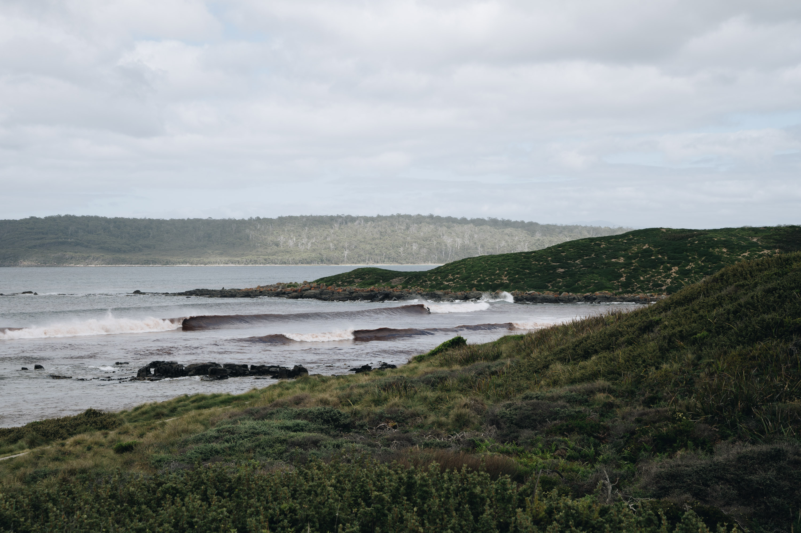
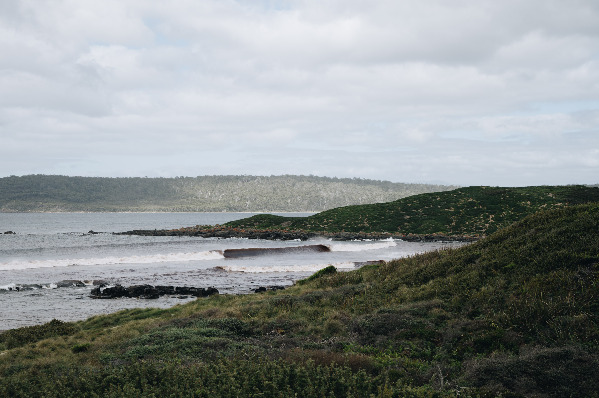
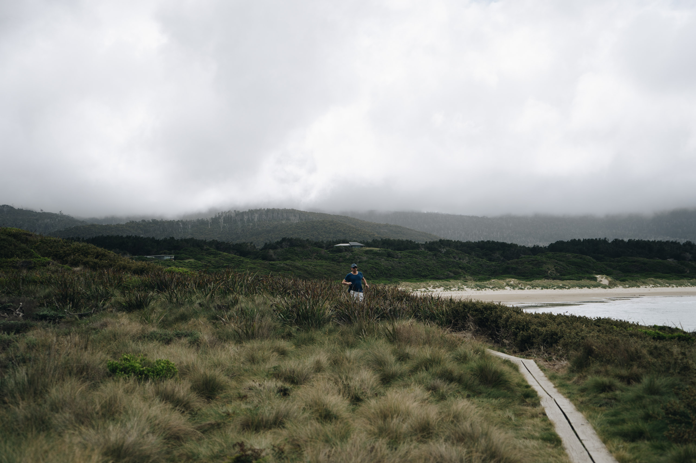
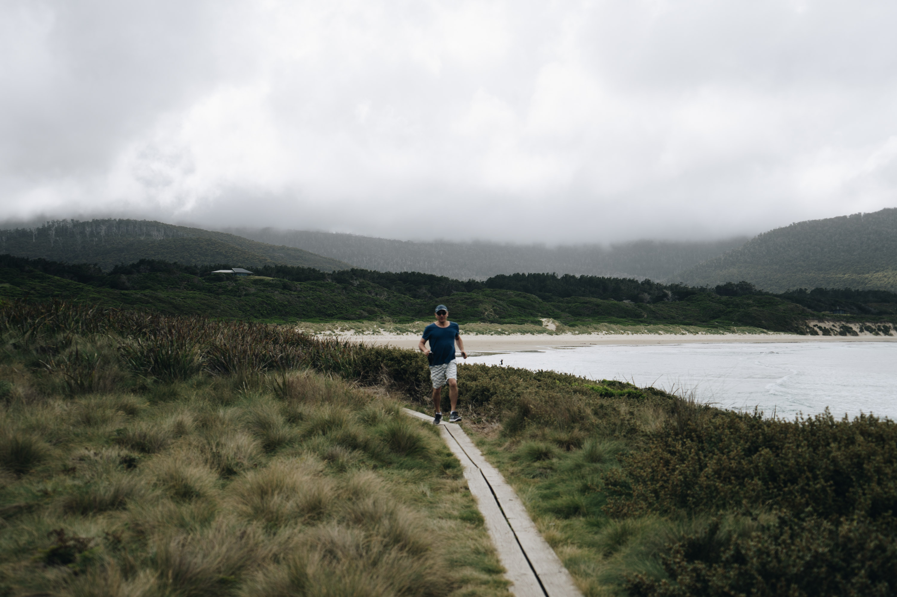
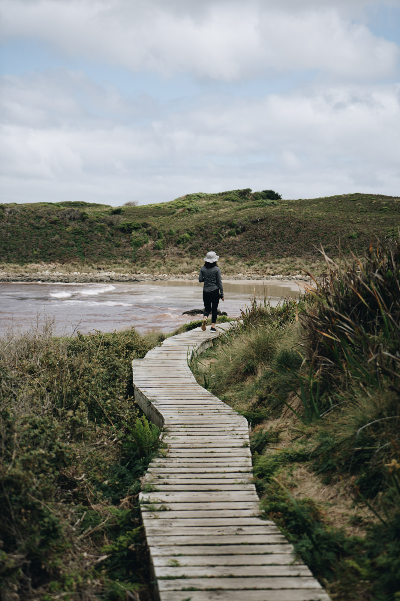

While driving to cloudy bay in Bruny island to go surfing. We stopped at a couple old wooden farmhouses that had been abandoned. They made for some pretty cool photographs with the green backdrop.

Probably one of the nicest beaches I've ever laid my eyes on. Filled with tall trees and the occasional luxury beach shack perched on the dunes.

Surfer getting ready to go out down the beach. I opted to surf around the corner instead.

Another view of the foggy landscape. Even on a day when there was no sun the beach looked green.

Mini pointbreak illusion with some lush hills in the background.

The track to the red-algae beach around the corner.

I was surprised! The swell was tiny, but there was still a wave breaking in the bay. Once you got out there though it was almost too straight and fast to get a proper ride.

Look how red the water is. The algae is super itchy and absolutely dreadlocked my hair.

Dad runnign down the track.

Almost there.

The boardwalk was nice.

Some of the red algae spreading to other parts of the island. This was the beach infront of our house. 
