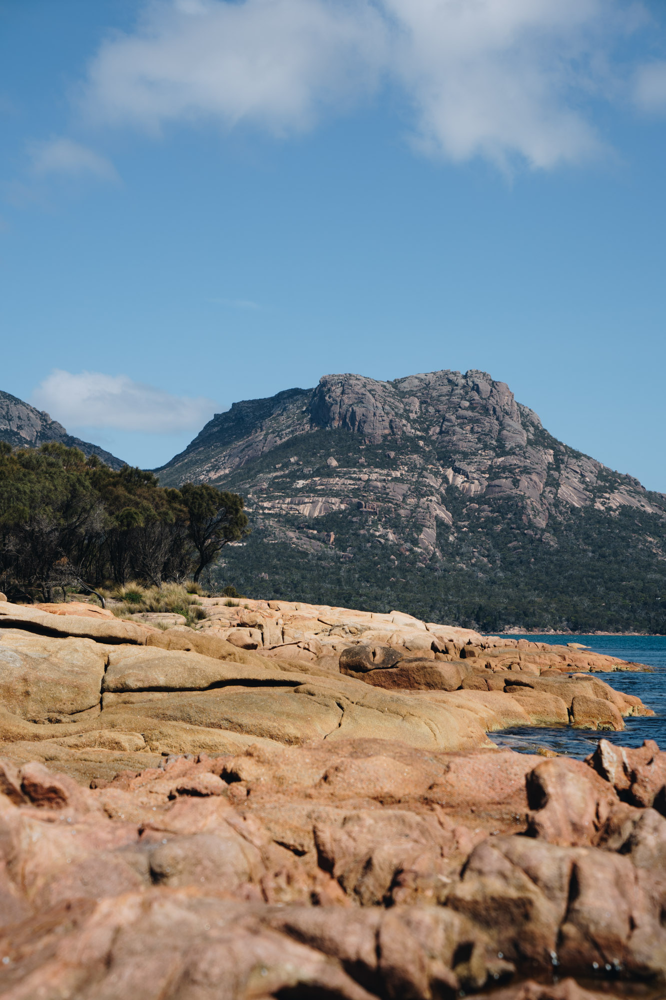
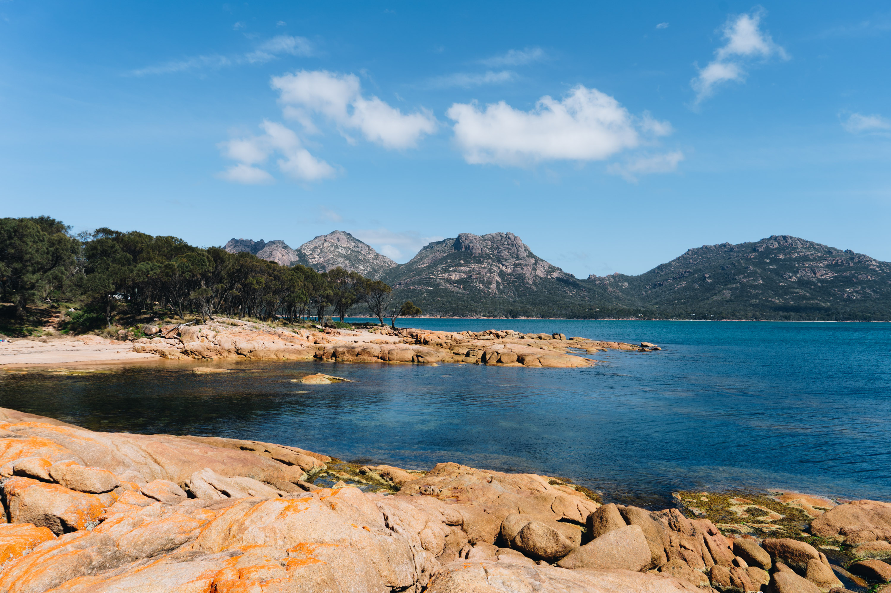
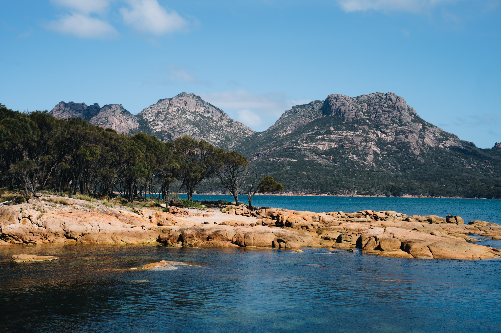
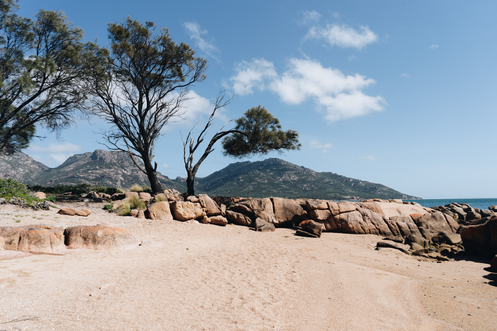
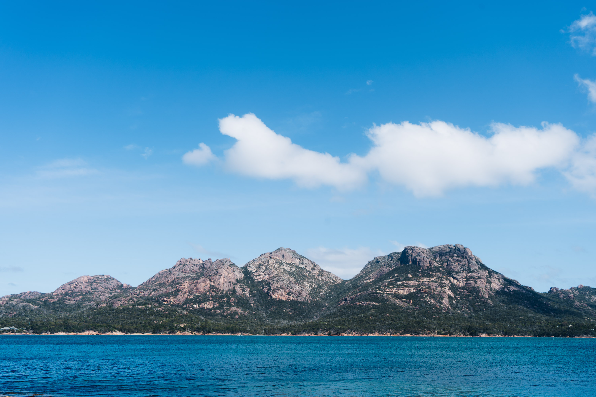
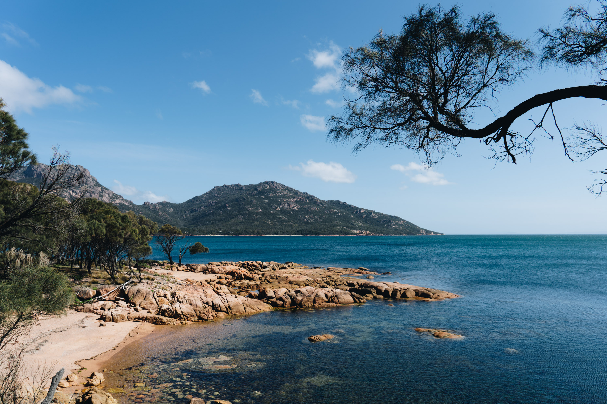

While visiting Freycinet National park for a few days, we stayed at Coles bay. There were some pretty sick beaches and bushwalks all around which kept me pretty occupied.

Smooth rocks of Coles bay.

Prime snorkelling spot.

The mountains in the back look like the Sierras in California.

A nice little sandy beach. This tree was acting as a little extension to the mountain top.

The water was icy cold and blue.

Didn't bother fishing here. I reckon I would have gotten snagged.

