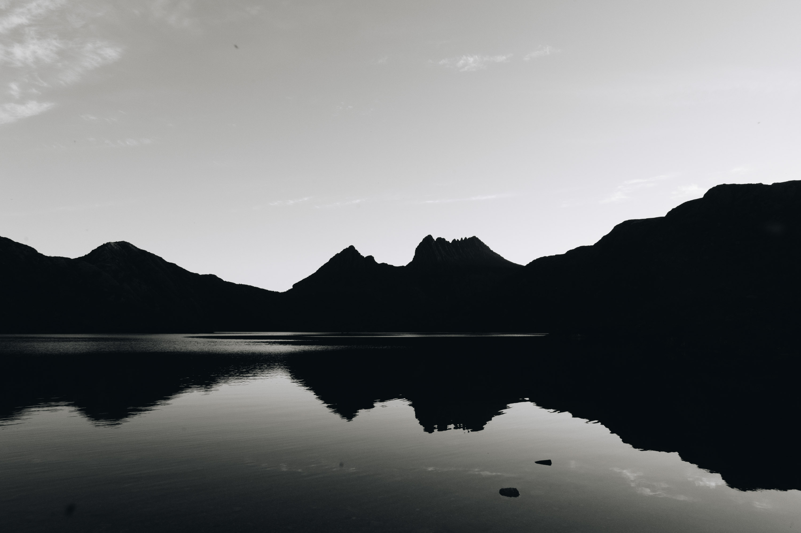
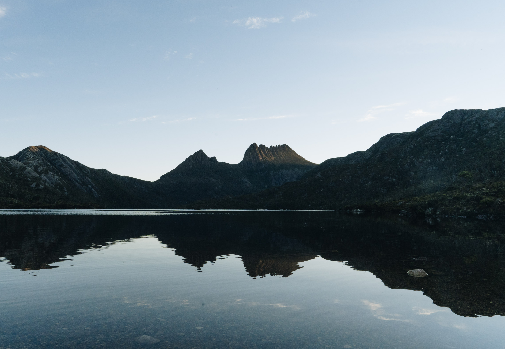
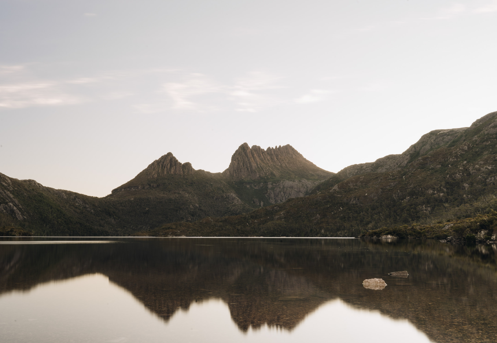
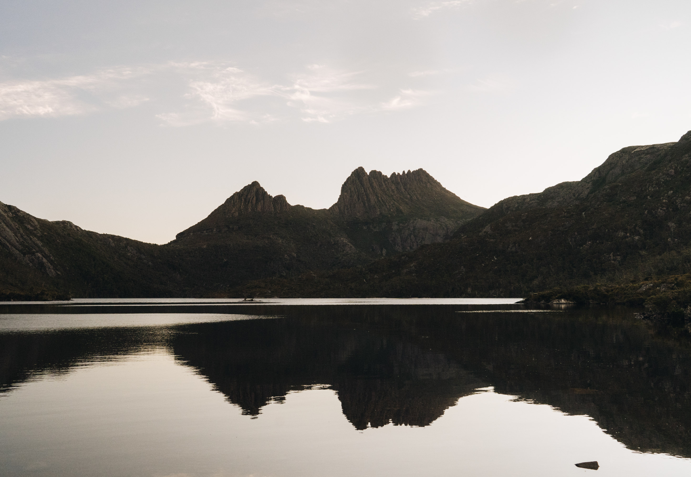
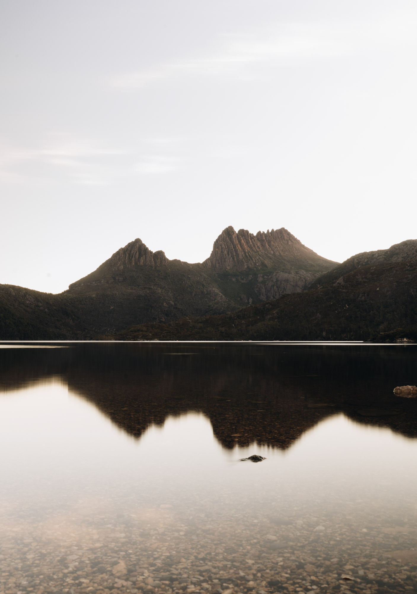

We went down to cradle mountain for sunset, and the conditions were really great. It's funny, right before all the tourists showed up the wind picked up and the reflections disseapeared. On the drive in to the mountain we saw a spotted quoll and a wombat/

Black and white.

Sheet glass.

Long exposure

Same time but normal exposure

My favourite image from cradle mountain.

A raw video of the calm conditions with some trout jumping out of the water at the end.

`youtube: WBAsMXgrdb4`