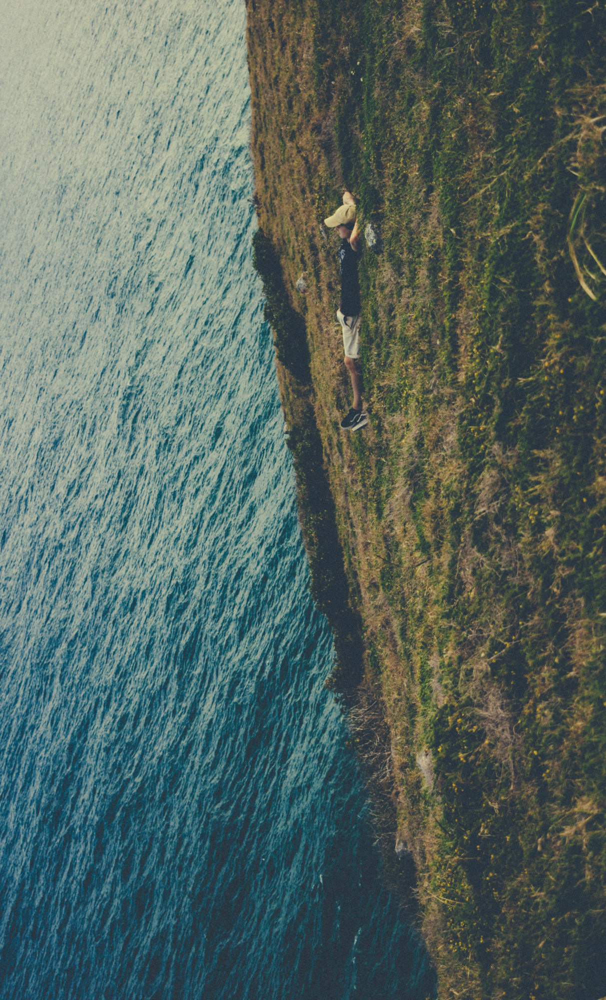
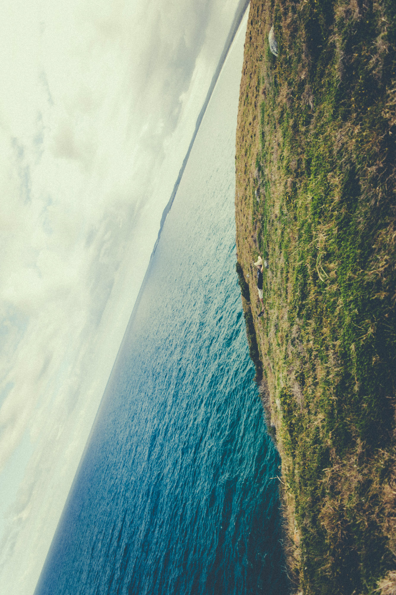
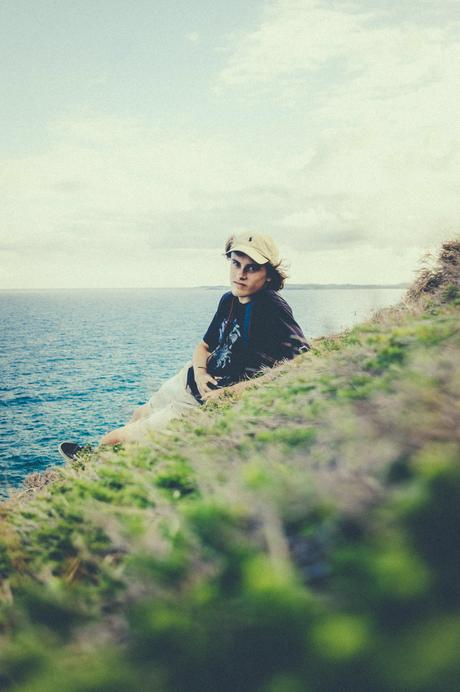
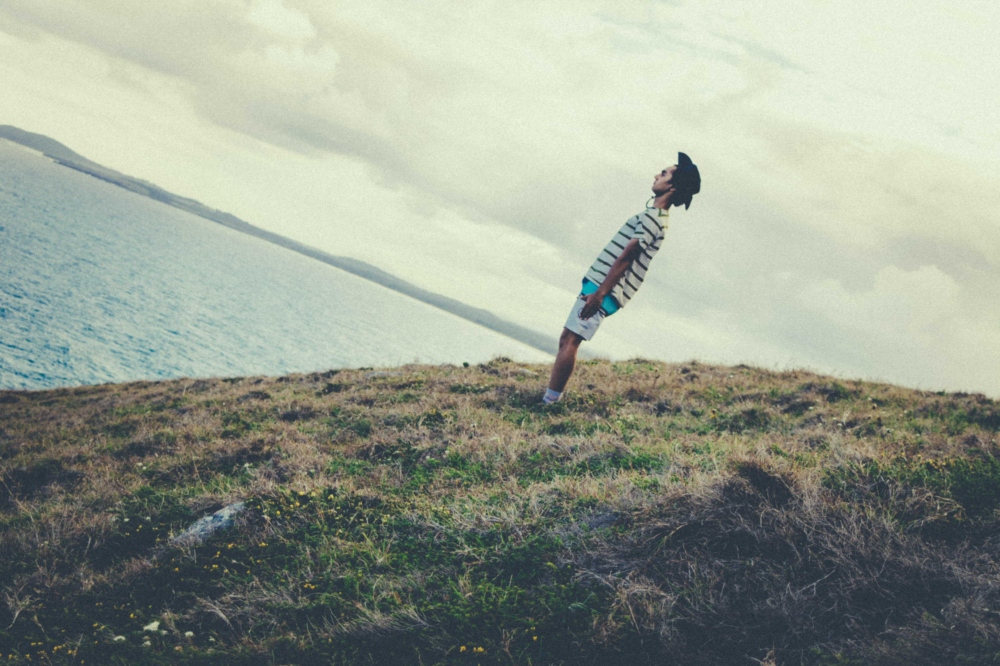
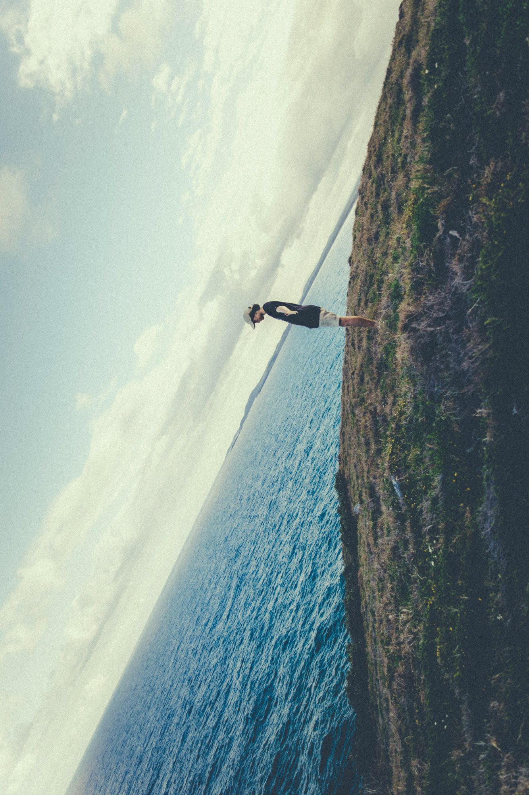
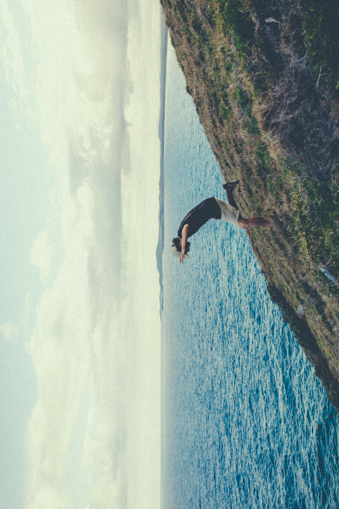
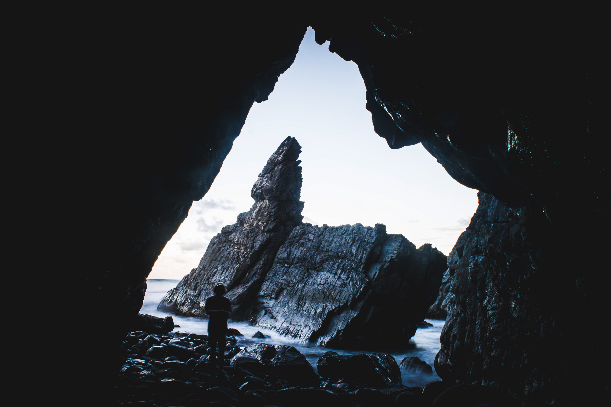
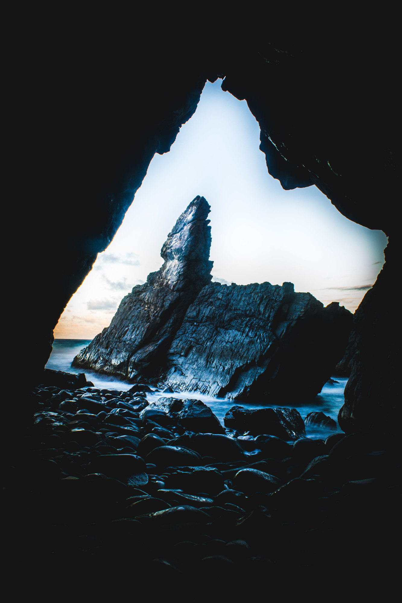
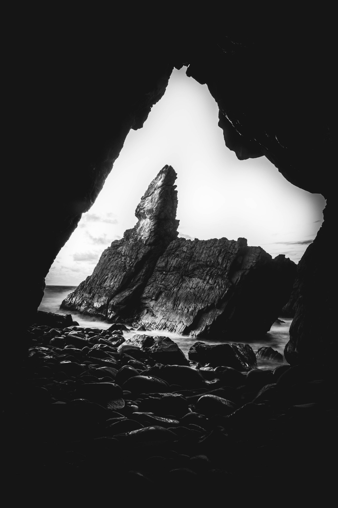

Aidan and I went for a walk on new years eve on the Crescent Head cliffs attempting to take some cool photos of the cave and the grassy cliffs.

Trippy.

Zoomed out.

One slip and you're in the ocean.

Confusing camera tricks.

Good way to end the year.

Don't fall!

Inside the cave, getting closer to high tide. We didn't have much time.

Sun starting to set.

Black and white.

Zoom and slow shutter; looks pretty cool