With cyclone Oma predicting huge swells and offshore winds for the Mid North Coast,Josh and I changed our minds about heading south and instead headed north to Crescent head for a weekend. We were gifted with pumping waves everyday, and big crowds and weather to battle with.

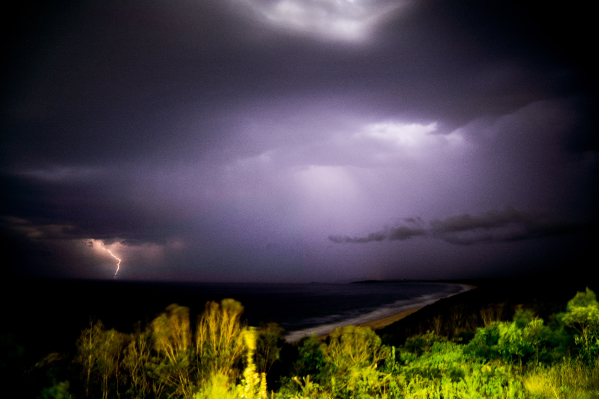

The storm on the first night was insane. 

The most lightning strikes I have ever seen in a 30 minute period struck over the ocean near our campsite.

When we first arrived in the afternoon, we went down to delicate nobby for a solo surf in 3-4ft wedgy peaks and it ended up getting too sketchy with the onshore wind starting to get stronger.

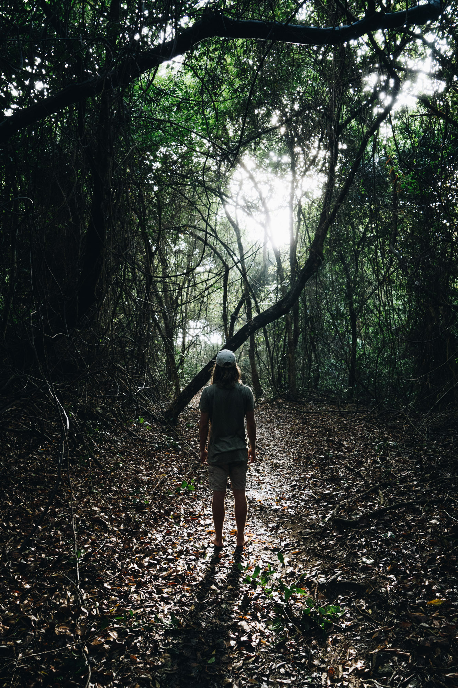

Racecourse headland.

The next morning we searched down the coast and first checked out the beach at Racecourse headland. There was no waves but the light at the walkway was very nice.

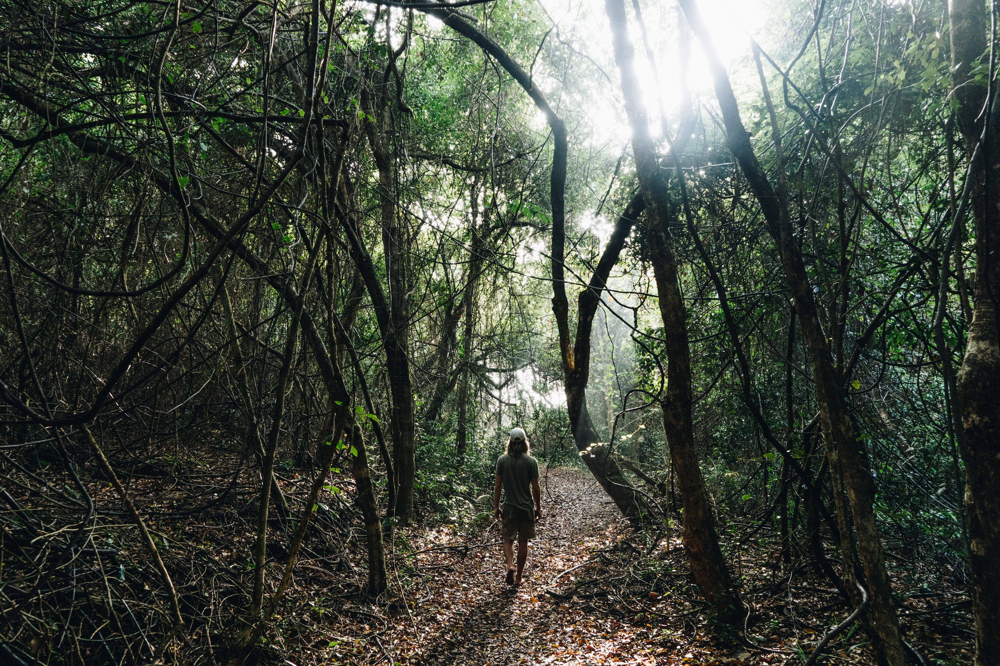

Another photo of Josh walking down down to the beach.

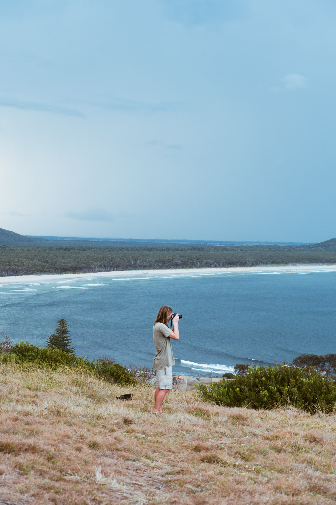

Josh on top of the hill on our first afternoon, watching the storm front slowly brooding off the coast.

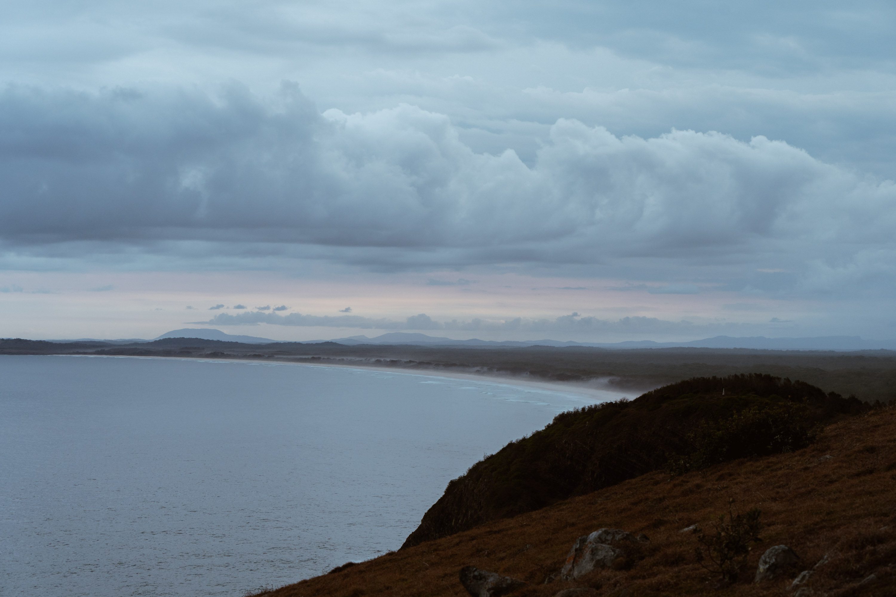

Some fog and mountains looking south from the headland. Even though it looks cold, it was so hot and humid even at night.

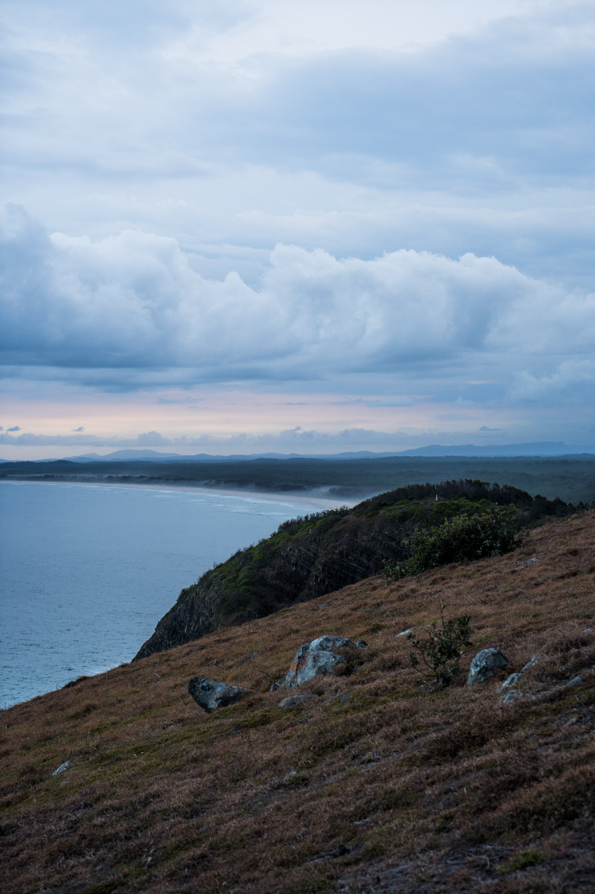

Beauty of the Mid North coast.

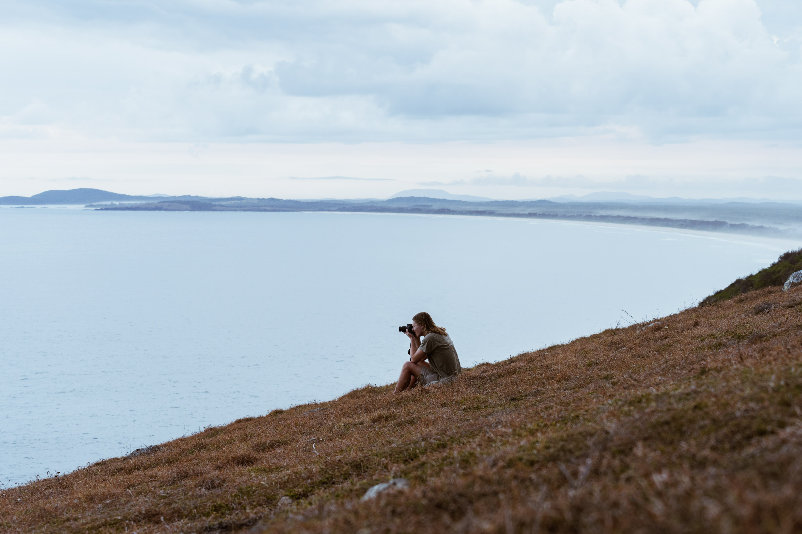

Josh pointing out to sea. I wish he had a book in his hand instead of a camera, would've looked nicer.

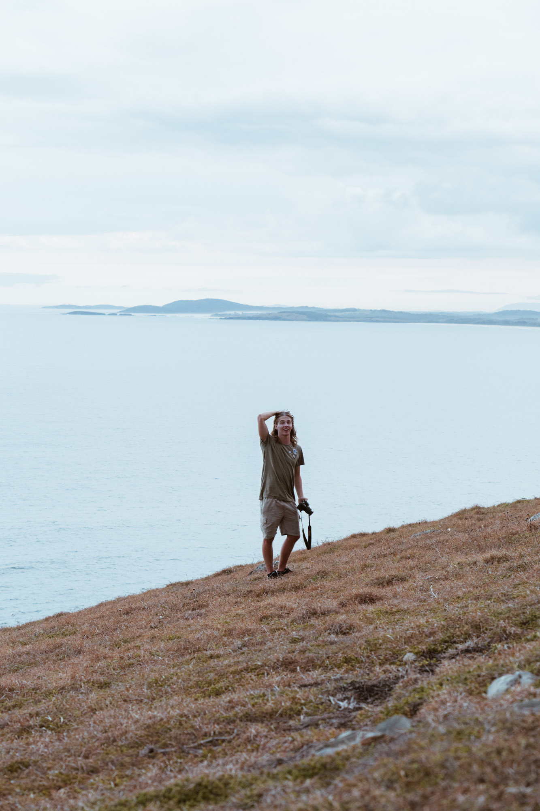

The perfect backdrop for a pose. Pity that I couldn't catch Josh in a candid moment haha.

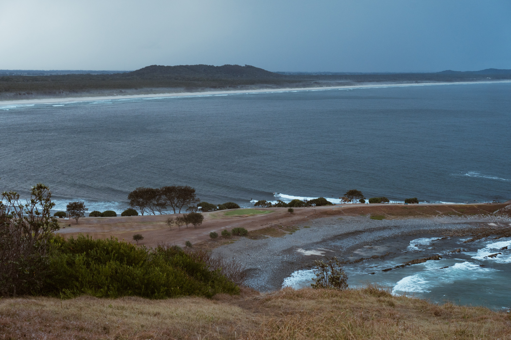

Waves still small in the afternoon but definetely started to pick up with a few surfers out near dark.

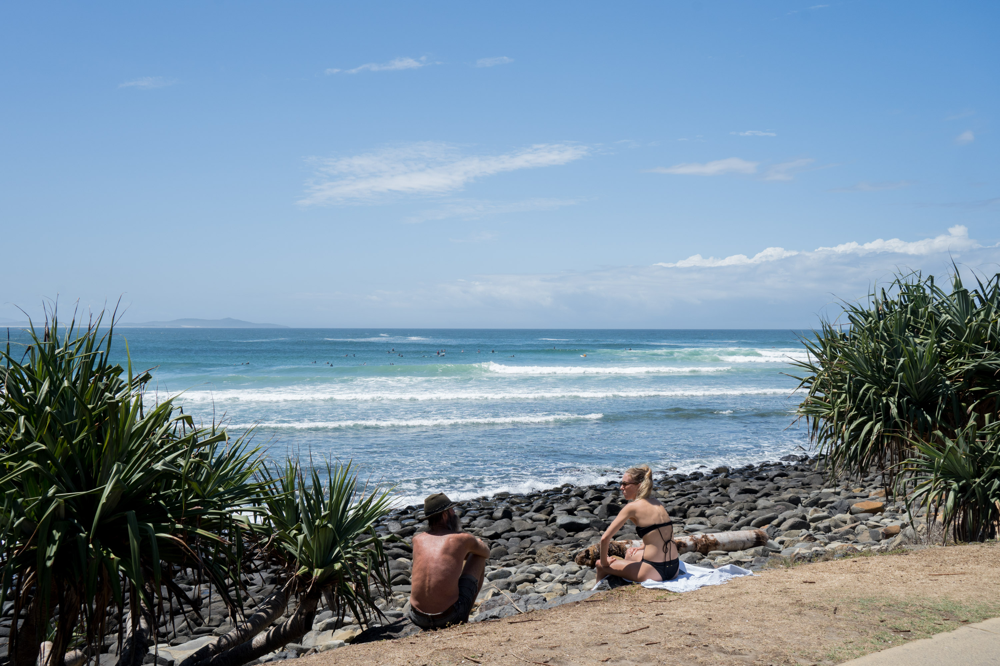

We got a parking spot at the point both days next to this guy. 

He always had a smile on his face and something to say. I needed a fin key to tighten my fin in my fixbox and I asked him if he had one. 1 hour later after rummaging through his messy rodeo he found one.

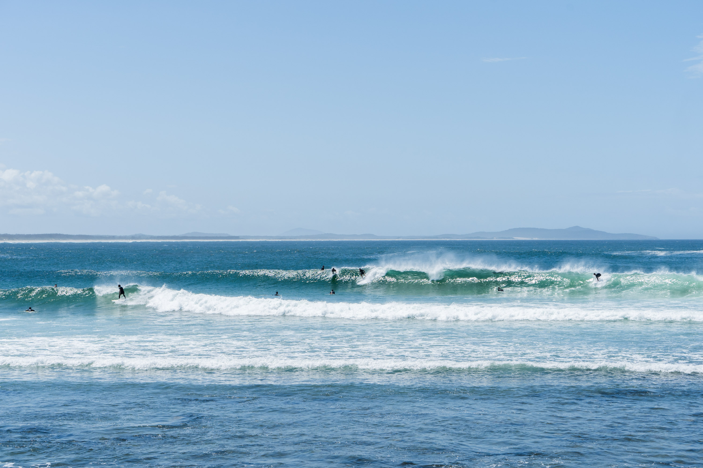

Waves were absolutely pumping. 

I took this photo after a 4 hour surf when it just started to get bigger and bigger. Shortly after this I got back in the water and surfed till near dark, when a crazy lightning storm hit and I hurried out of the water when a bolt struck near me. Heaps of people still surfed untill dark, but I didn't like my chances and we had to setup camp before it got fully dark.

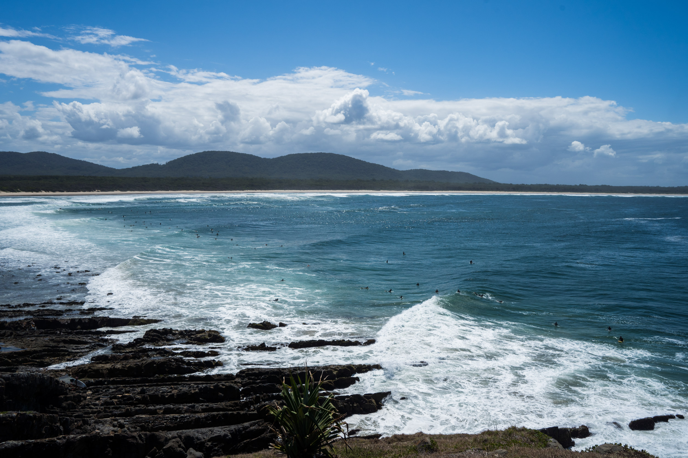

The crowd was very spream which meant that getting a wave wasn't overly hard.

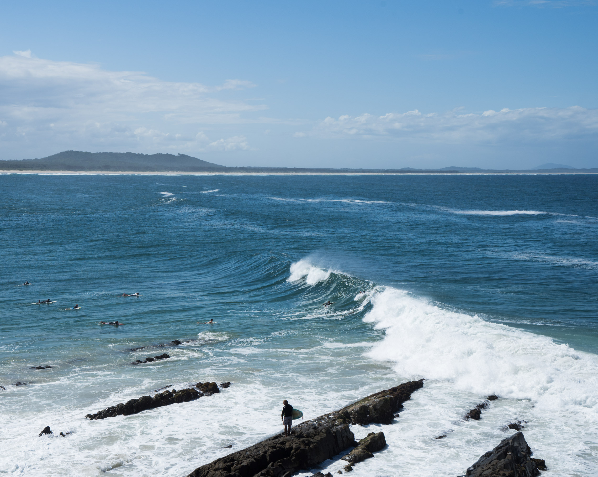

A nice little one coming through the point. The rockoff definitely got a little sketchy as the tide got lower!

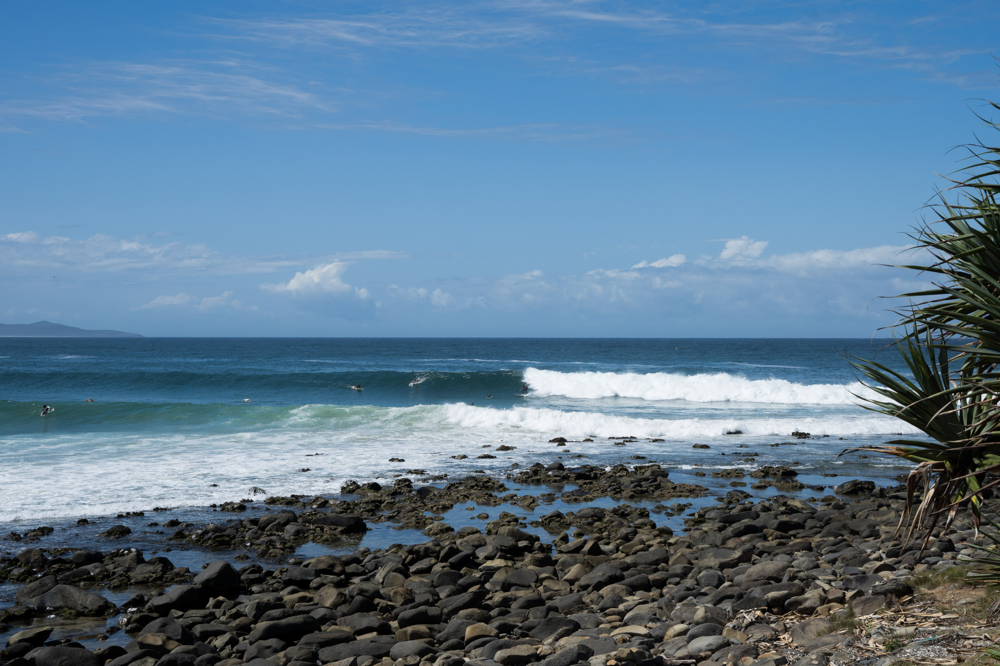

This guy would've loved this one.