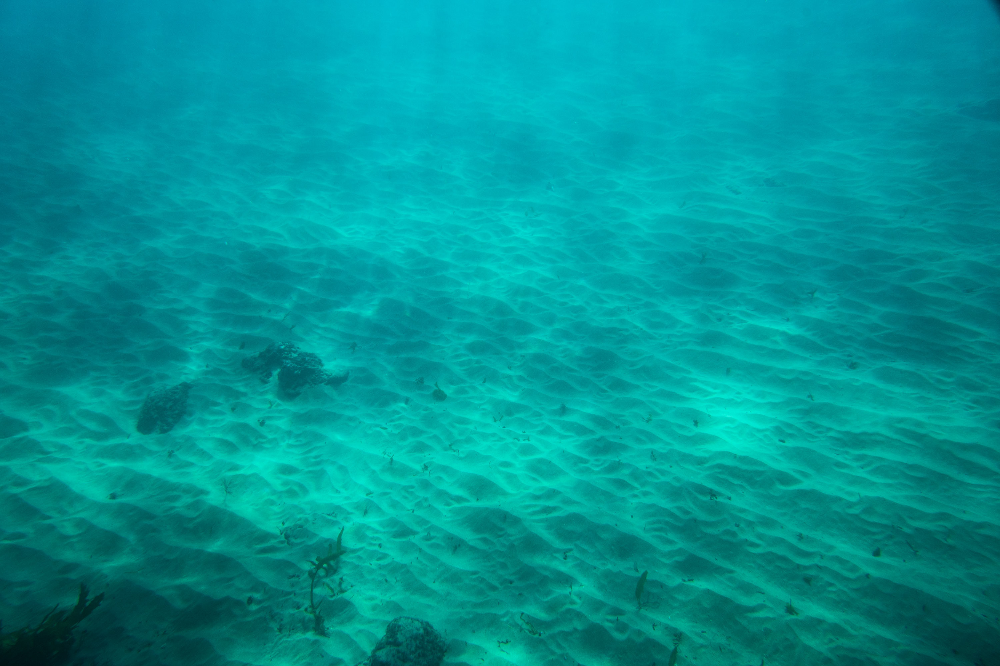

A couple of the boys went for an afternoon speafish and snorkel. There weren't too many good fish around. The best I saw was a decent sized bream but it was still fun to explore the North Curl Curl headland and the different underwater structures that you usually don't get to see.

Liam speared a pretty big rock cale. We told him they taste good and he went home and tried to cook it but realised they taste like dog crap.

A nice school of bream and tarwhine bream. Spot the darker looking one on the far right, it was pretty big.

Aidan floating around.

The drop off. From 2 to 10 metres deep. A little bit further out there was another crazy drop off. Floating off the reef to the deep section felt like how I imagine it would on the moon.

A few rocks on the swim back to the beach.

Barren sandy area between the beach and the reef.

More smaller bream. I think my housing port had fogged up by this stage.

Exhausted.
