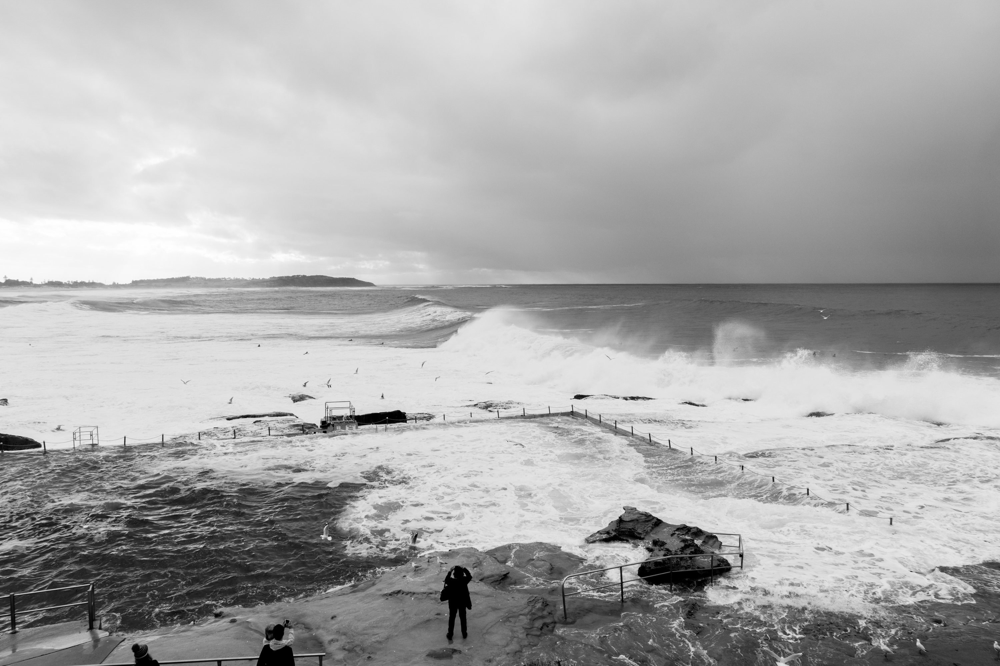
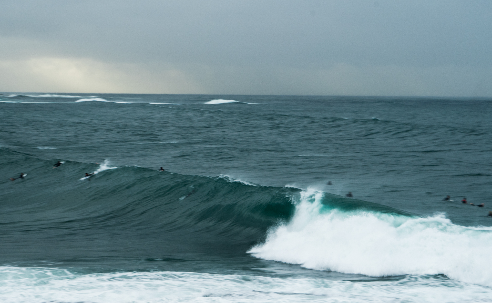
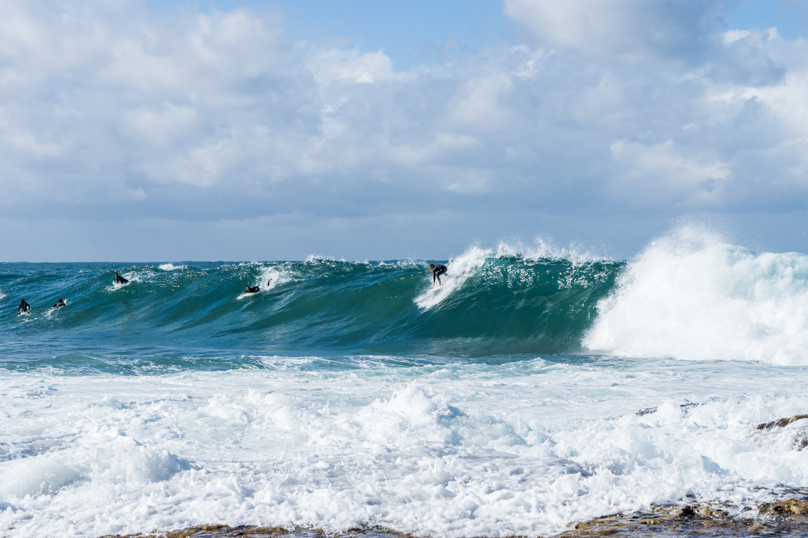
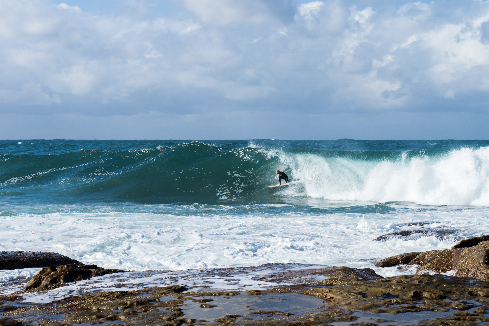

The waves pumped at dee why point for the first day of winter. When I first rocked up at around 8:45 there were just lines stacked on the horizon and you could clearly tell which waves were going to hit the reef well and bowl up. I think it was better on high tide as I surfed for three hours and some of the set waves started closing out, as Dee why point sometimes does.

The crowd was very busy, everybody keen to give some bigger waves a crack after no proper size for a couple weeks. As usual some of the locals were getting the best ones, wave after wave from around the corner at first rock. But with sitting at first rock comes a guarantee for some wipeouts which I caught on video.

The whitewater, seagulls, the pool and the seaspray create some cool contrast in this image.

A speed blur of the seagulls blasting past the point. I shot this image with an ND filter with my shutter speed at around 1/30th of a second and just panned at the speed I thought they were going. You can see some were flying closer to the speed I was panning and some were not. That's the fun part about these types of images. You never know what you're going to get.

The back bombie going off while an invisible crowd of 20+ battle the 8ft+ sideshore windy peaks.

A speed blur of a nice barreling wave that slid through the pack.

First rock wipeout. Look closely to the right for the airdrop attempt.

This guy made it to the bottom and realised he had wiped off too much speed to actually make it down the line.

Ethan pumping down the line on a wave that was a grower; it actually got pretty decent size towards the end.

The same wave, a couple moments later. Ethan trying to decide what he's going to do with the section coming towards him.

The next frame.

Pull in or pull out?

A few people watching the surf action.

Ethan on a nice looking wave but unfortunately it closed out.

This wave would have been nice to get on a bit further down the line.

Ethan taking the drop on another one.

Local charger stalling for a barrel on his backhand.

Some cool reflections facing towards North Curl Curl

A few wipeouts

`youtube: K29P9ACTzn0`