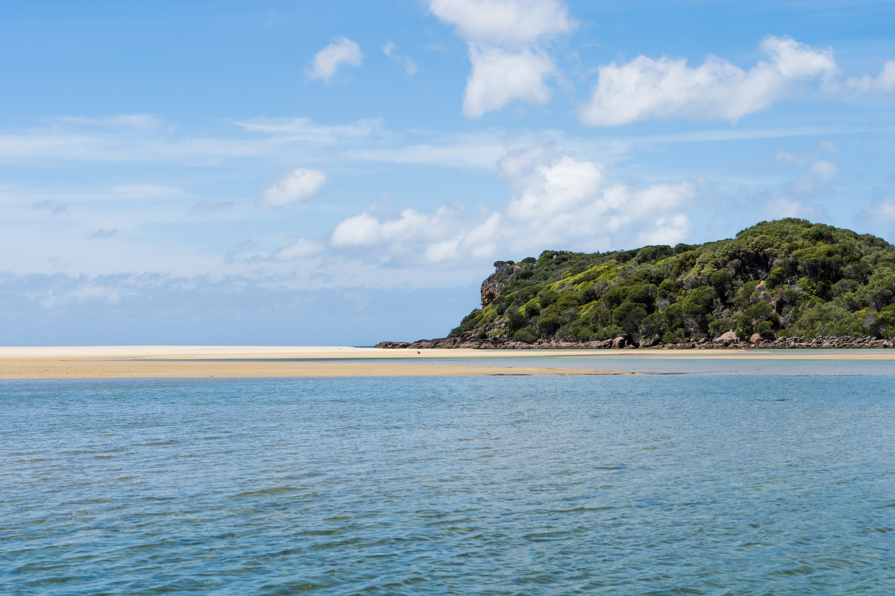
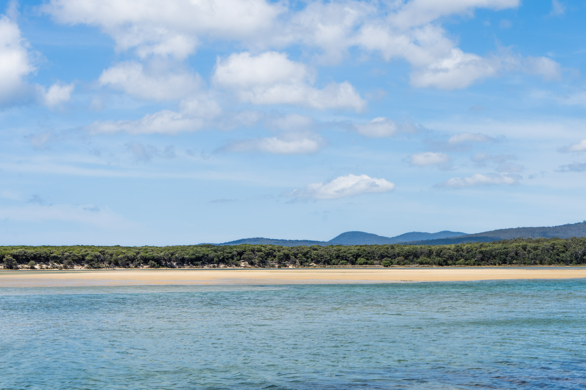

While we were on our "schoolies" south coast trip, we were camping at saltwater creek campground and went for a day trip spearfishing to disaster bay. On the way back up from the beach, we found a lookout which overlooked the bay and showed the true untouched beauty of the far south coast.

In my opinion this is the best beach in NSW with how hard it is so access, Wonboyn lake right behind the water and a predominant offshore wind in summer. It was a shame the swell was small, because the beach looked like it had very good potential for fun surf. I'll definitely be back soon.

Not a single footstep on the whole beach.

The southern headland at the bay.

Leave only footsteps.

Making little drawings in the sand.

Me!

Josh

Wonboyn lake. There was a couple of houses, each with their own jetty. Dreamlike.

Wonboyn lake was a real beauty.

The Nadgee wilderness in the distance.

Could sit here all day.

Tha boys.

Some fun looking peaks. Only problem is it's a very long walk to the end of the beach. Would be work it when it's a little bigger. 

Nadgee wilderness.

A photo of some guys who haven't showered for 12 days.

Crystal clear water.

One of the jetties of the houses on Wonboyn lake.

Jadogz.

Chilling out.

Walking over to the sandbank.

Crystal clear and kinda cold.

You shouldn't be this exited when you spear a baby stingray.

Kaelan with his eyes on the big mullet.

Rory nailed this one. Probably the biggest mullet I'ver ever seen. We cooked it up with some morrocan spice.

Trying to get a better view of the boat.

Liam admiring the fish. 

Aidan in the front, me in the back. 

