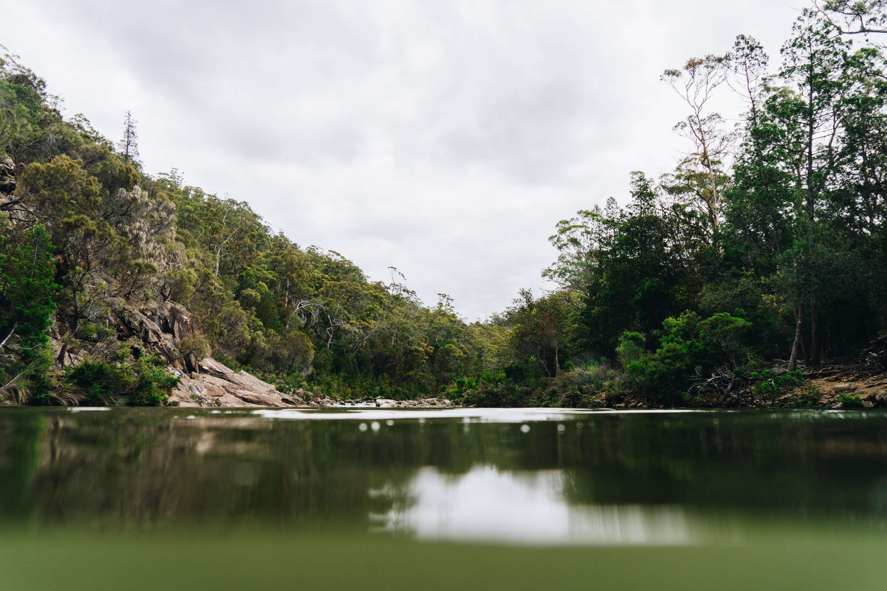
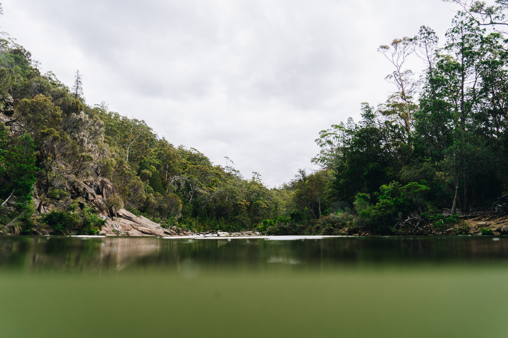
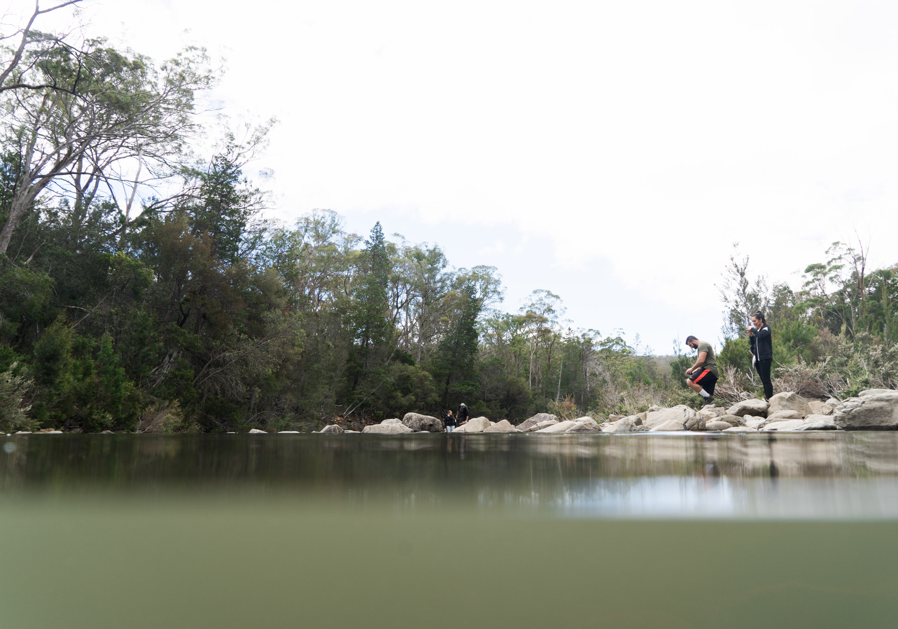
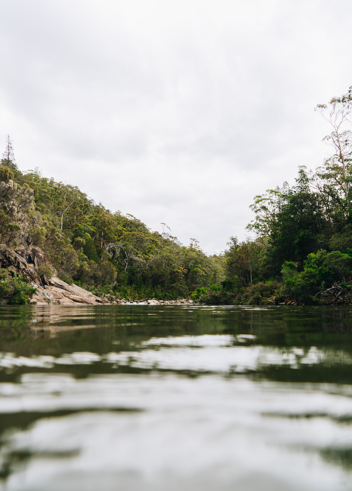
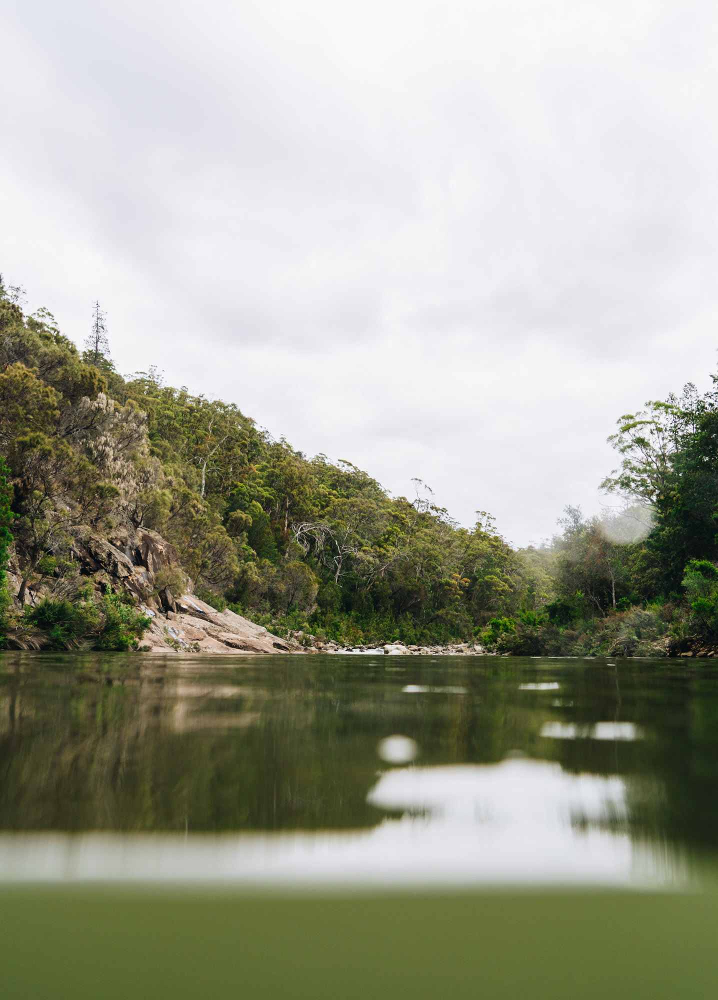
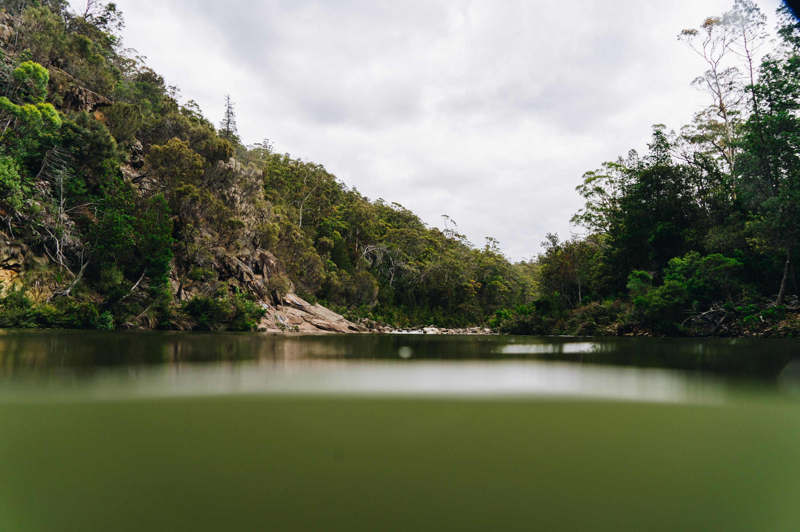

A cold afternoon swim in the douglas waterhole, in Douglas-Apsley National Park, Tasmania. It was the middle of summer and yet the alpine water was freezing. I was the only one willing to swim in the water.

My first plunge into the water. Icecream headache inevitable.

Lime green water.

Few people hanging out, most people didn't pay the parking fee.

My favourite photo from my swim.

Under/over.

Deeper than it looks.

