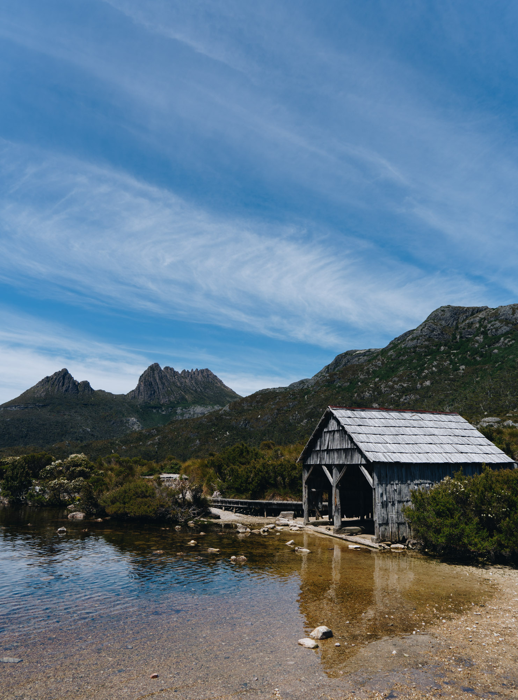
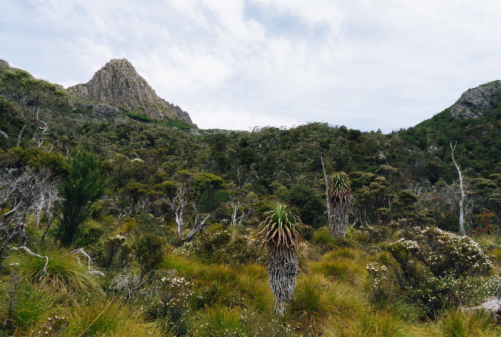

I really wanted to do the cradle mountain summit walk, but I guess the lake would do while I was with my parents.

My first view of Cradle Mountain, truly surreal.

Aesthetic mountain shapes.

The old wooden boatshed. I managed to sneak a photo with nobody around.

High view.

Inside the boatshed.

Mum and dad.

The trees were so green. It helps when its raining here like half the year.

Long exposure.

One of my favourite shots from the mountain. The water was completely calm in this brief window.

Through the forest canopy.

Dad pondering life and mum looking like a kid in a candy store.

Zoomed out.

Pandani plants. Quintessentially alpine Tassie.

Looking down the track

A short snippet of the walkng track.

`youtube: Px5Ki1uXhHI`
