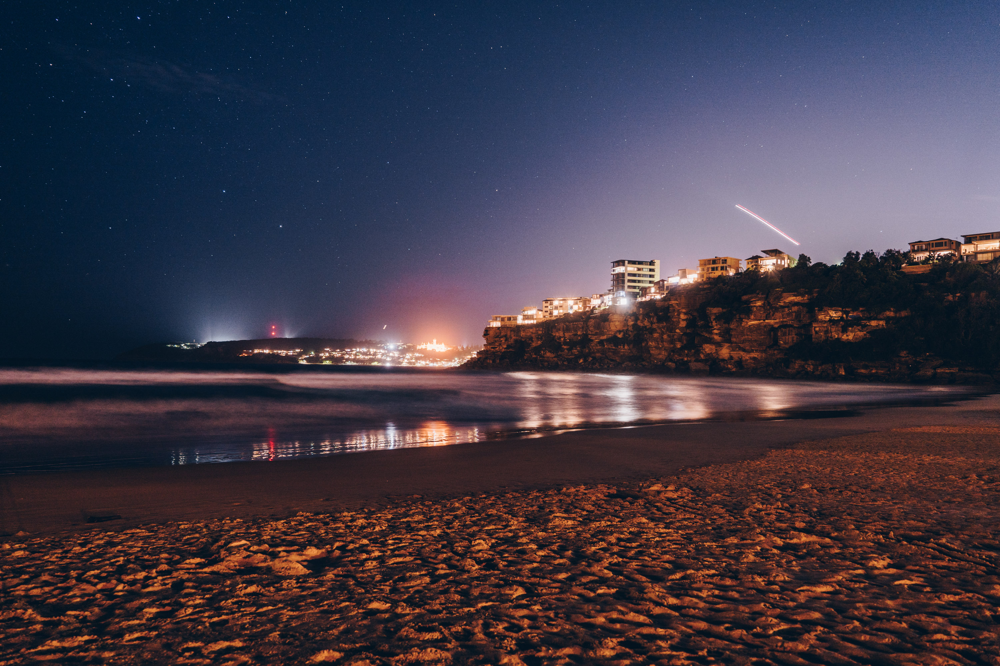
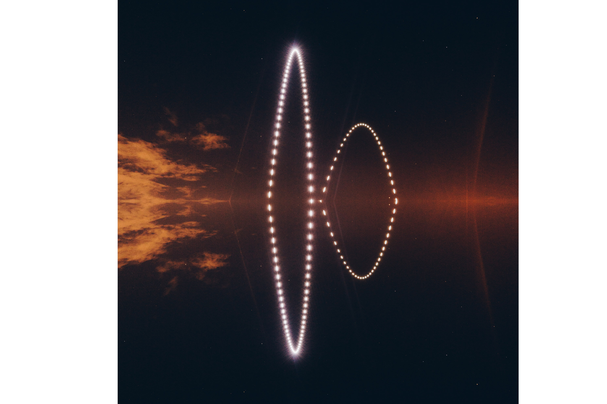

Inspired by some of Reuben Wu's drone lighting work, I 3D printed some lumecube mounts onto my phantom 4 drone and headed down to freshwater beach to test out the long exposure lighting technique.

Waiting for the sun to set at north head.

Joe took this cool long exposure while I was setting up the drone.

Freshie has a nice backdrop for drone lighting, but I think it would have been cooler without the buildings.

Attempting to make a square. I later found out that using the Litchi third-party drone controller software I could program the drone to make perfect shapes.

Getting close and closer to a good shot..

I really like this one

A few variations of the drone position.

Playing with the lumecubes exposing on Joe.

I used a light painting app that changed the colour of my phone screen every second to make a rainbow.

Throwing the lume cube up while flipping it made for some cool images.

Me throwing up the two lume cubes. Never again. I spent 20 minutes trying to find them after this photo.

Throwing up two at once for a mcdonald's sign.

An edit of the previous photo with just the sky as the background.