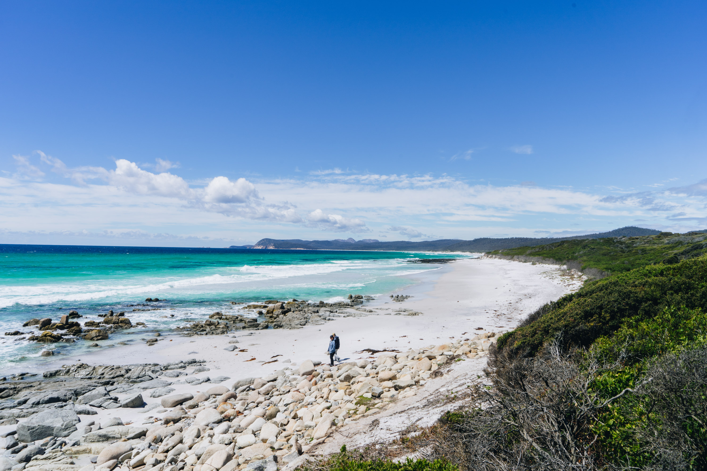
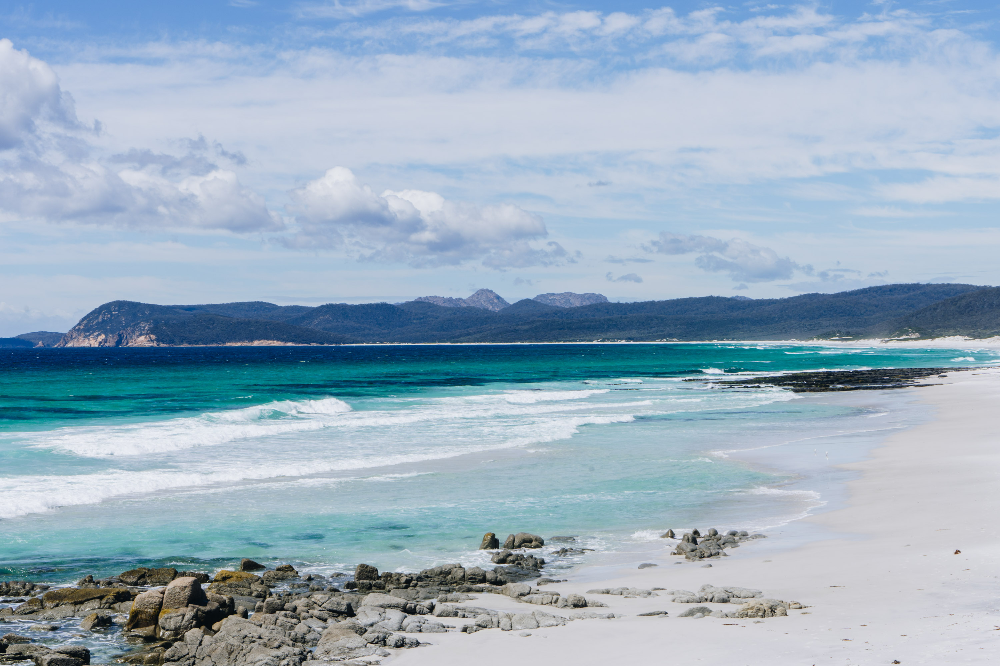
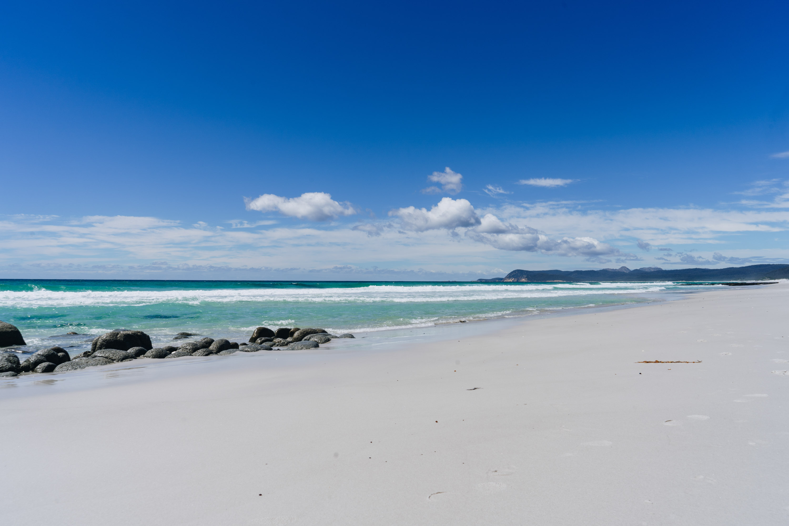
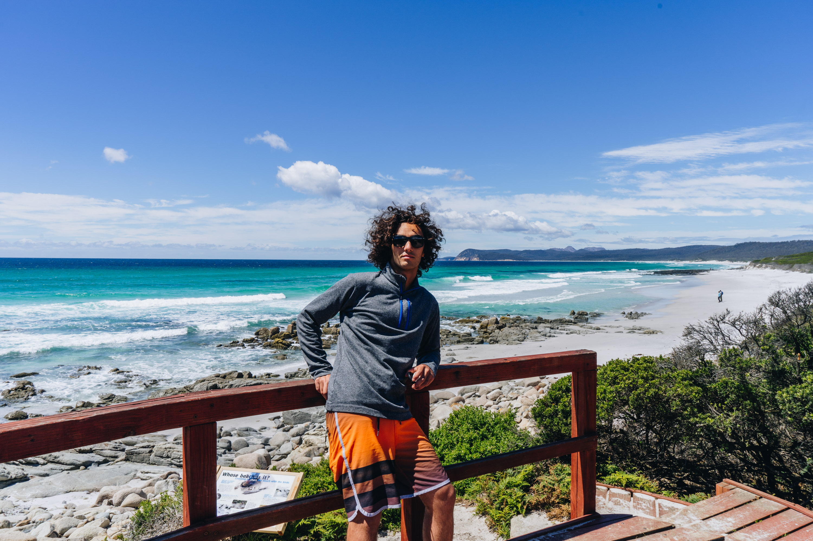
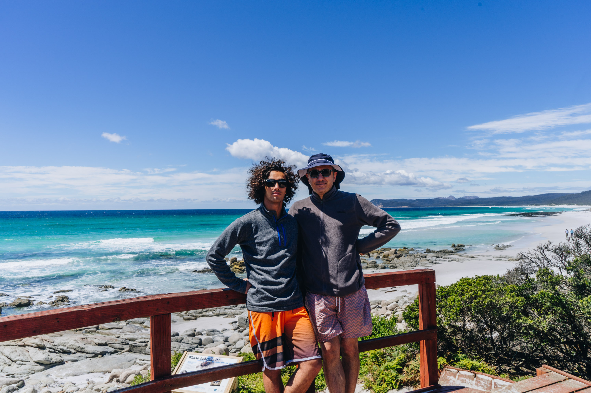
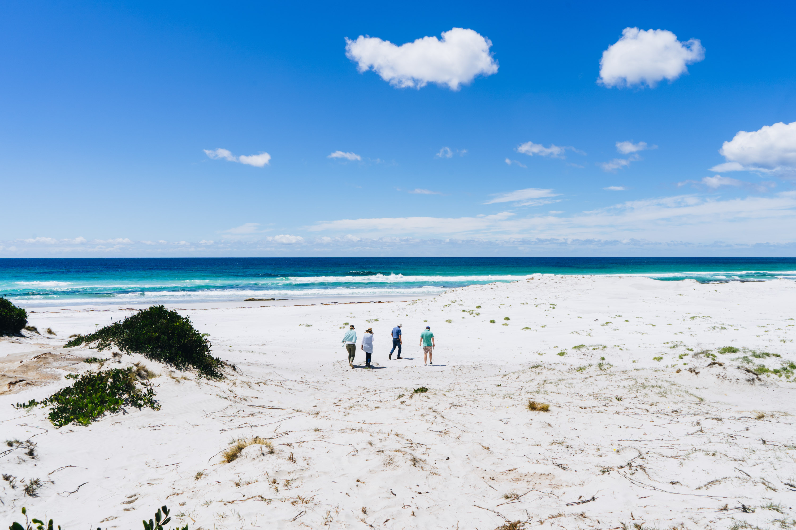
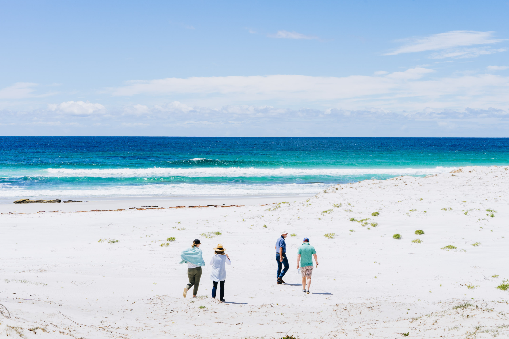
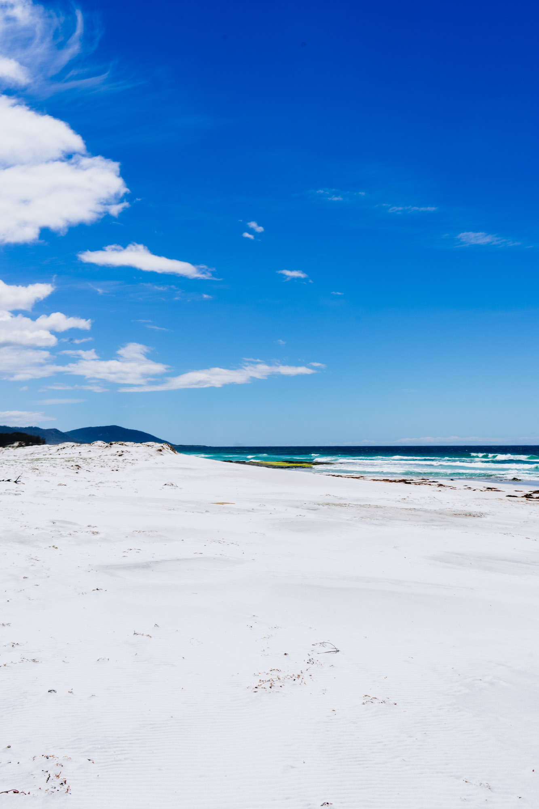
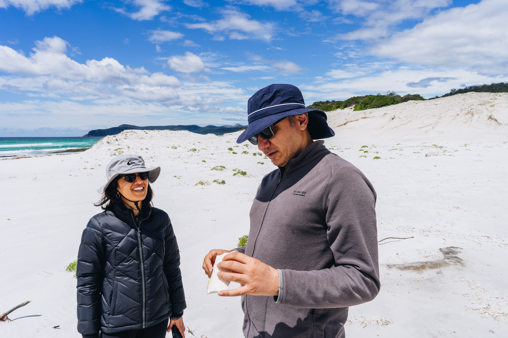

While we were staying at Coles bay, we went for a drive a little up the coast to see if there were any waves around, and to explore the beaches a little.

The waves were tiny, but the beach had sqeaky white sand, reminding me of the NSW south coast.

The mountains of Freycinet in the background.

Teal blue water.

Afroman.

Dad and I.

A family strolling along the beach.

If there was a westerly wind there would have beach some clean mini waves.

Looking north to the moss coloured rocks.

Dad thinking about how he can sculpt the cuttlefish shell.

