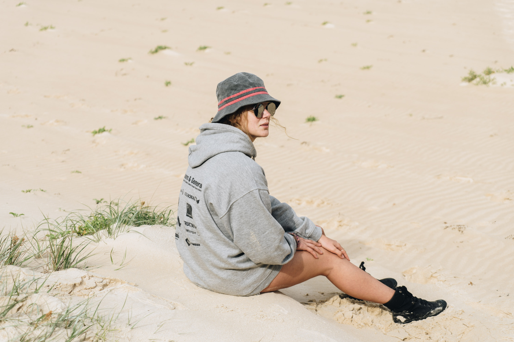
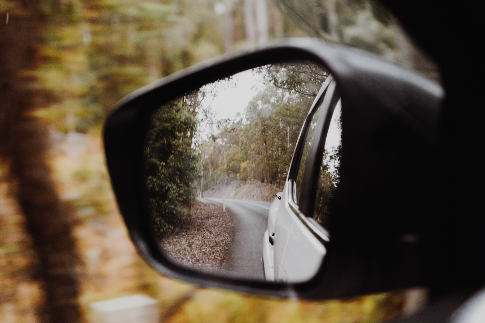

Out first stop of the south coast trip was Meroo Campground. We walked down the track to chill on the beach for a bit after being in the car for 3.5 hours from Sydney.

Banter.

Liam checking out the lack of waves.

Apparently it's a pretty good surf spot. 

Hiding in the grass.

Havin a laff.

Jadon doing a backflip off the mini dune.
 

Around this corner there was a secret beach.

Emilie.

Me.

Joe.

Greg.

Emilie again.

Looking north, the beach was untouched.

Liam checking out the coast.

Onshore slop, but still tiny waves if you were really keen.

Looking out the mirrors of the Navara.

