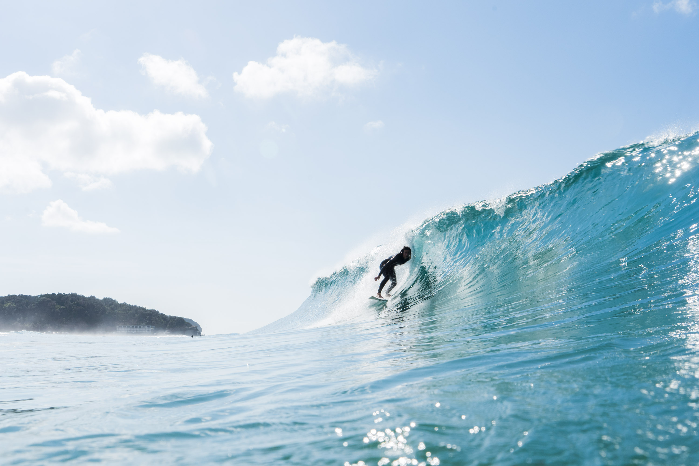
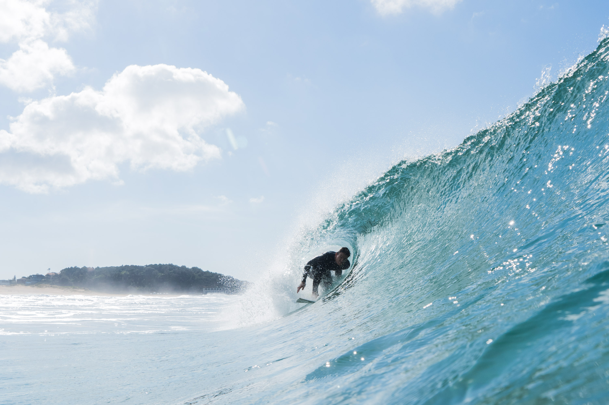
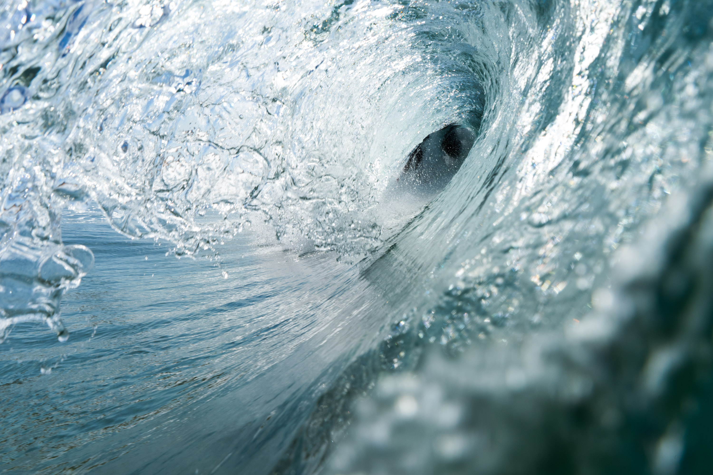
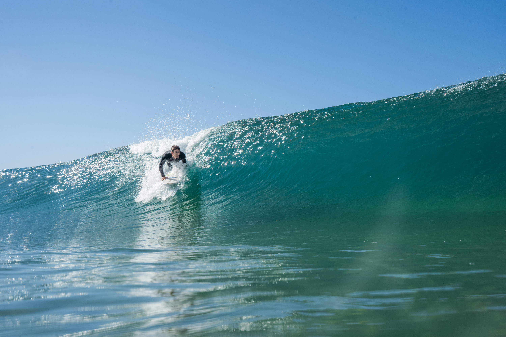
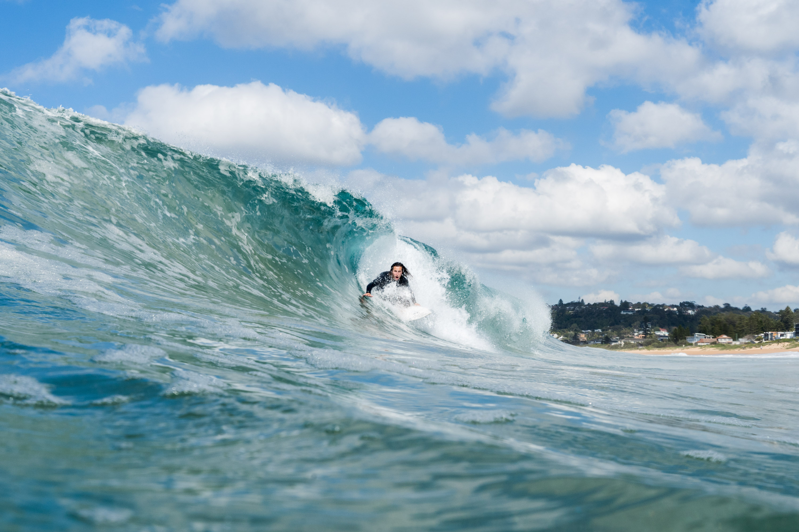
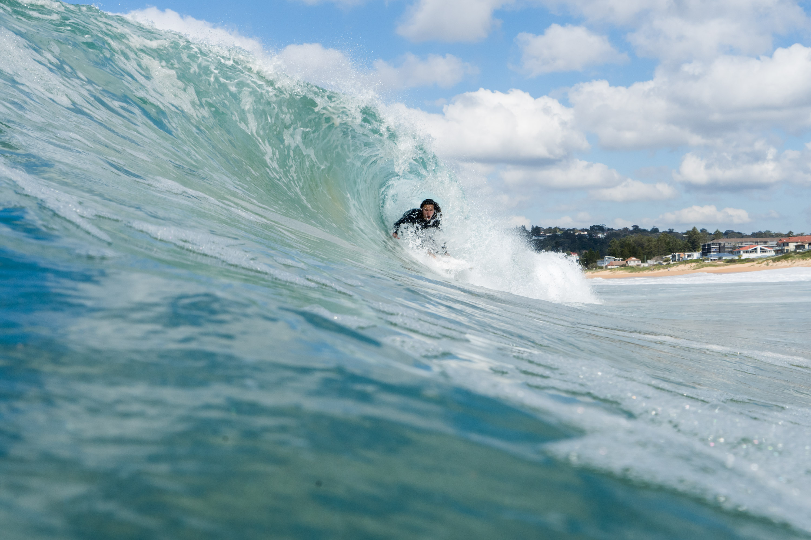
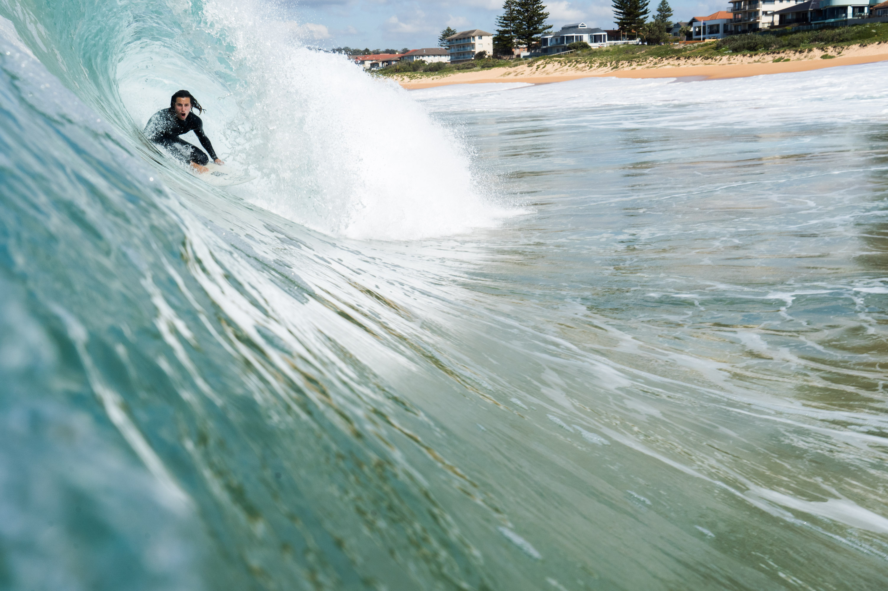
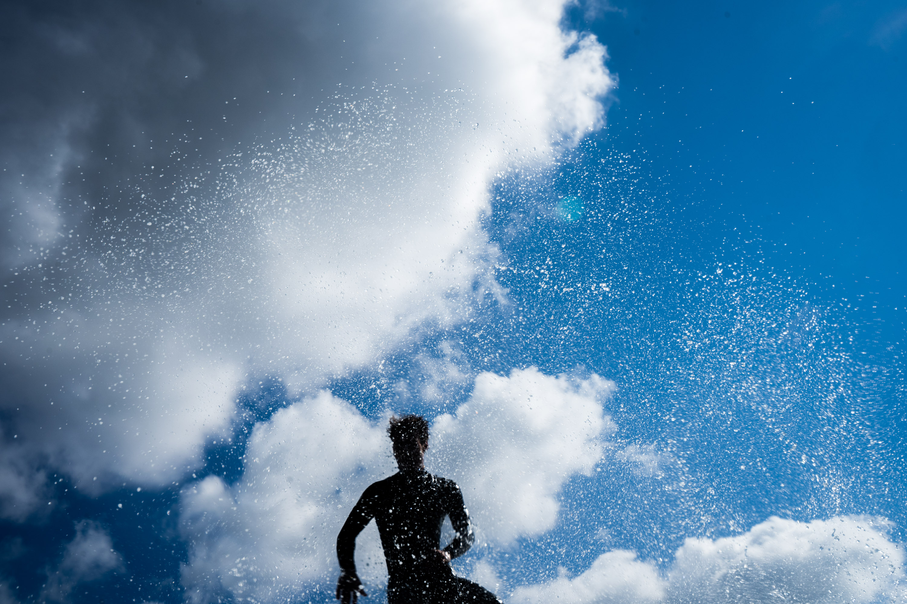
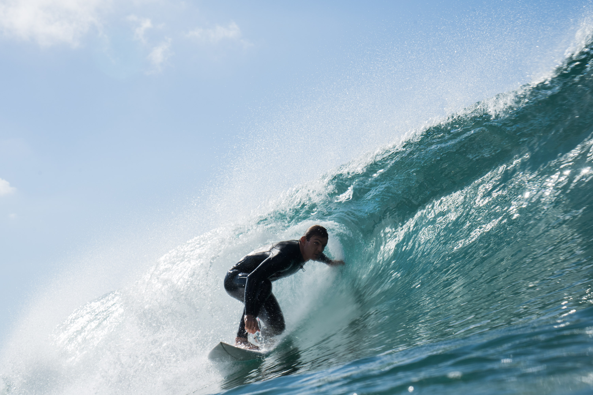
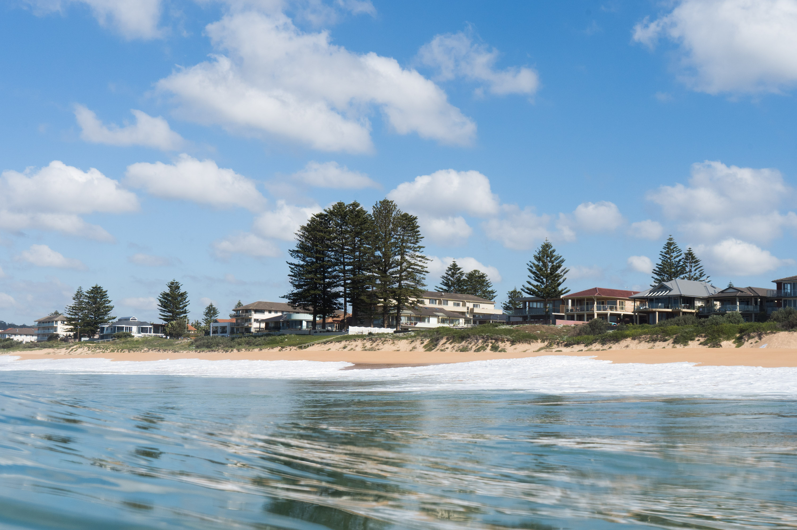

We saw a long-ish period 4-6ft south swell on the forecast and thought it might be good to take the jetski out. It ended up being smaller, and the jetski unfortunately broke down out near the narrabeen carparks. After three hours of paddling the jetski into fishermans beach, it was eventually in.

Darcy trying to get into one.

Gezza in a little tube.

I like this one.

Both about to get lipped to the head.

Chunky right.

Holding on.

Annoyed that the camera was pointing too far down on this one.

Droplets.

Another mini tube.

Some nice pine trees.