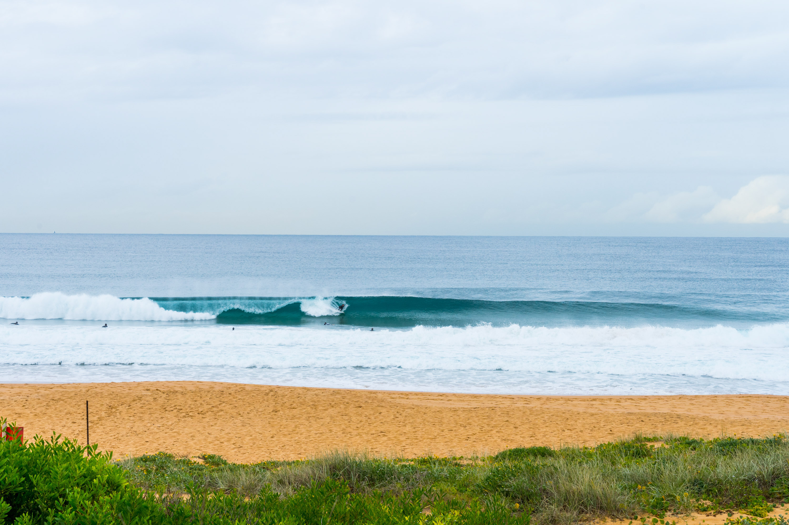

A nice, short period peaky ESE swell hit Sydney today and I just knew it would be pumping. We got to narrabeen at 7:30 and got out there straight away. 

It just kept getting better and better and I got one of the most fun lefts I've ever caught. When I got out of the water, sore from paddling for so long I took some snaps. The pics don't really do justice at how fun it was because it started getting a bit smaller when we got out.

Setting up to pull into a nice barrel.

The next frame.

The last frame. I thought surely that he would make this one but I guess not.

A nice little left nugget, just gotta get on on the shoulder.

Josh's feet, 5mm away from stepping in dog shit.

Through the bushes.

Below sea level wave infront of the lifeguard tower.

