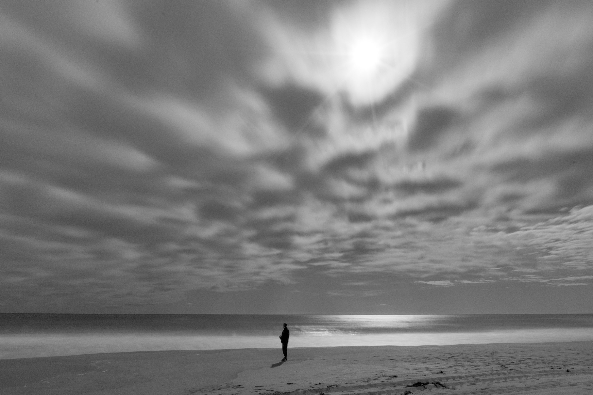

I saw there was a full moon and hurried off to Narrabeen to try capture some celestial light shining up on the beach. By the time we arrived the clouds had concealed the moon completely, but it was so bright that it still illuminated parts of the ocean and the beach.

The test shot. Looks like I need to clean my sensor.

Looks like it was taken during the day.

Dad took a cool photo of me with the moon straight above.

The same image in black and white.

Dad's silhouette.

My favourite photo from the night, Benjamin Everett style.

North Narrabeen pool, flipped.