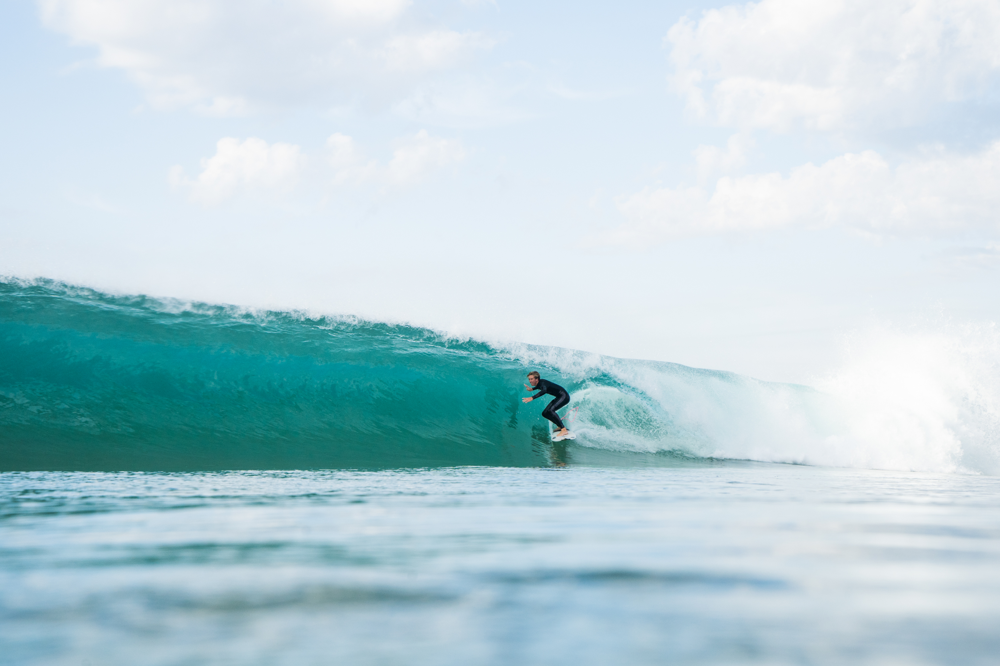

It was a smoky morning from hazard reduction burns going on in the blue mountains and also narrabeen head, but the wind was offshore and the waves around 2-4ft. The swell direction was too south and the tide was a bit weird. The waves weren't great but it was still photogenic and fun.

A nice backlit drainer; one of the better waves of the mornin.g

One of the next frames of the same wave. One of my favoutise photos that I've ever taken in the water.

Jamie airdropping to his death.

The next frame

Right before the impact

Another really nice looking wave, but decievingly fast and shallow.

Kai tucking into a closeout.

Kai tucking into another closeout, this time from the beach angle while I was trying to get my flippers that had fallen off back on.

Another little washing machine.

Kai threading the needle on a nice right.

Jamie straight air punt down the beach.

Jamie pulling into the biggest wave of the morning, still not that big.

Nice little cover up.

Bracing for impact.