The day after the fun, peaky ESE swell hit a larger, longer period SE swell appeared for the next morning and the rest was history. Some of the best shaped waves I have ever seen. 

Empty barrel after barrel was just reeling off down the left bank.

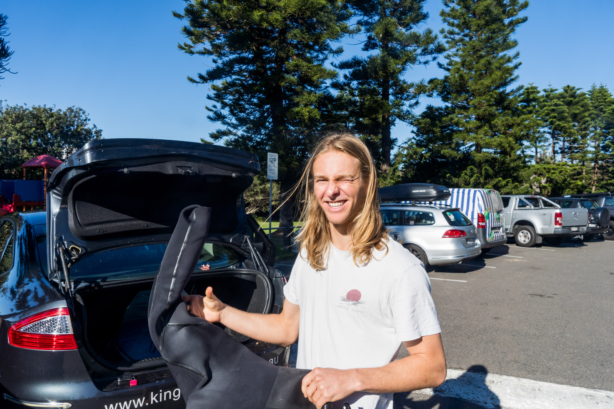

Josh suiting up, ready to cop a beating.

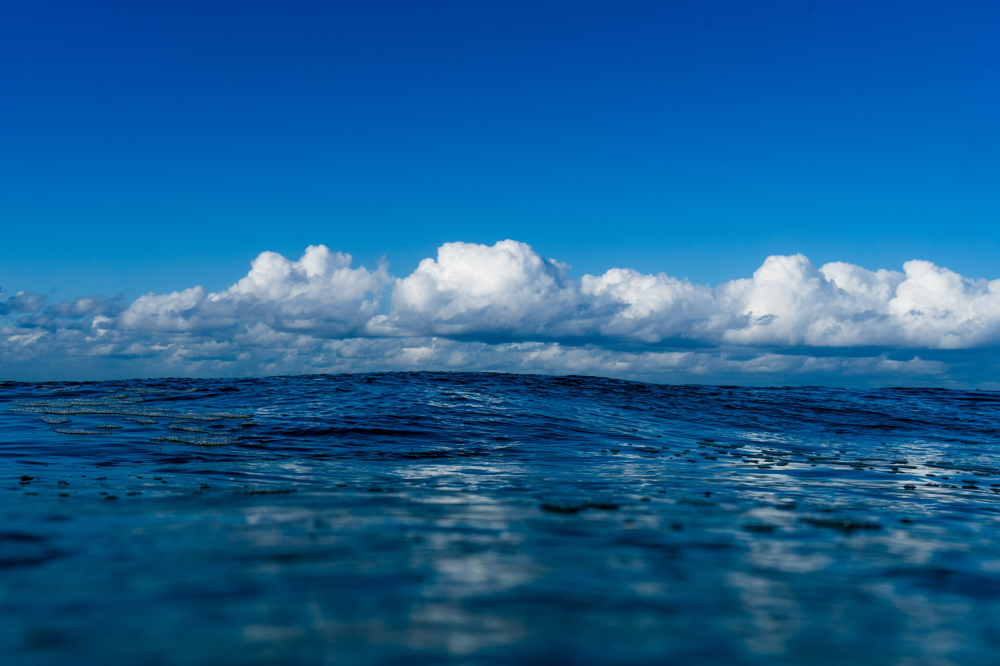

Clouds, Morgan Maasen inspired.

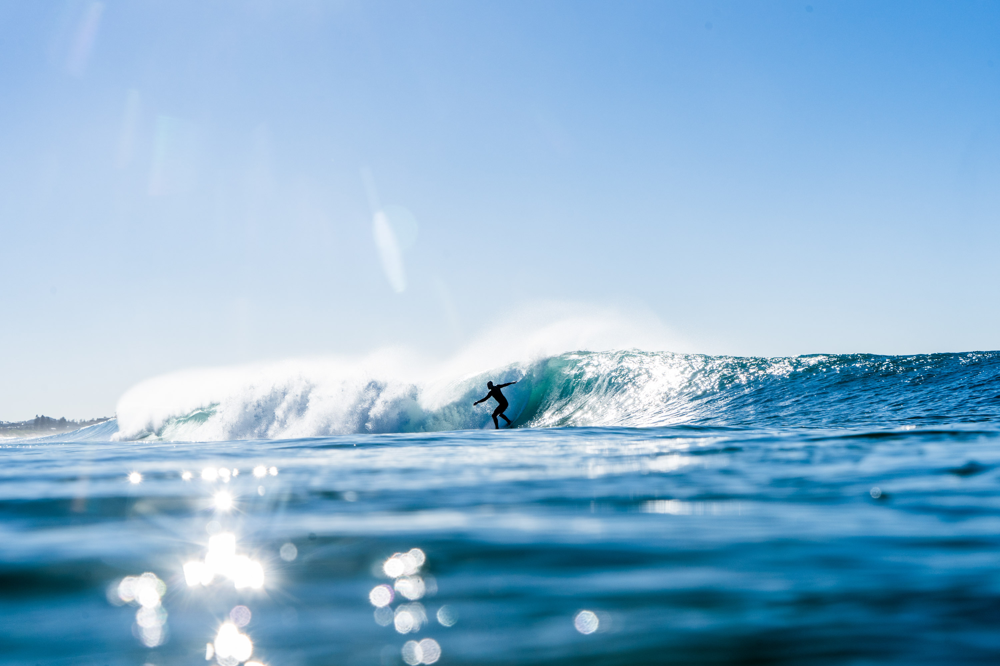

The first image of a large barrel sequence.

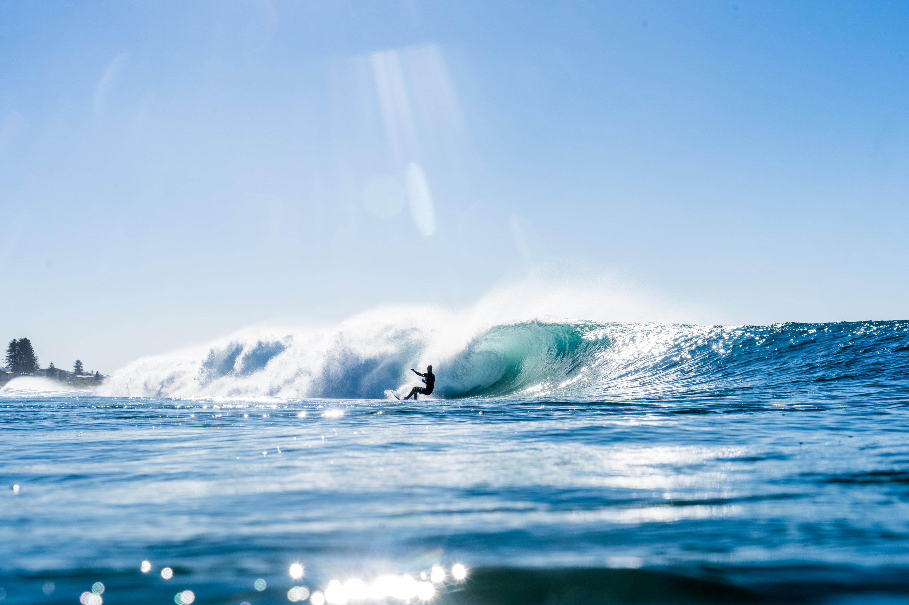

Swooping around, ready to stall.

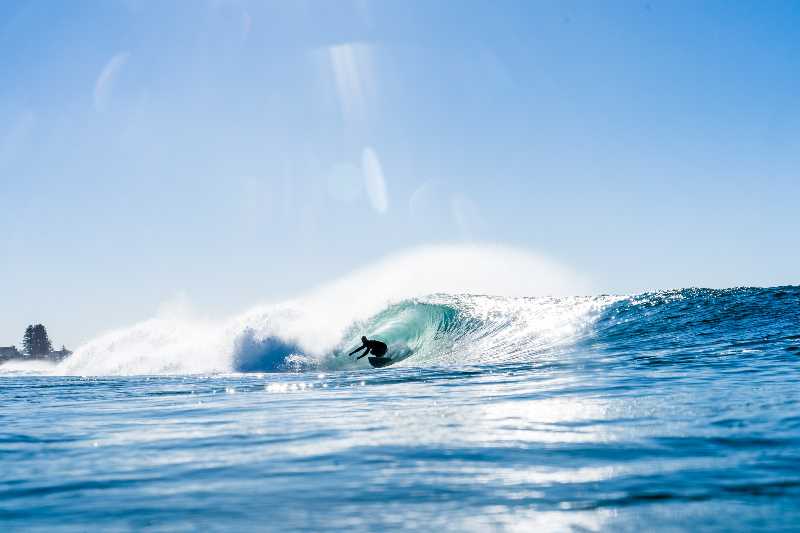

Check turn.

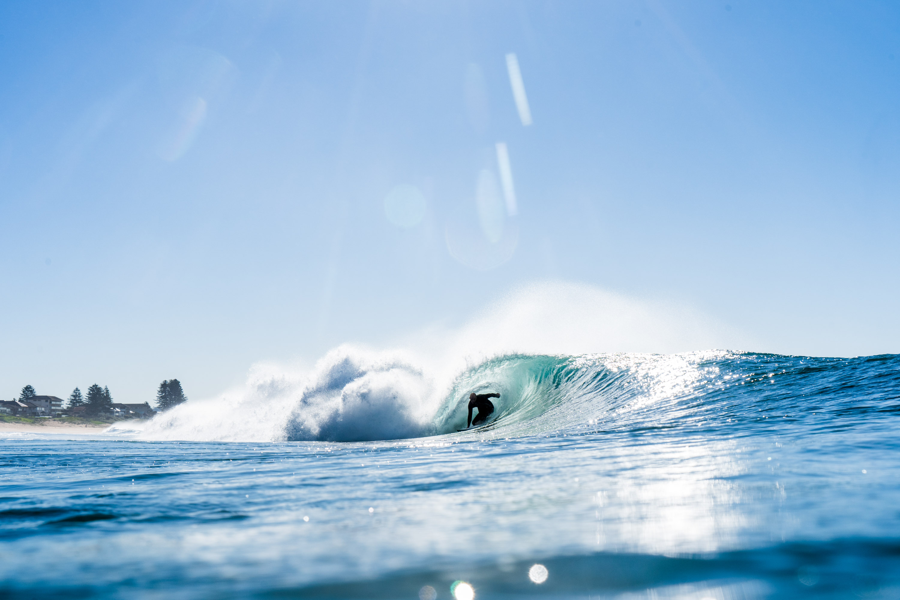

Locked in and holding on tight.

A couple seconds later.

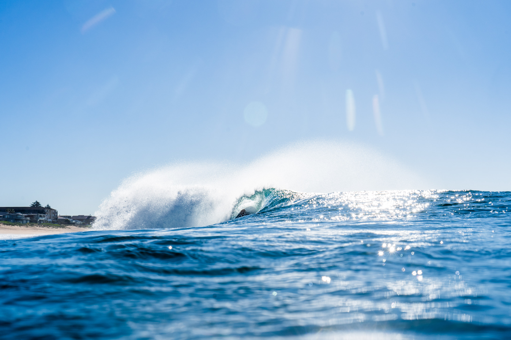

Getting pretty deep here, but he made it. This guy was definetely the standout of the session.

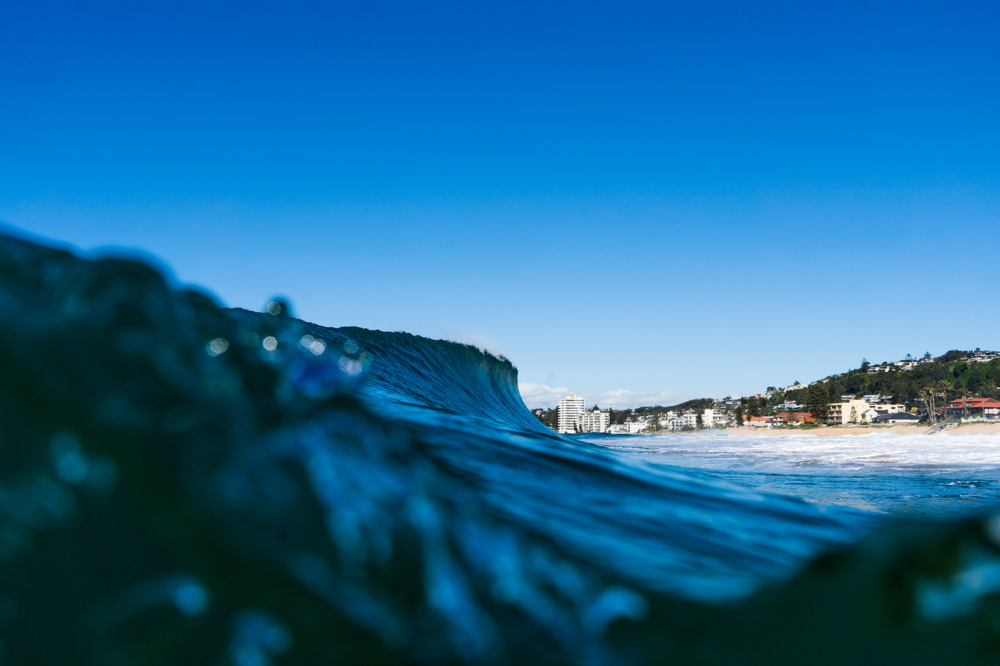

A nice right getting ready to throw wide.

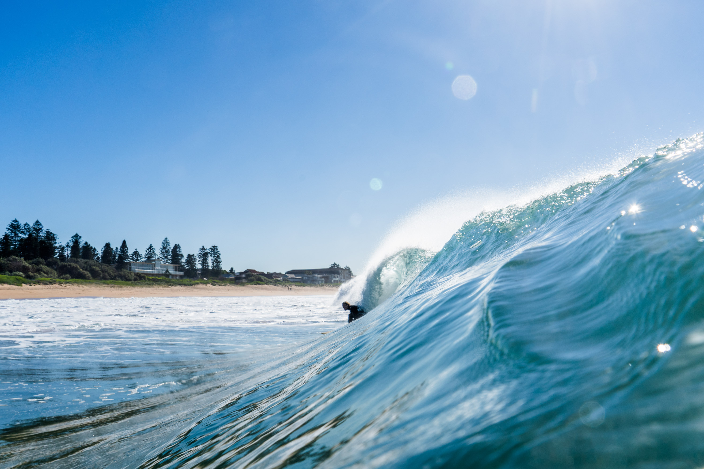

Josh tackling a nice double up.

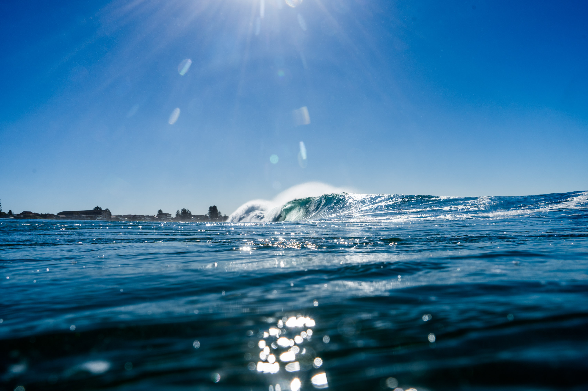

Picture perfect empties.

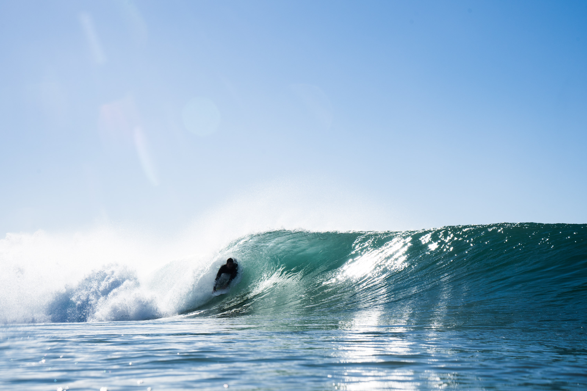

Small insider. Still fun.

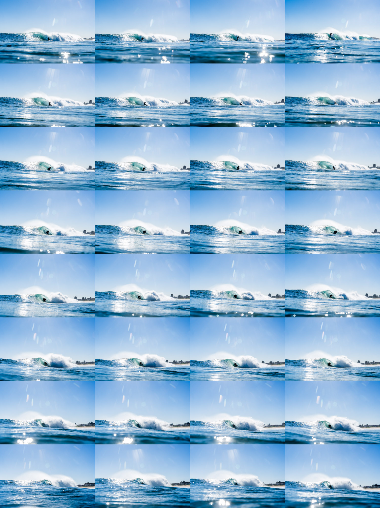

The full sequence of a nice little barrel.

