The waves were smal but clean, it was the perfect day for doing some tow ins and perfecting the air game. Jamie drove the jetski up to south narrabeen from the Fishermans beach boat ramp and enjoyed a 1-2 hour session towing into some fun ramps with a couple brutal falls and broken boards.

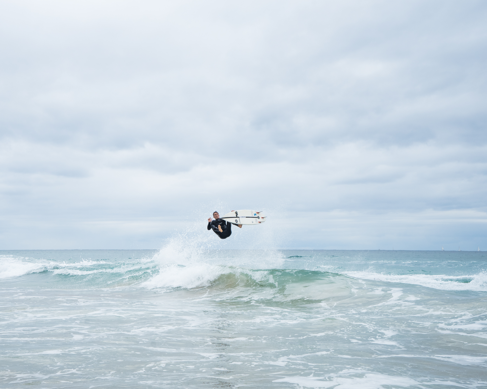

Gezza boosting pretty high for such a tiny wave

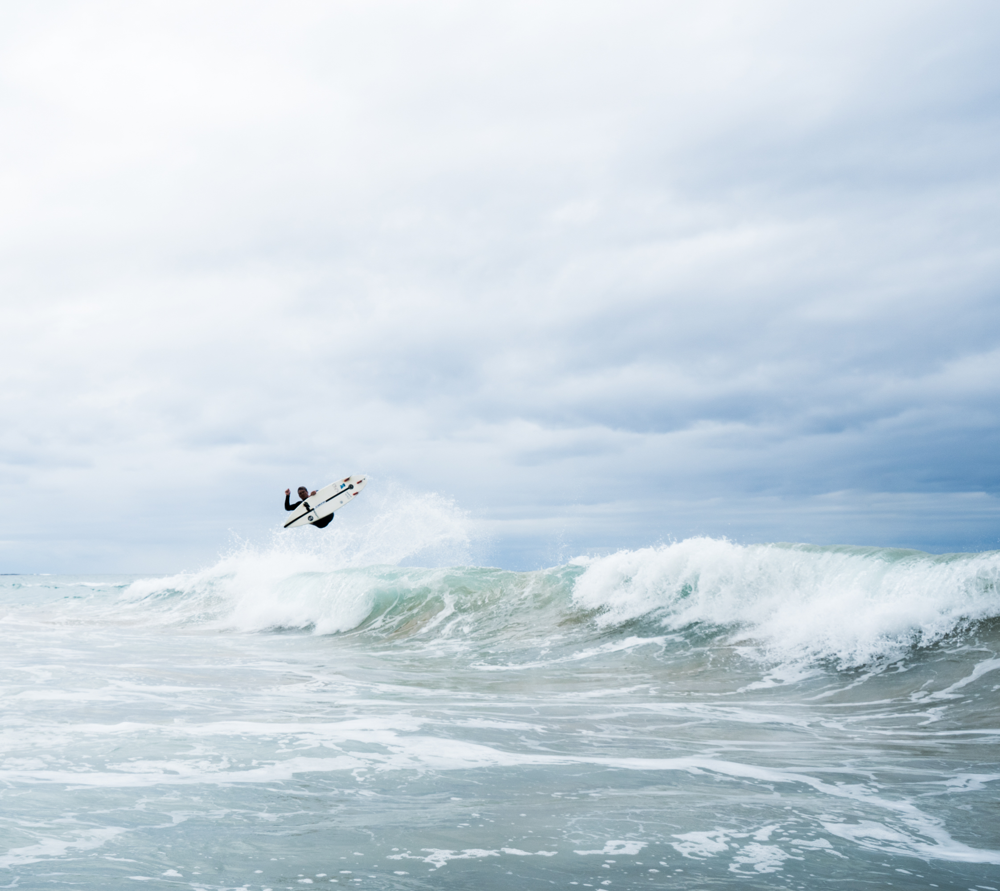

Another tail high boost from Gezza on a smaller wave

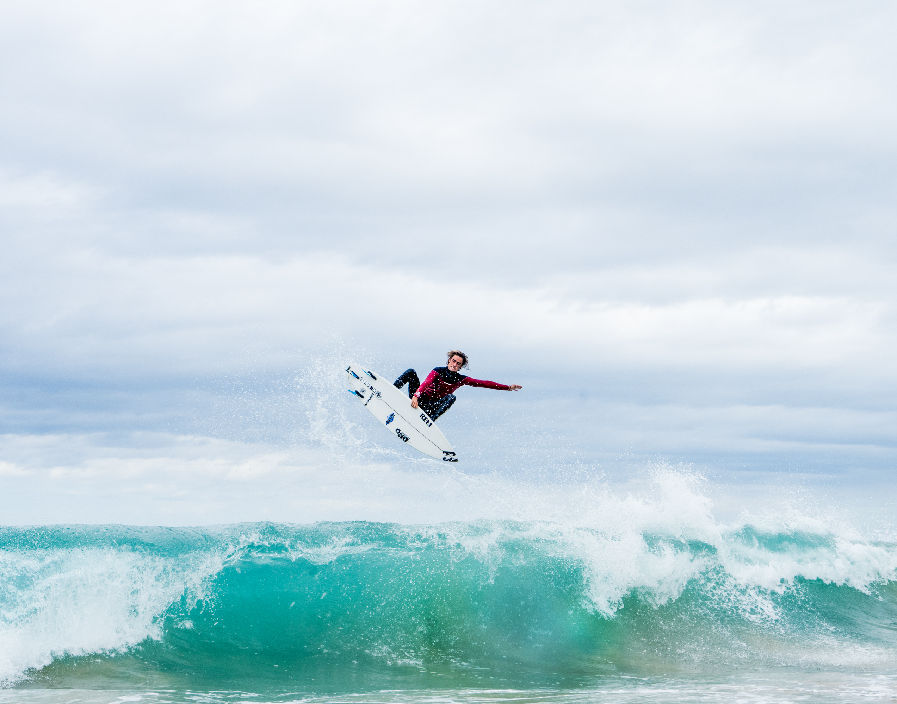

Straight air rocket punt

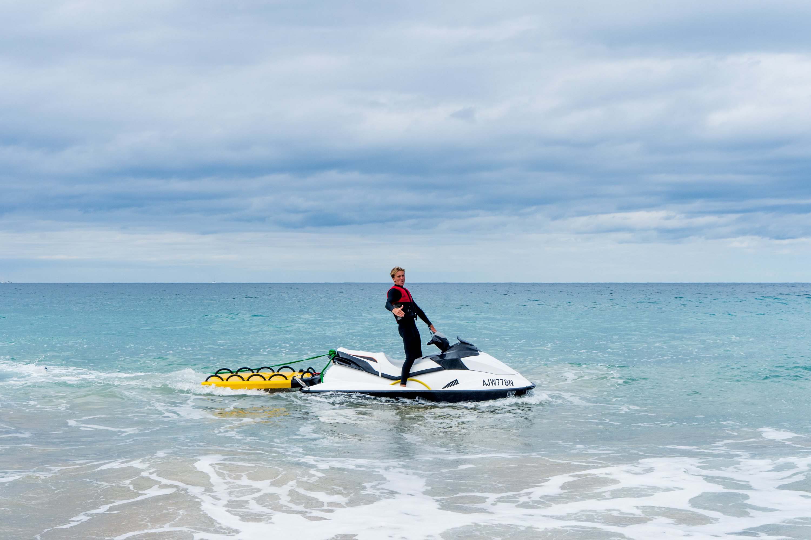

Jamie the jetski boy

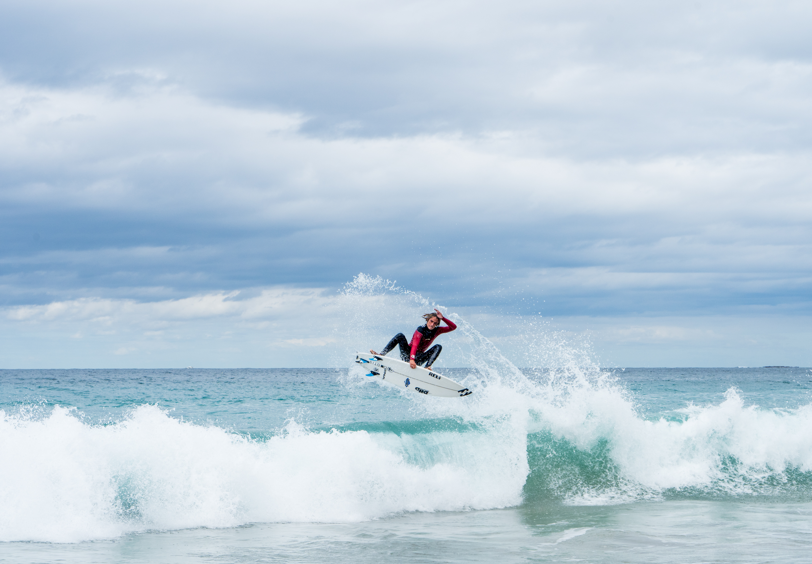

Duke spinning another cool reverse

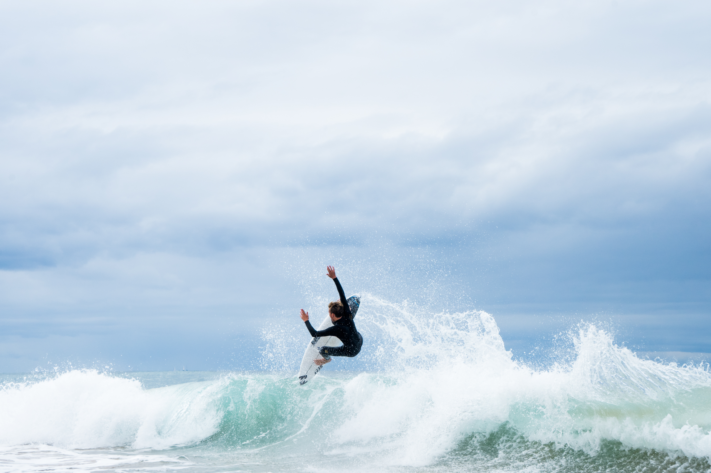

Jamie doing a nosepick air with some storm clouds brooding on the horizon

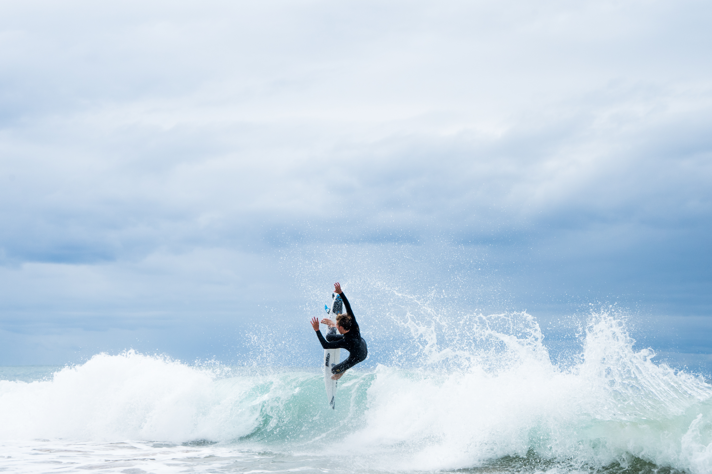

The next frame of the nosepick, he came disconnected with the board

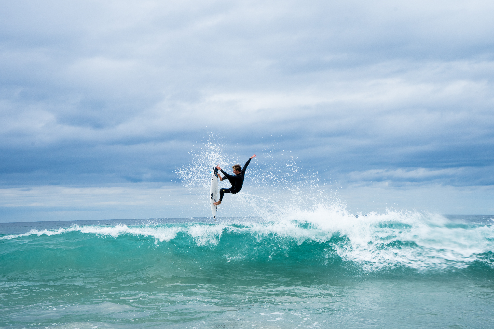

Another cool straight air, the tail was pretty high on this one

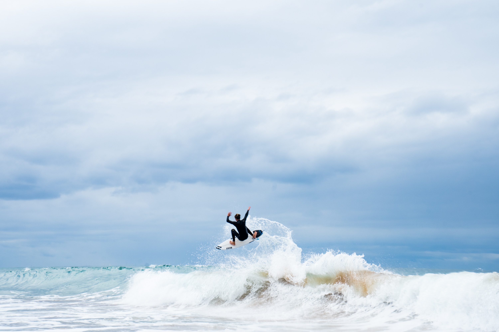

Boned straight air

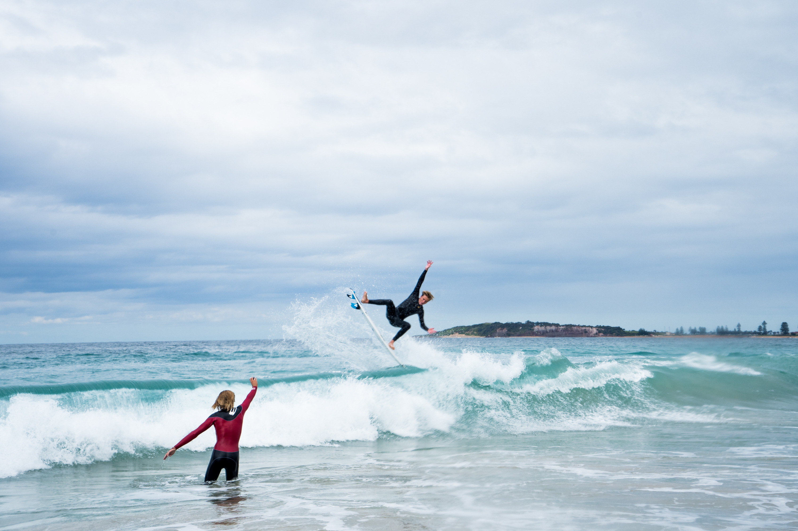

Jamie's air reverse with Duke getting the shot on his gopro

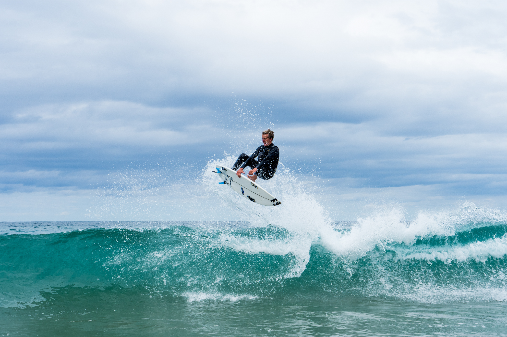

Indy grab air reverse

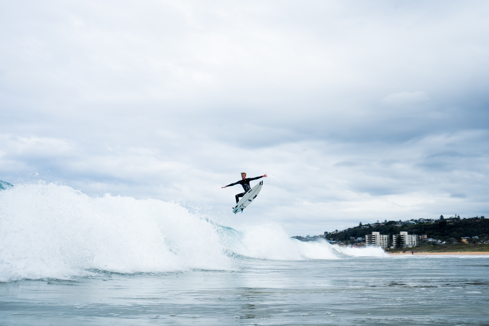

How to break your board

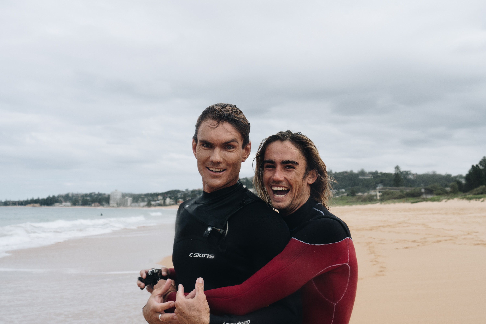

Having a laugh