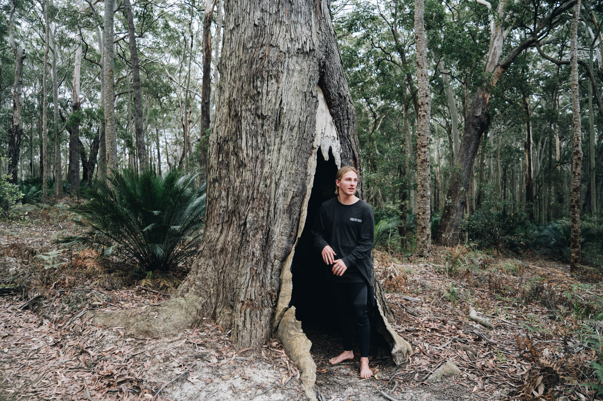
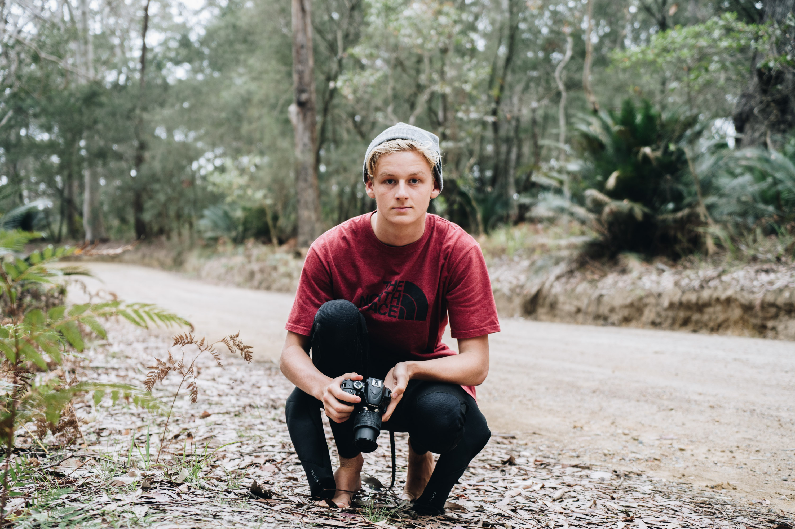
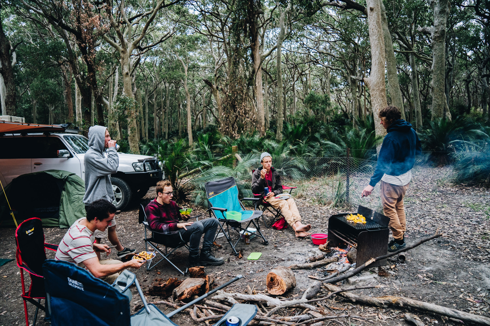

On the drive in to the campground we found this crazy hollowed out and burnt tree. Had to stop and take some photos. 

I can't remember why we were all in our wetsuits, there were no waves.

Josh and Liam looking up the tree.

Joe also in his wetsuit.... strange.

Jadon chillin in the tree.
 

The fleet of cars.

Cooking dinner.

Nice little fire stoves at every campsite.

Liam with his nutritious sausage, steak and potatoes.

Josh cooking up the mexican sausages.

The next morning, Liam and went for a fish off the northern headland, but had no luck. While we were walking over the rocks we spotted a really deep looking waterhole, which we eventually got everyone to come have a swim in. It was probably deeper than 5 metres in some spots!

A small part of the waterhole.

The sharpest rocks I have ever felt in my life.

Rory and Josh.

McNutt jumpning in while everyone watched. Rory is also underwater too.

Explosion.

Good pic for the modelling profile.

Getting deeper.

There were so many urchins everywhere. Explains why it was so barren down there. 

If you look closely there is an eagle perched on the clifftop.

Sharks view.

A cool one, taken by Josh.

Trying to do an over/under doesn't work with a flat port.

Me throwing a shaka. Not very photgenic underwater.

The paj leaving the campground the next day.

Cheeky.

Best or at least second best campsite I've been to. The forest was so lush. 

Looking down towards the road.

Everyone telling me to hurry up so we can leave.

