On our first morning at Saltwater Creek in Green Cape, Joe, Kaelan and I ventured off on the rocks to see what cool things we could find. We ended up finding a crazy blowhole/sea cave and some clear quartz crytstals too.

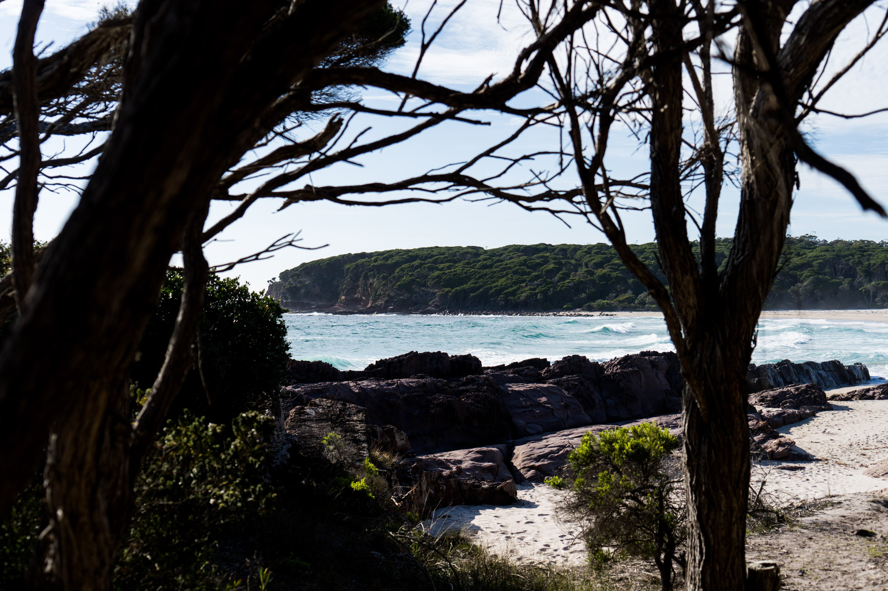

View from the walking track.

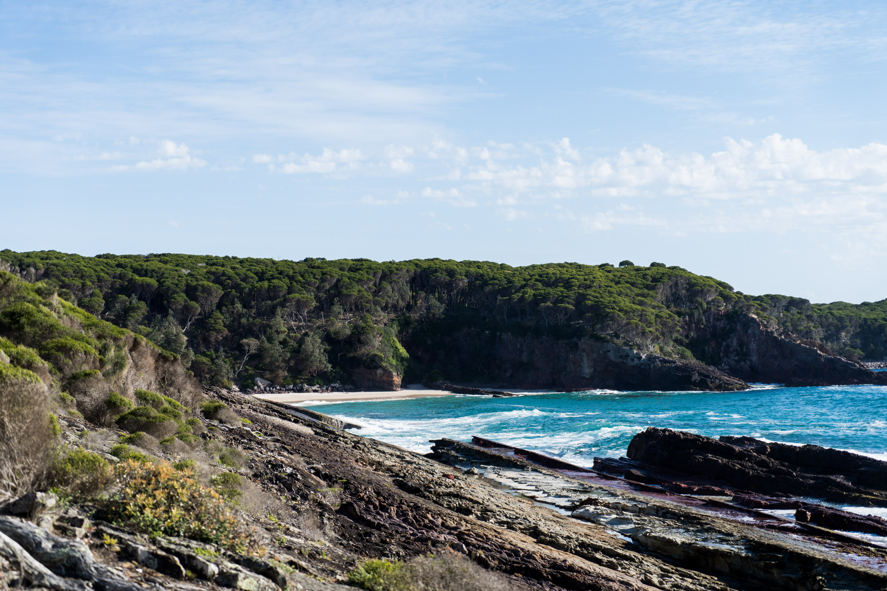

The hidden beach we tried fishing at the afternoon before. You can either scramble around the rocks to get here or climb down those cliffs.

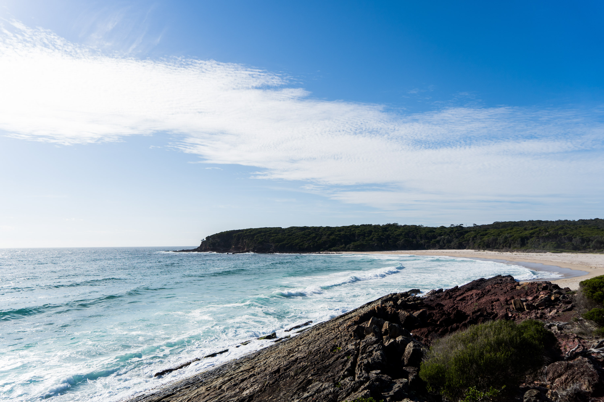

In the southern corner there's a nice pointbreak. Shame there was no swell when we were there at all.

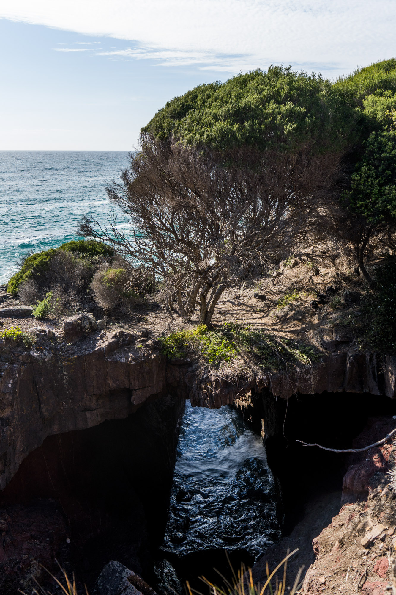

Only a thin layer of rock under this tree.

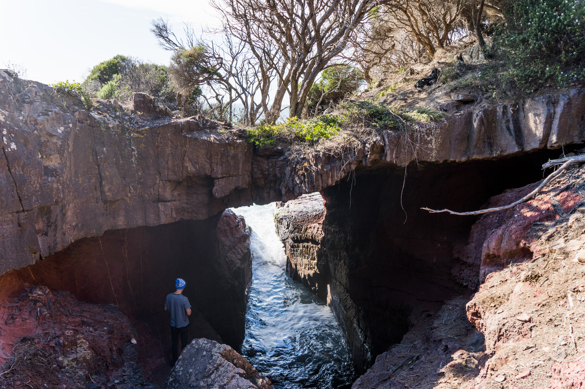

The inside of the cave was fully red, like some other rocks in the area.

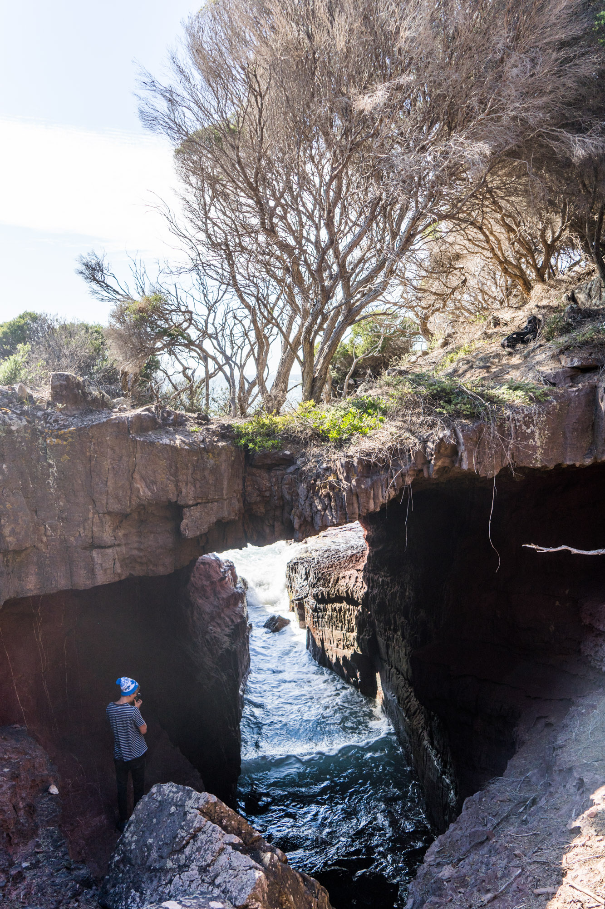

I imagine this will collapse one day.

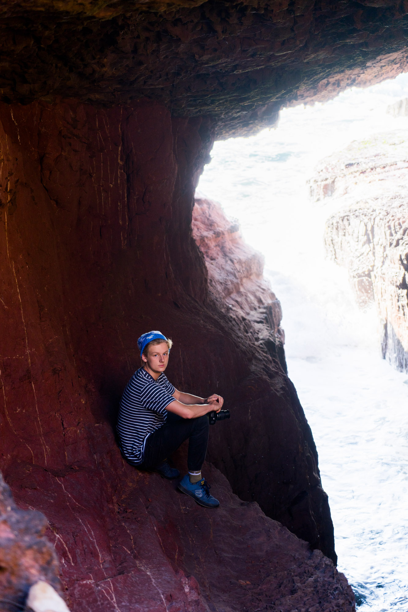

Joe sitting in a sketchy part of the cave.

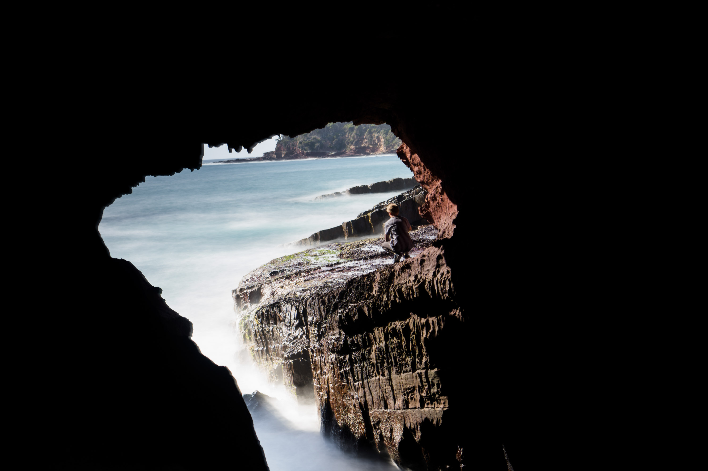

Testing out some long exposures. Some came out cool.

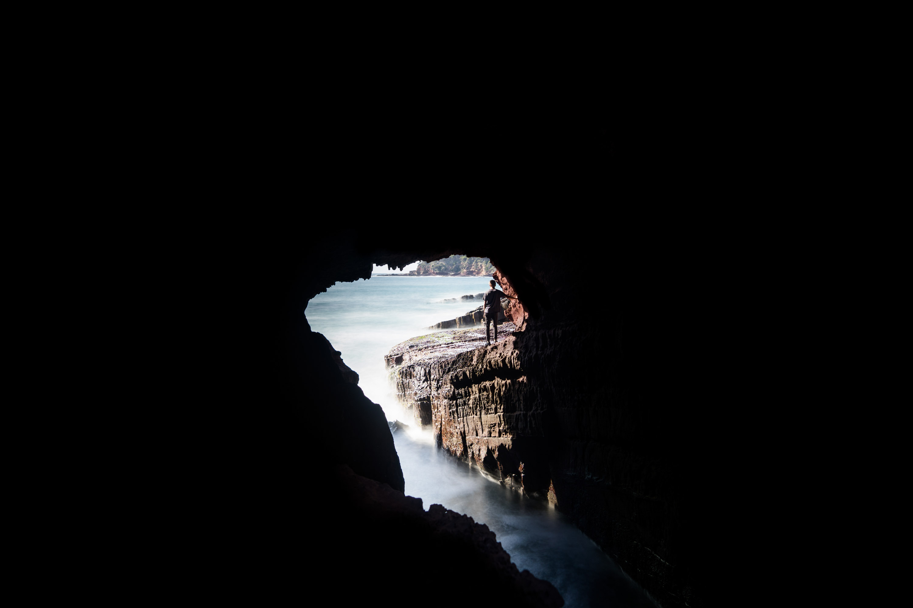

My favourite one.

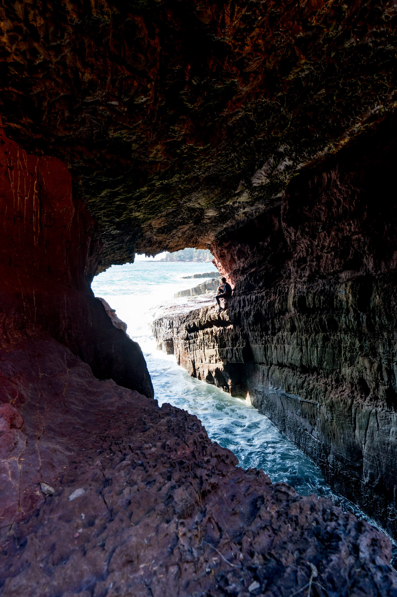

The inside of the cave, normally lit.

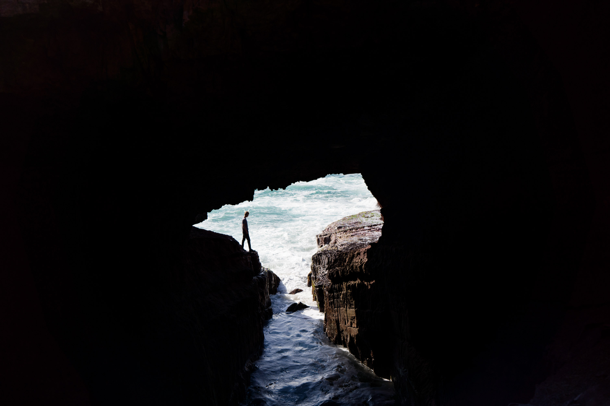

Another really cool view inside the cave. Joe was contemplating trying to jump across but gave up in the end. It was quite large.

A closer view.

