The week starting from 4th July was one to remember. Relentless east swell is not a regular occurence during winter in Sydney, but we'll take what we can get. Unfortunately I had to get my wisdom teeth out on the fifth so I only got to witness the first day of the swell which was probably the best anyway.

I got to North narra around 10:30 and it was just lines stacked to the horizon. I don't think I have ever seen beachbreak waves in Sydney this long. It was just hitting the bank perfectly. I flew the drone for a little bit to show how the dynamics of swell and sand were coming into play to make some fun waves.

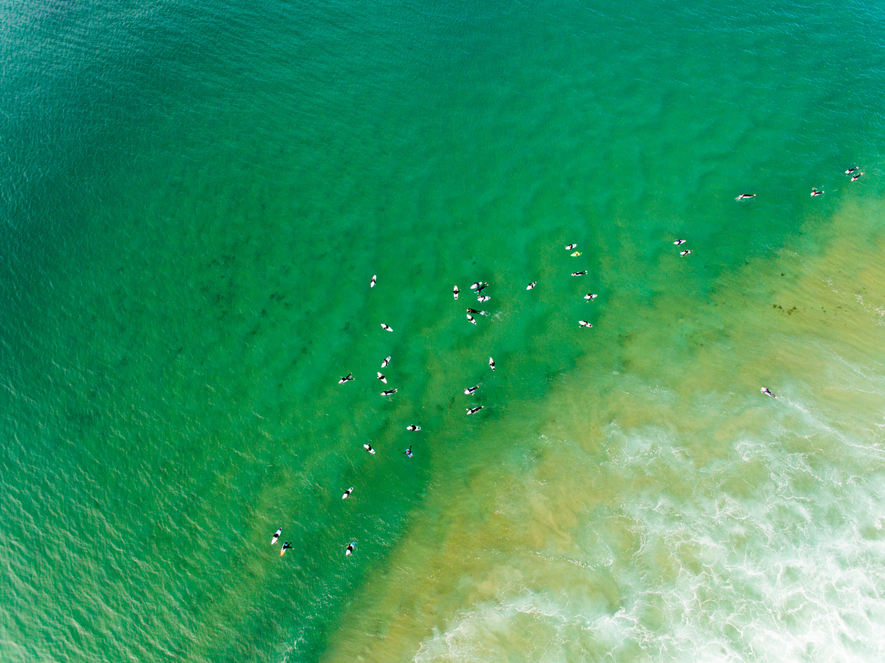
Too many people out. This is only 1/4 of the crew.

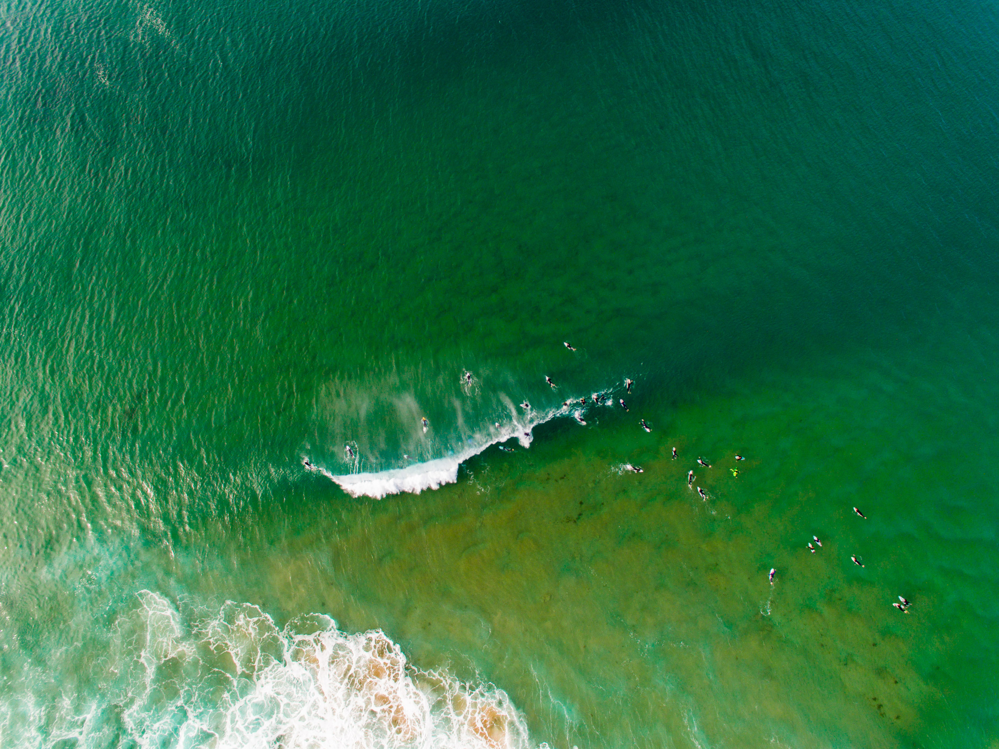

The lefts were wayy better and much longer, as seen here.

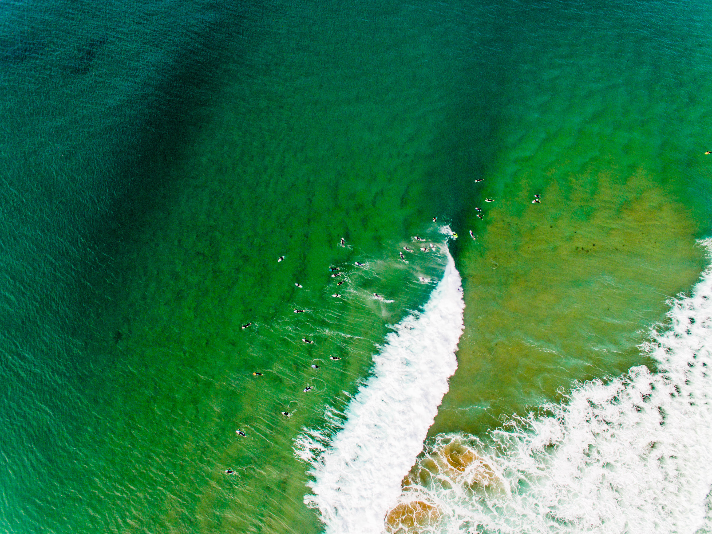

Another view of the perfect, reeling sandbank.

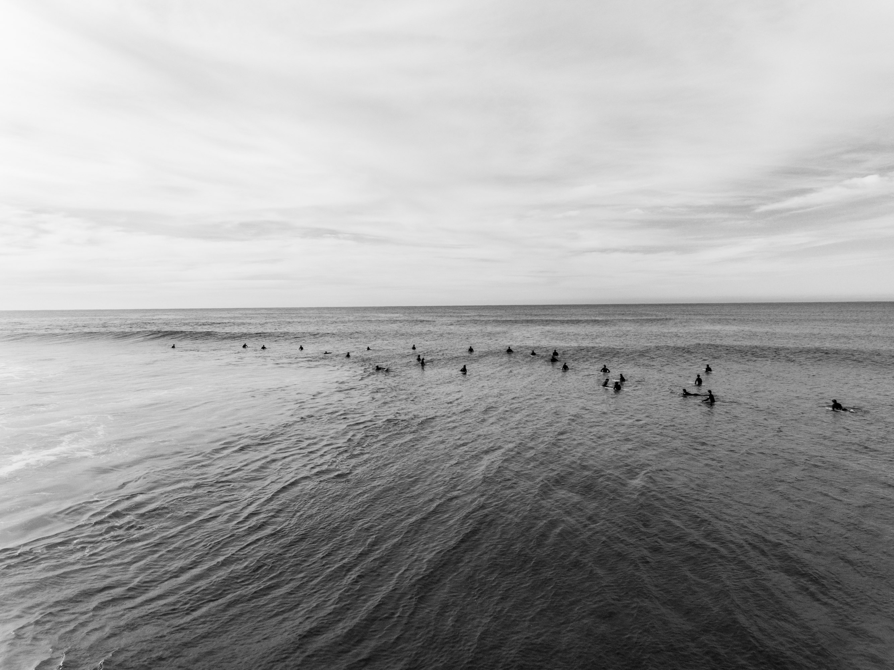

Monday blues.

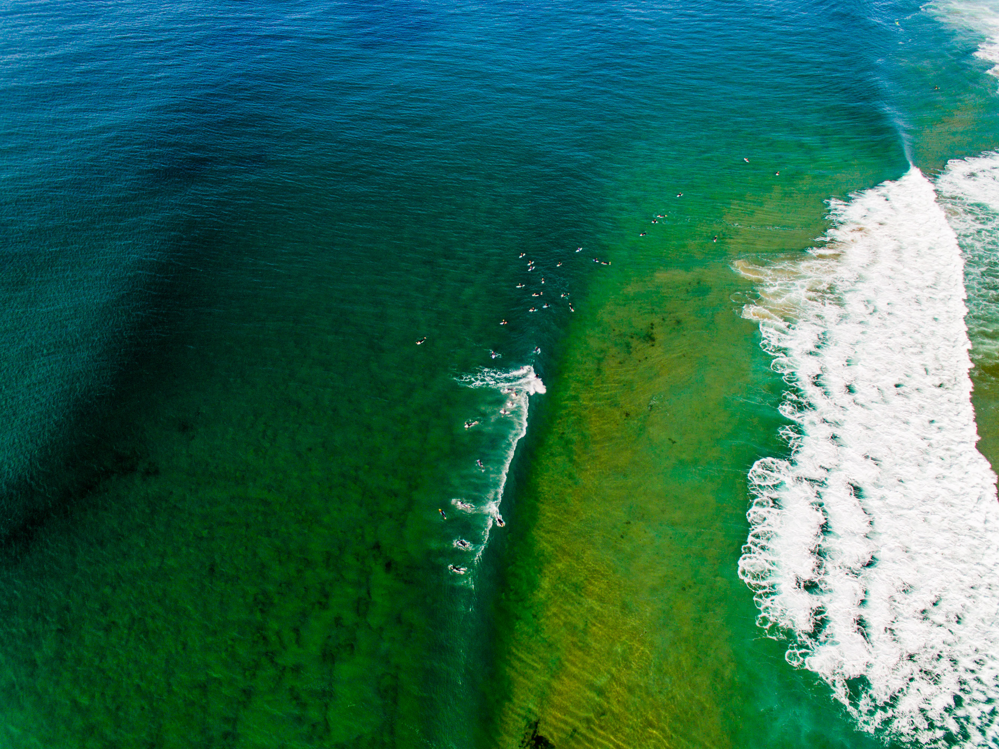

Looks like an A-frame from above, but I bet the right closed out down the line. You can see how shallow it really is from this view.

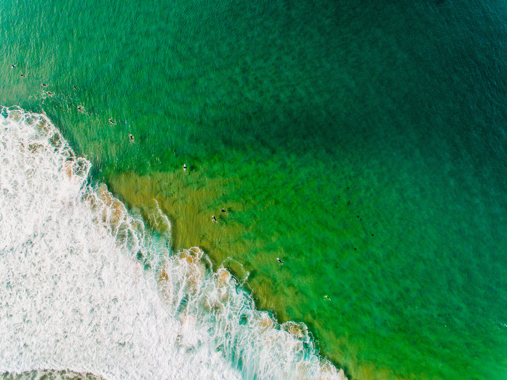

The channel.

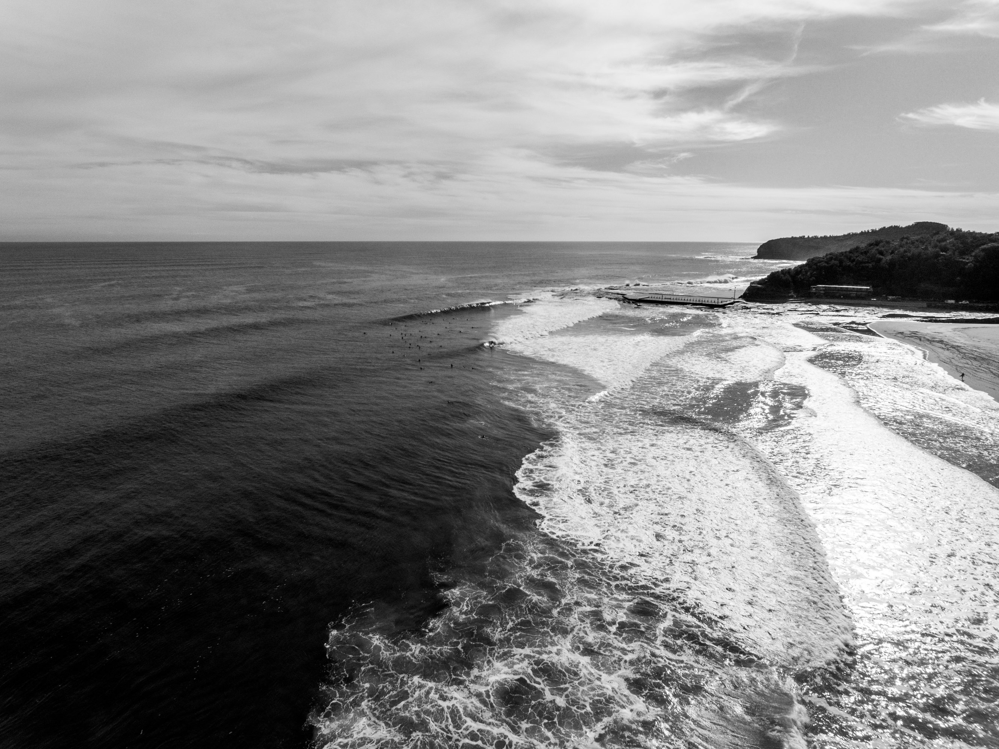

If North Narrabeen was a right. Pure heaven right there.

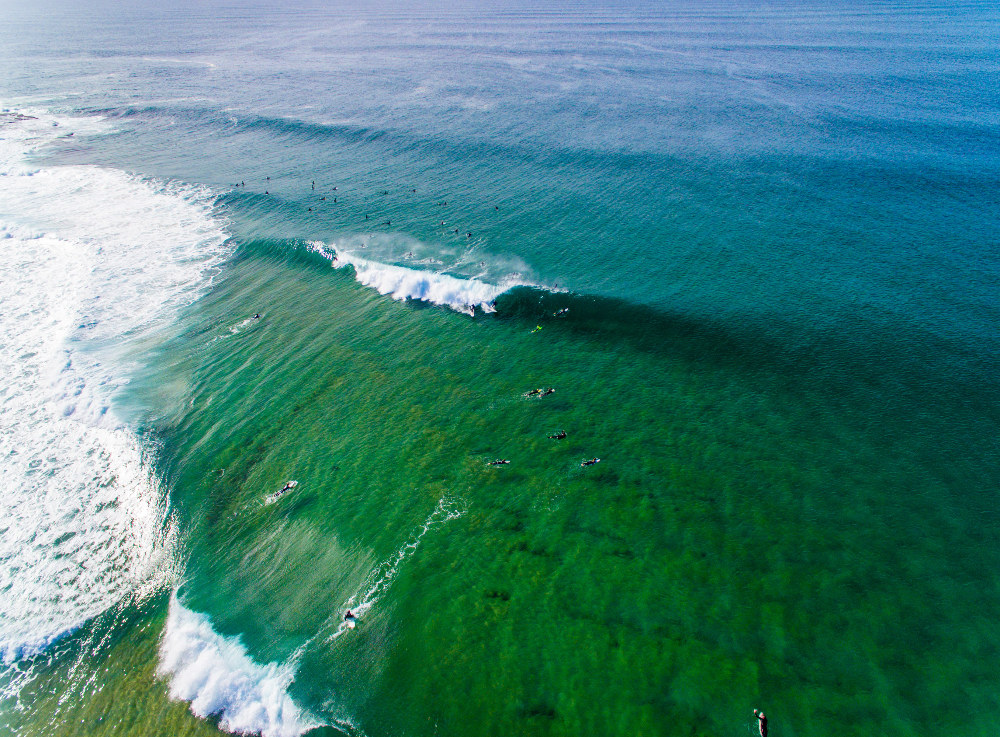

Nice A-frame peak. This wave went on for 150m +.

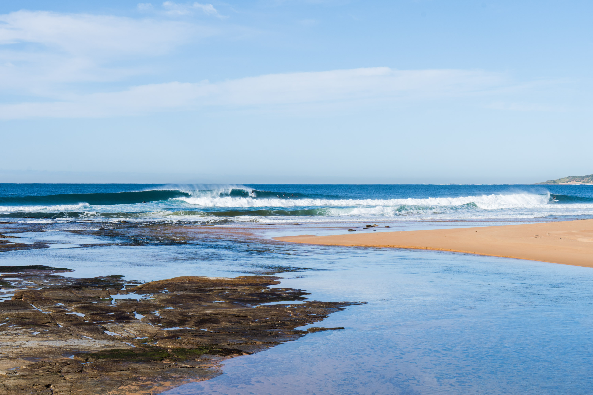

An interesting vantage point I found from the lagoon. Shows the length of the wave well.

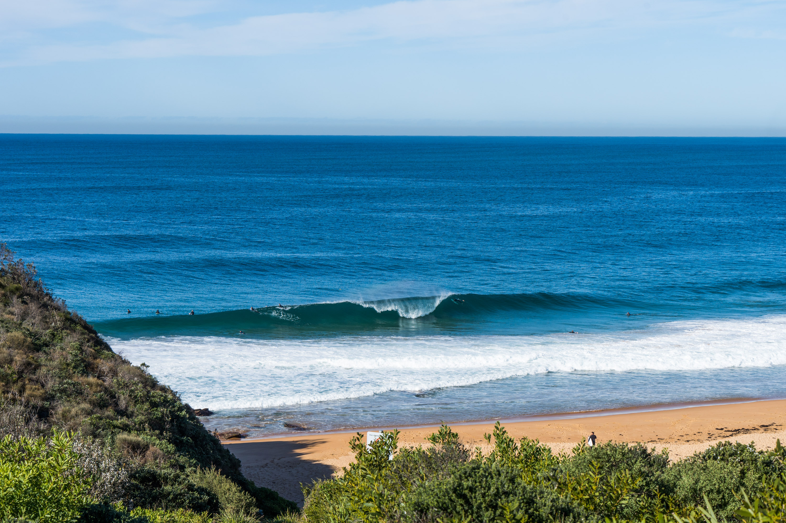

The first wave I saw when I rocked up at Turrimetta. Very nice.

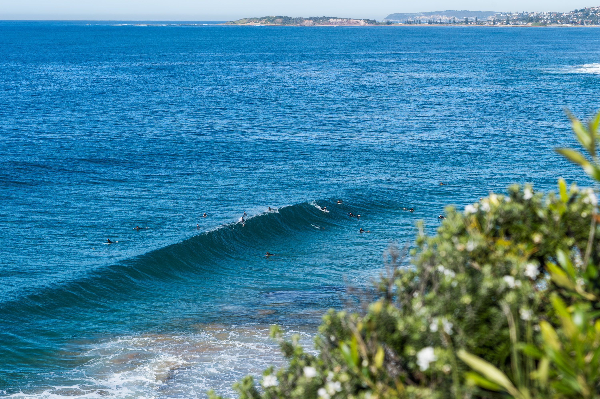

I went and bush-bashed on the cliff to get some cool angles.

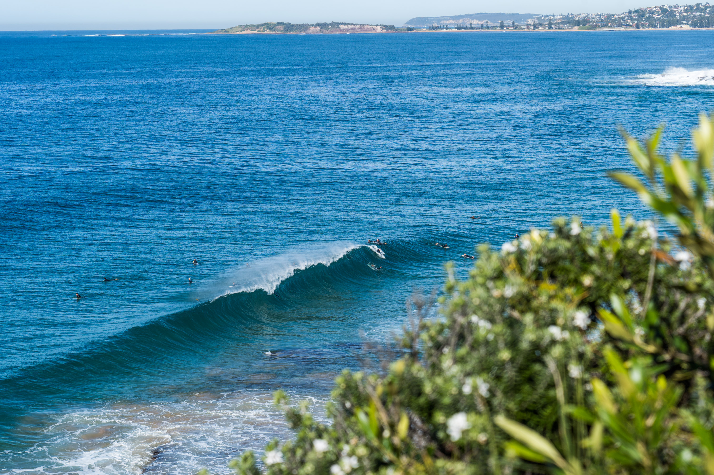

Frame 2.

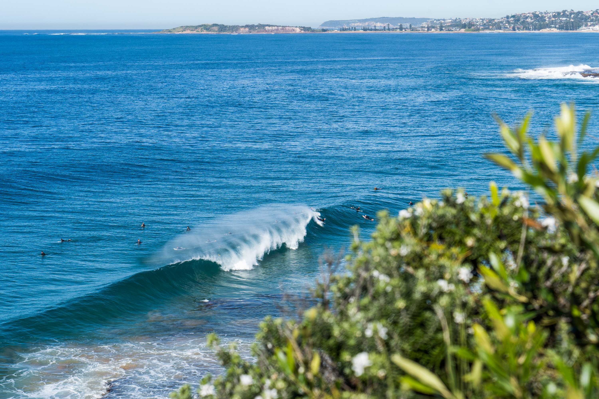

Frame 3. I really think the Northern beaches are a goofyfoot heaven when an east or northeast swell hit.

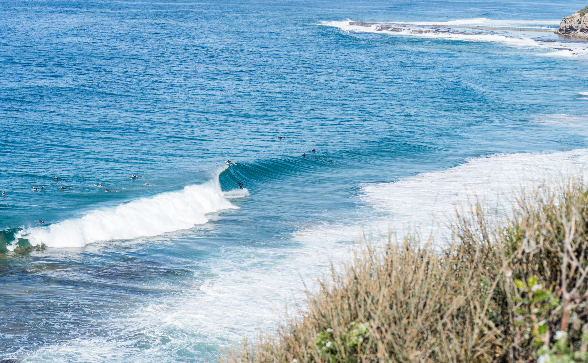

Lining up for a tube down the line.

Check out a short video I created of the day and subscribe to my Youtube channel if you want to see more.

`youtube: q8NEXGP7Oow`