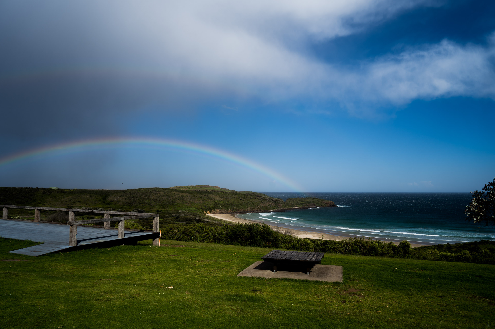

Our last stop of the South coast road trip was the farm. And with a south east swell + offshore wind, it was one of the better surfs I've had in a while. At one point Josh and I had it to ourselves. Just A frames along the whole beach.

Our first view of the break. I think the swell direction was slightly off for this spot because on the way I saw some much bigger waves at some other beaches, but no good banks.

A few kid friendly waves up the eastern end of the beach.

Some fun little ones.

The odd tube if you could crouch low enough.

Speed blur. I found out after this that I really need to clean my sensor.

A windy tree.
 

To top the day off, a rainbow popped up over the headland.
 

So sick.

We picked the perfect time to head home; the wind picked up and the swell dropped off.

