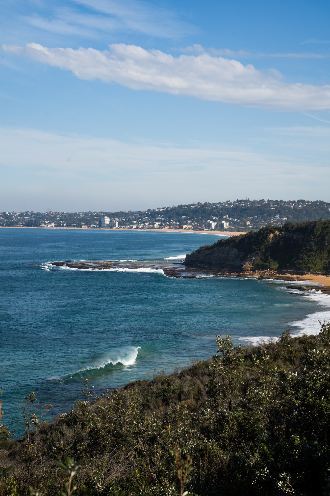
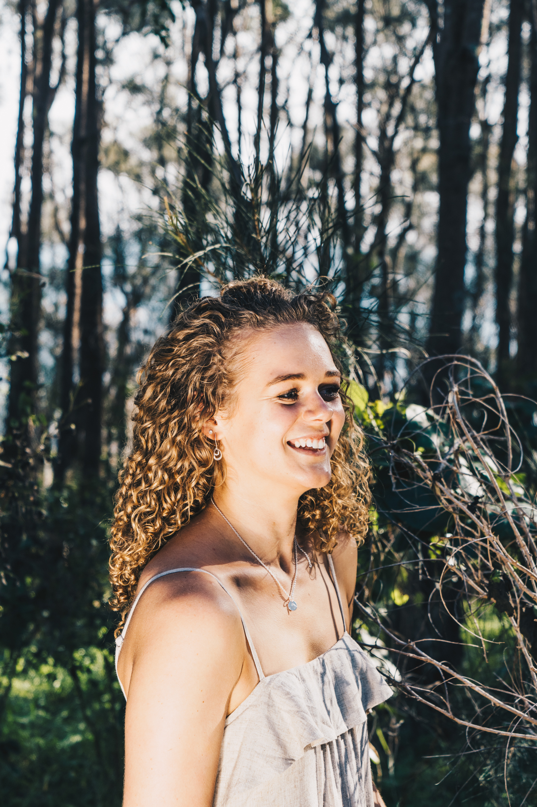
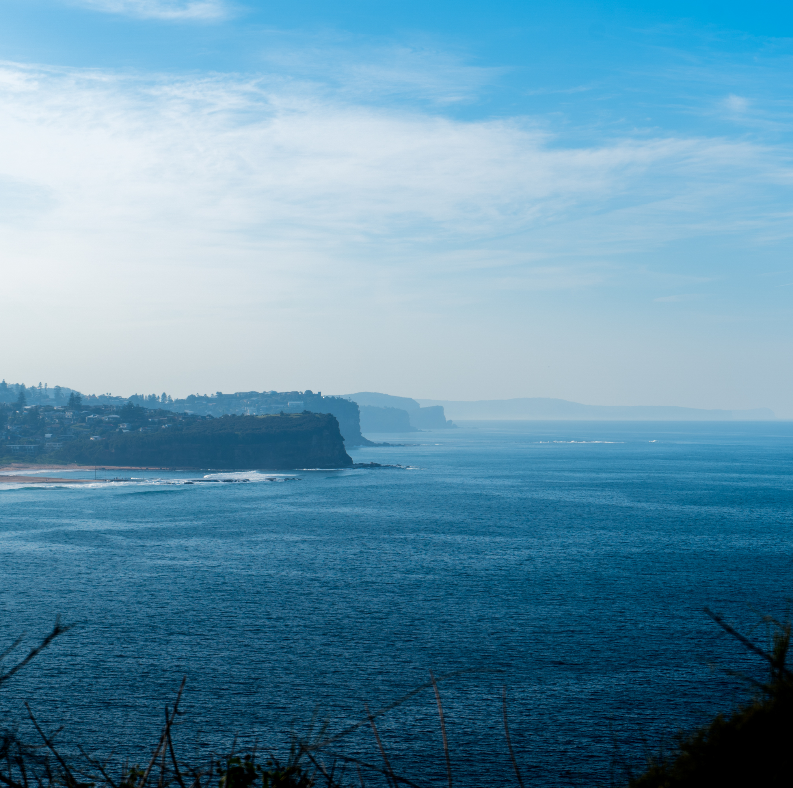
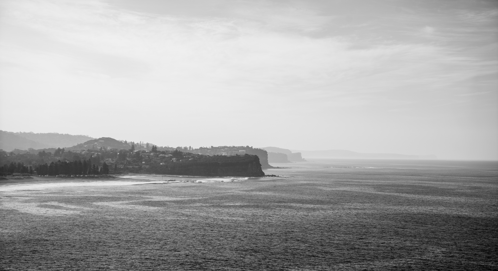
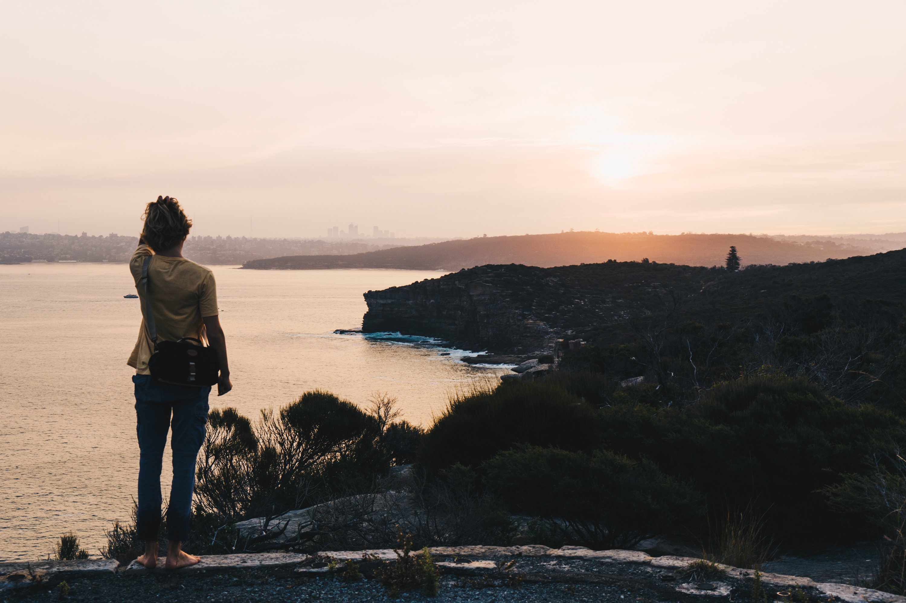
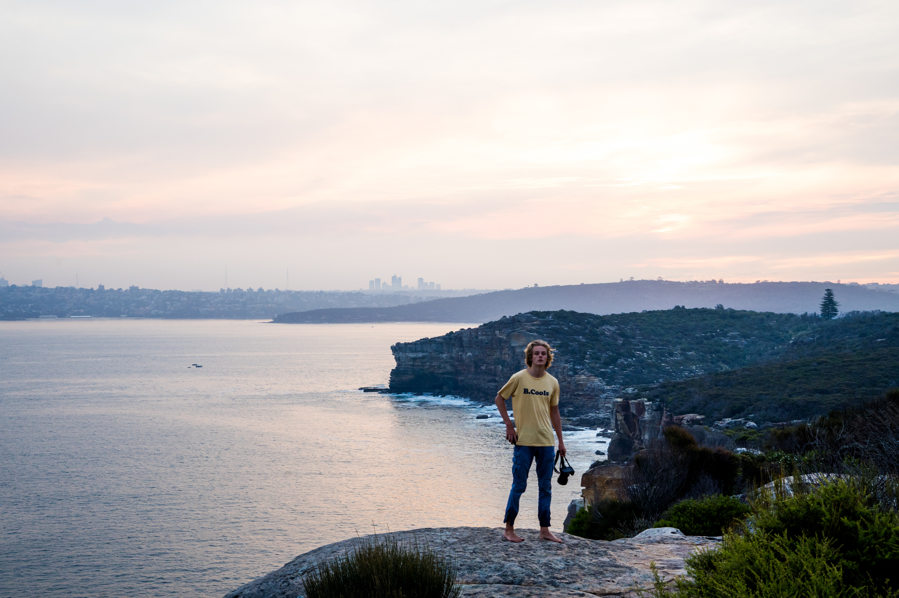
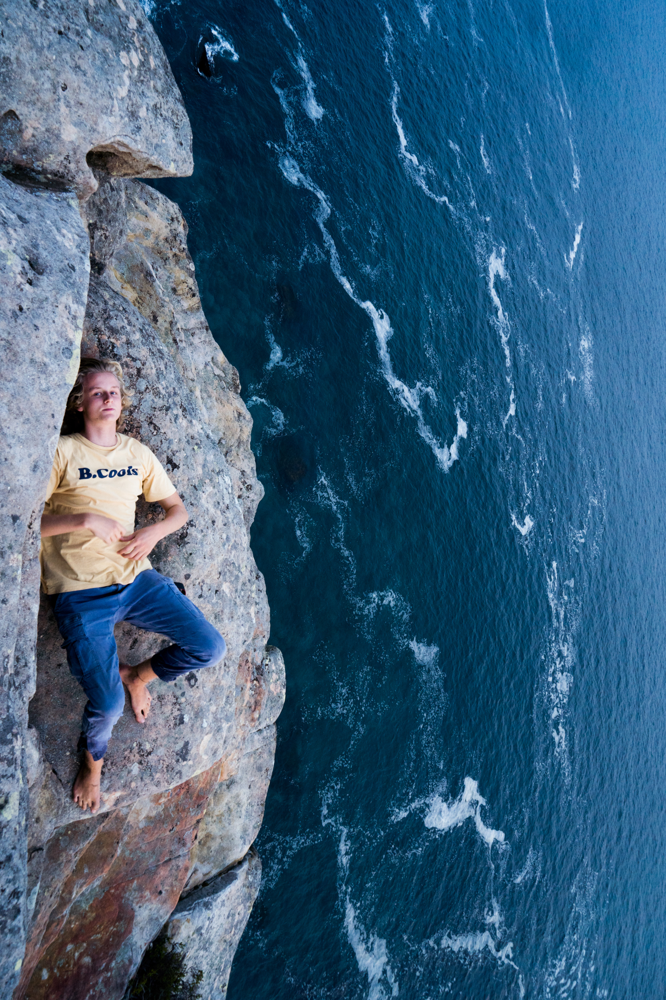

On this day Joe, Emilie and I went to do some filming for a video at Turrimetta beach/headland and also went to north head in Manly at sunset. There were a few nice shots from this afternoon. The light was very weird from the hazard reduction burns in the blue mountains and also at Turrimetta Head. When we walking through the fence to the headland it was still smouldering and in some places even on fire still.

A nice little wave at Turrimetta point looking towards North Narrabeen

Testing the home-made foil reflected on Emilies hair while Joe was taking some photos of her. I tried to take some photos while I was trying to hold the reflector at the correct angle to the sun but it was hard

Another shot taken with the reflector

A more pulled back angle of Emilie with some nice shrubs in the background

Another photo taken while trying to hold the reflector for Joe. This photo would have benefited from a higher shutter speed as you can see parts of her body have some motion blur as she moved.

Smoky headlands all the way to Palm Beach.

Northern Beaches layers in black and white.

A couple really good waves started to roll through Turrimetta in the afternoon. You could bet I was annoyed I didn't bring my board.

A funny moment I caught of Emilie flicking her hair and Joe on the phone.

Emilie sitting in the beach grass and the cactus plants.

Joe thinking about what kind of shot he wants to take next. I was just impressed with how cool these plants looked, I had never actually been up close to them before. They seen to grow very quickly.

Joe at the Fairfax lookout at North Head, Manly. A great spot to watch the sunset instead of just staying at the carpark.

Barefoot monkey.

Lying on the edge of a huge cliff in a cave, not the greatest of ideas mate.