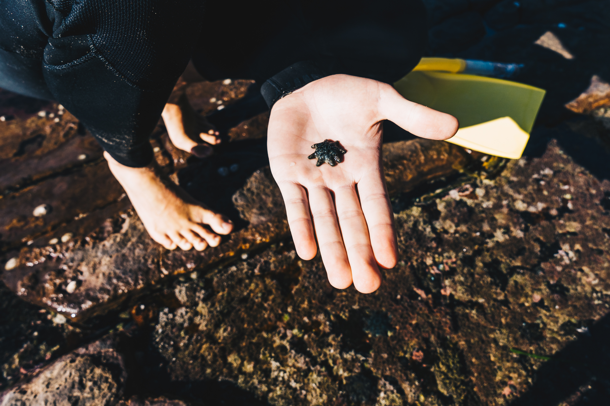
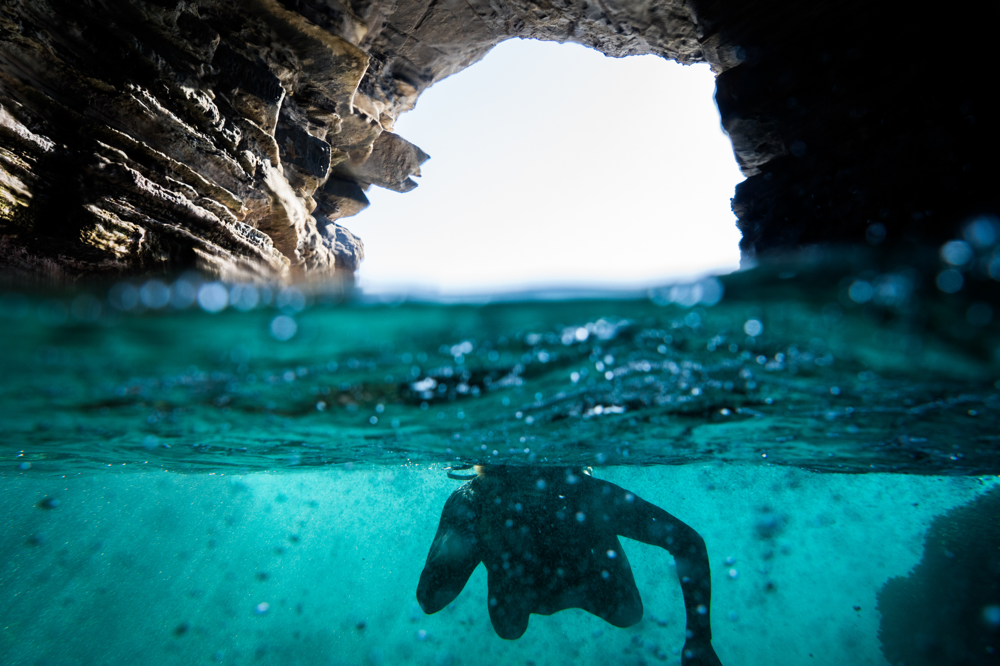
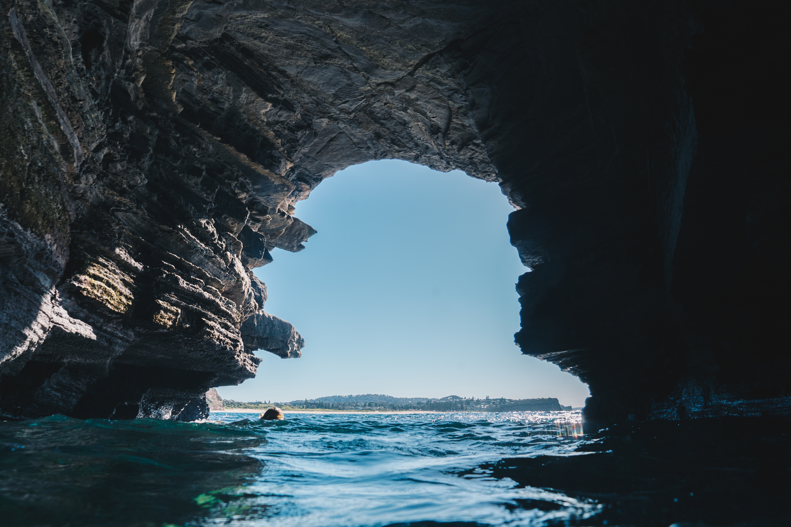
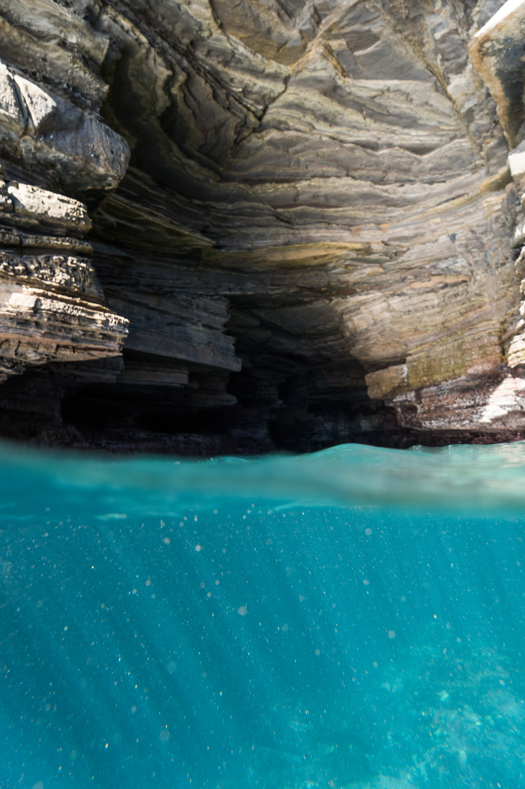
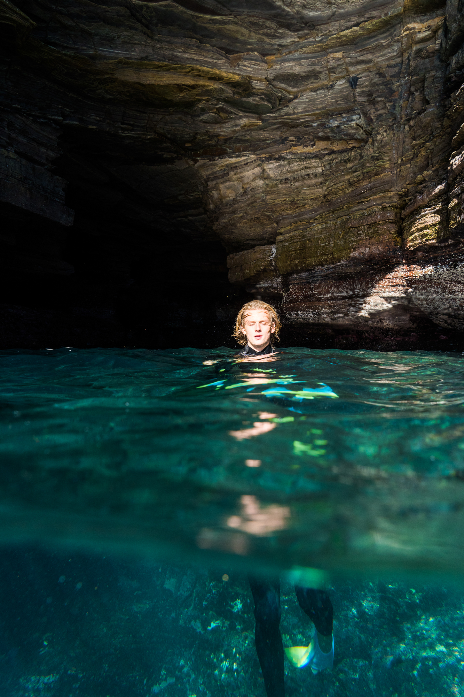
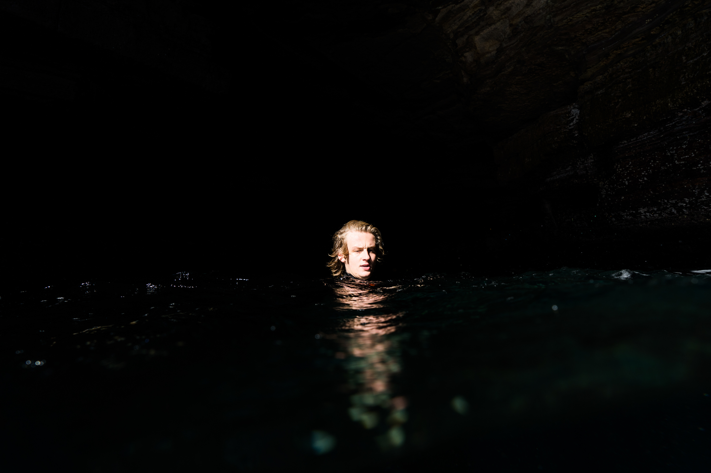

The waves were flat and the weather was nice and sunny so Joe and I decided that we should swim through the Warriwood blowhole and see if we can get some cool shots.

I didn't realise that the water clarity would be so good. The water was fully blue and down inside the cave the rays of light danced upon the cunjevoi lining the sea floor.

Walking around the headland to find a spot where we could jump of the rocks to get in the cave. We found a nice little tide pool

Joe insisted on holding this baby starfish so I had to get a photo of it

Being attacked by an octopus that I found in one of the rock pools. It was pretty scary when the waves washed over the rocks and octupus was nowhere to be seen and then all of a sudden it would leap for your feet and camoflague itself.

The entrance to the cave.

Joe bobbing around.

A nice view of Mona vale beach.

Facing the complete opposite direction to the previous photo, to the exit of the blowhole. it was so sunny that all the highlights in this image have been blown it. It was pretty hard to keep constantly changing all the camera settings in the water housing every time I turned around in the cave as the lighting situation was completely different.

Interesting shadows and colours.

A more narrow view taken when a wave was inside the blowhole, the roof seemed much higher.

You can see how cool the cave really is from this under over angle. Pretty deep and almost mirroring the randomness of the roof structure

Some nice rays of light penetrating the surface at the entrace to the cave.

Joe basking in the sun.

I thought no colour suited this image well.

Darkness in the middle of the cave