Rachel and I went for a morning bushwalk on the America Bay track, and then visited the West Head army bunkers which are still relatively hidden to the public. 

The America Bay track is short, and runs alongside a cystal clear creek which eventually runs straight off the cliff into a large waterfall overlooking the bay.

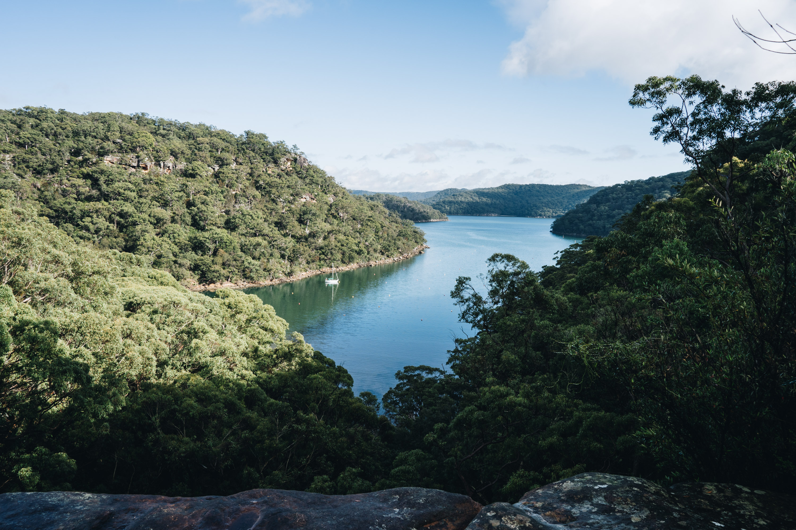

The view from the top of the lookout.

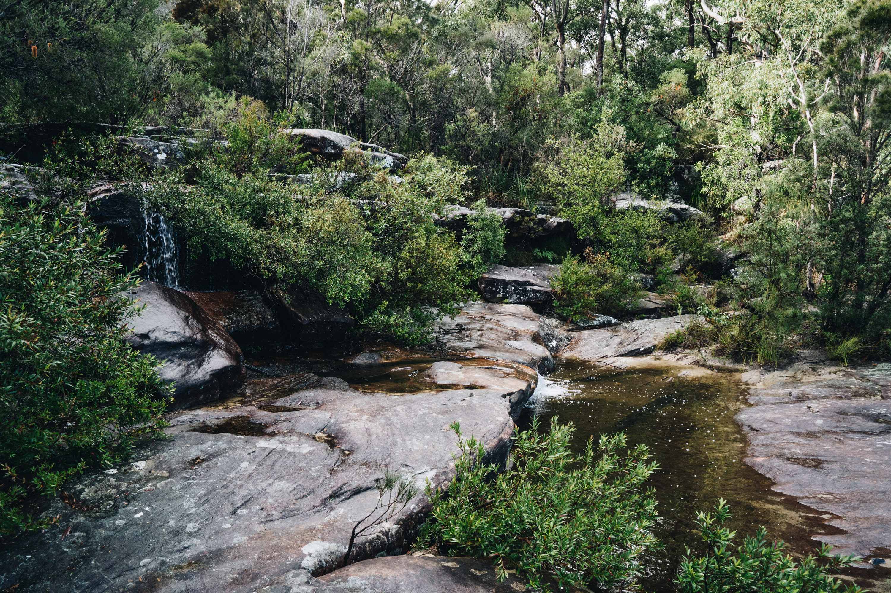

Would be nice for a swim here if the water wasn't so cold. Definitely in summer.

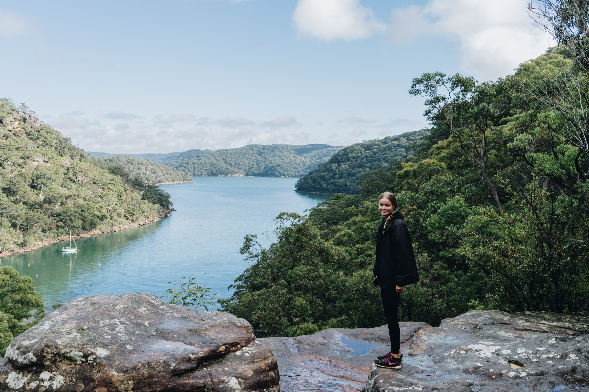

Reluctant photo.

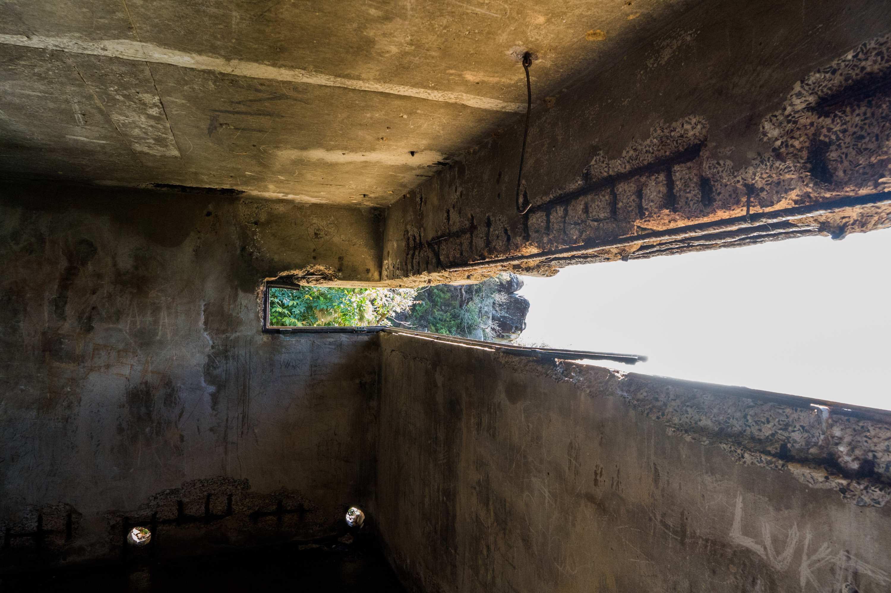

Inside one of the West Head bunkers.

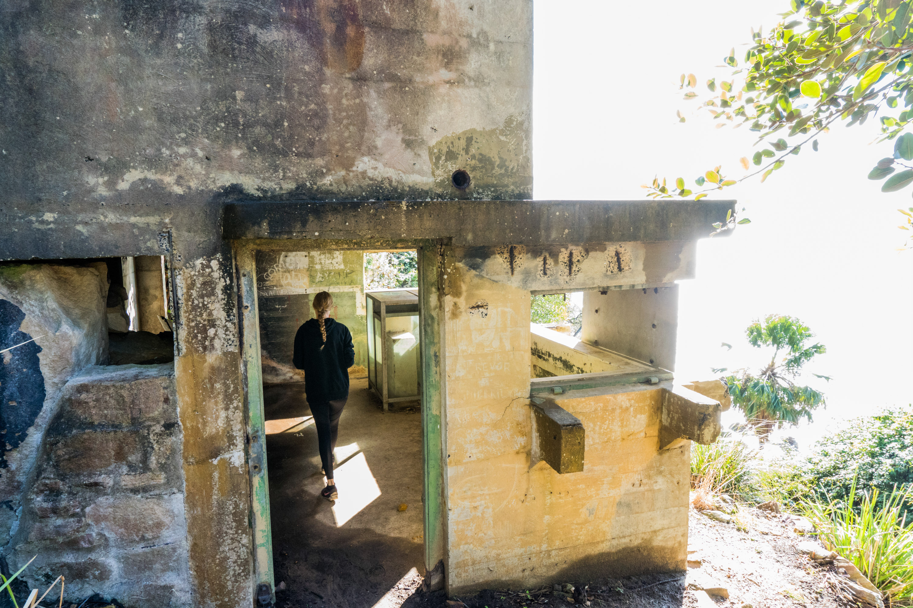

An outside view.

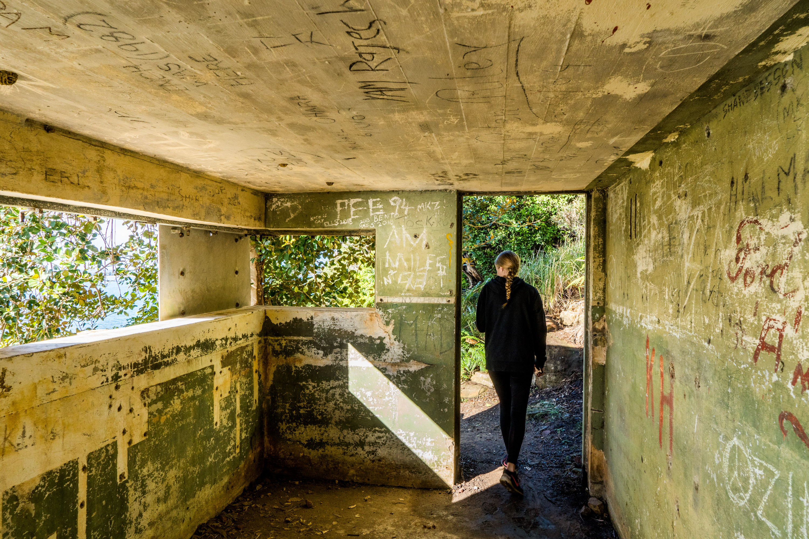

Lots of old graffiti and messages on the wall everywhere.

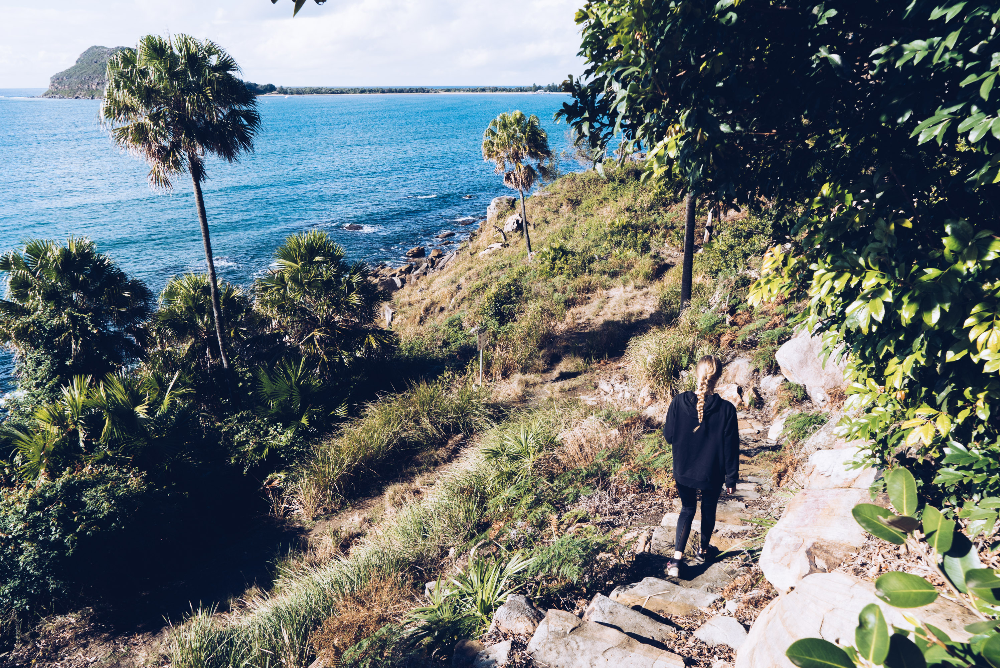

Almost looking like a tropical oasis with those palm trees. That's Barrenjoey Headland in the background there. I think next time I will definitely bring my fishing rod because the swell doesn't really get into the bay.

I assume this is where the gun used to be mounted.

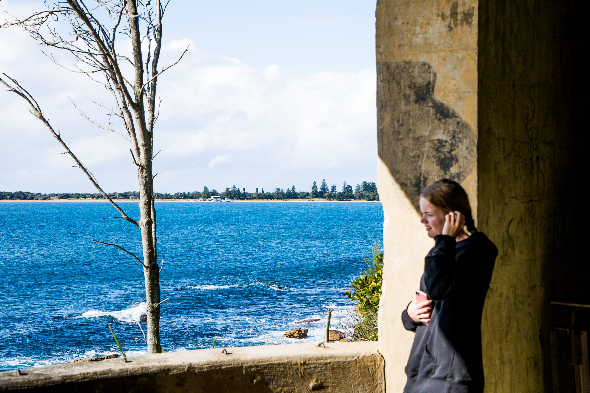

Looking back at the Palm Beach boathouse in the distance.

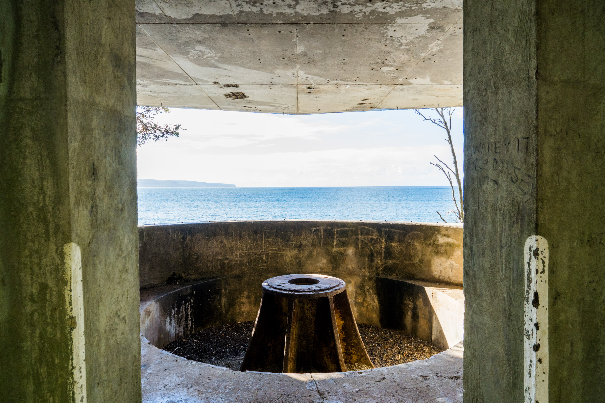

Another view

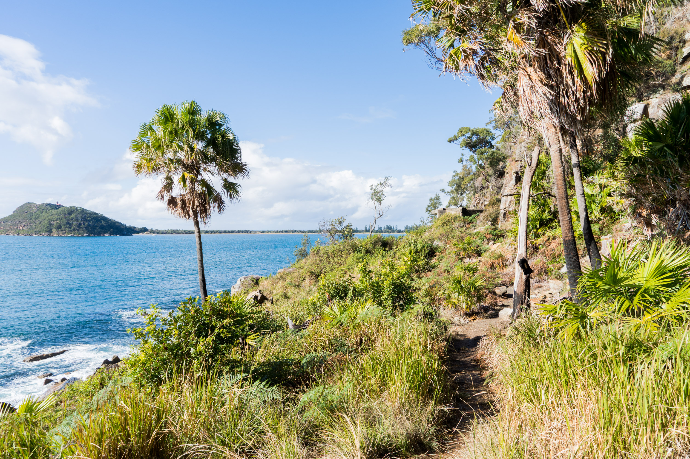

Definitely one of my favourite places in Sydney. If you keep walking along the track you'll see other bunkers which are all unique.

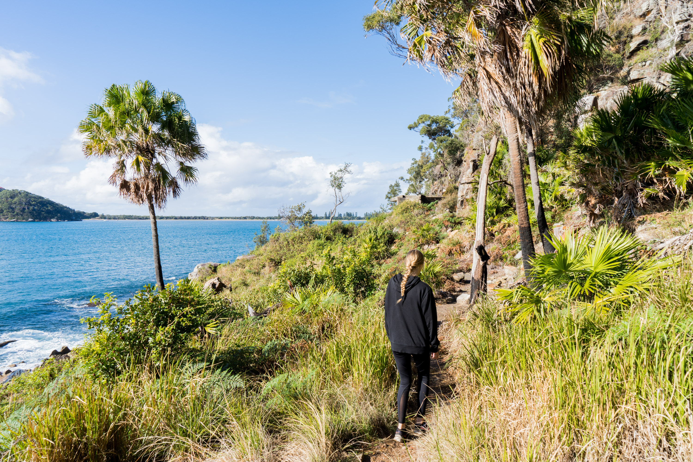

Going to chekc them out.

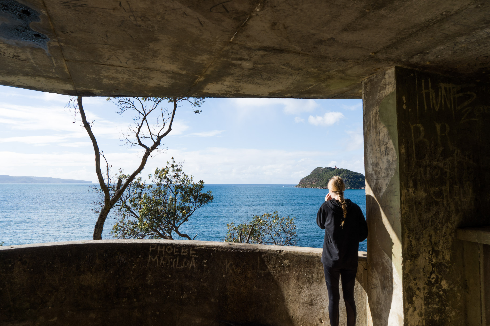

This one had a nice view, blocked by a tree though. 

Some cool red flowers.

