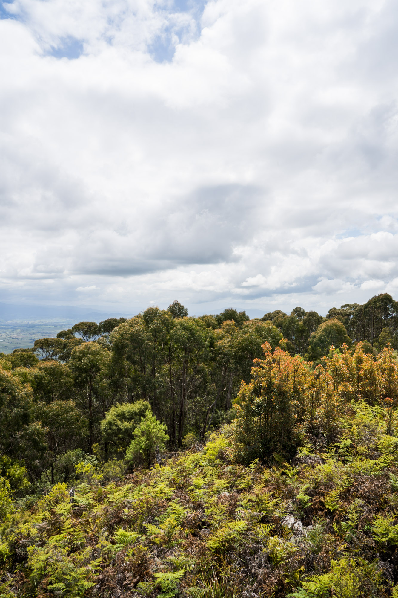

Before we headed up to Whitby's farm, we stopped off at Wolumla peak, which gave us panoramic views of the south coast mountains and provided a good spot for having lunch. I flew the drone up over the tower to try give some perspective of how high we were.

Looking straight down on the cars.

High above the farmland in the distance.

South east forests national park.

On top of the tower. Perfect for fire spotting.

Some of the greenest grass I've ever seen on the way to the peak.

The drives around here never get boring when you have these views.

The mighty triton on the way up to the peak.

The were towering high even while we were standing on the tower. Definitely blocking some of the view.

The coast in the distance.

The Paj and Triton with endless space behind them.

Another awesome view of the peak. The Nav and the 80 pictured in this shot.

