Bantry Bay, a historical army storage facility, abandoned and forgotten, left to explore illegally in Middle Harbour.

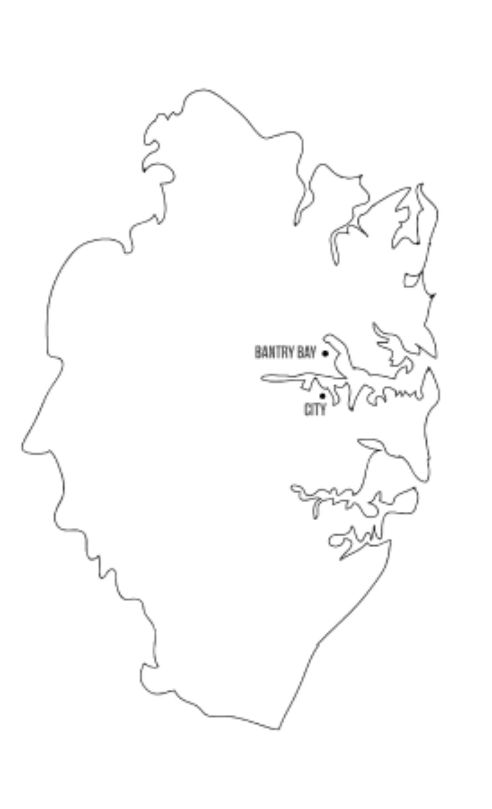

The location of Bantry Bay in relation to Sydney city.

## A History

Bantry Bay is a bay located in the Garigal National Park in Middle Harbour within Sydney Harbour, in New South Wales, Australia. it was named after Bantry Bay in Ireland. Bantry is the deepest natural hole in Sydney Harbour, reaching depths of up to 40m.‍Bantry Bay used to store military explosives. The storage complex consists of nine explosives magazines which replaced old hulks that had been used to store explosives in nearby Powder Hulk Bay on Sydney Harbour. In 1915 the works were handed over to the state Explosives Department, which regulated the explosives industry in NSW. In 1973 operations at Bantry Bay were discontinued and the facility was closed. The NSW Government currently maintains the site and in 2003 announced it would invest A$350,000 in restoring the aging roofing.

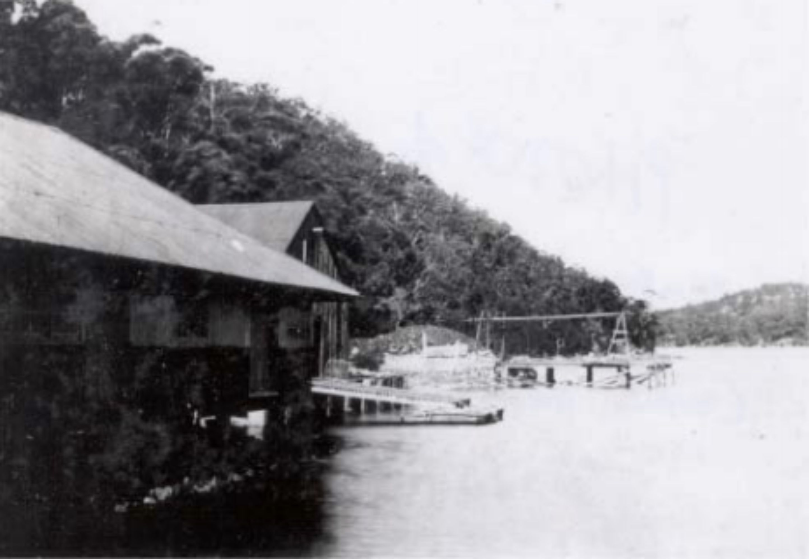

Proposed site of coal bunker at Bantry Bay, 1918

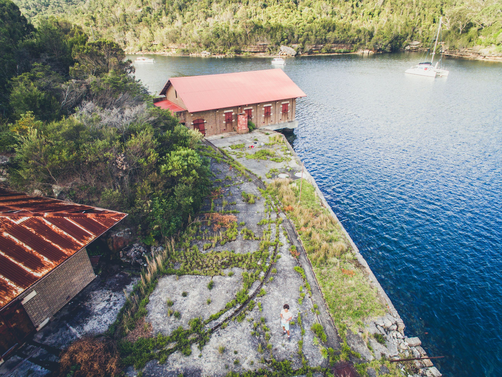

The concrete seawall has been overcome by weeds and grass poking through

## The use of land

90 hectares of land which included the eastern and western shore of Bantry Bay, was resumed and announced as a public magazine reserve in January 1907, at a cost of $23,000. All the land surrounding Bantry Bay from the water’s edge to the summit of the hills, comprising 283 acres in total was also announced in September 1908. This reserve area was necessary to restrict urban encroachment into the unsafe, danger [area.In](http://area.in/) 1909 plans were drawn up by the Department of Public Works and £8000 appropriated for the construction of sea walls, excavation of the hillside and drainage of the cleared slopes.31 The construction and excavation of the site was very slow, which according to the Explosives Department was due to a lack of funds.

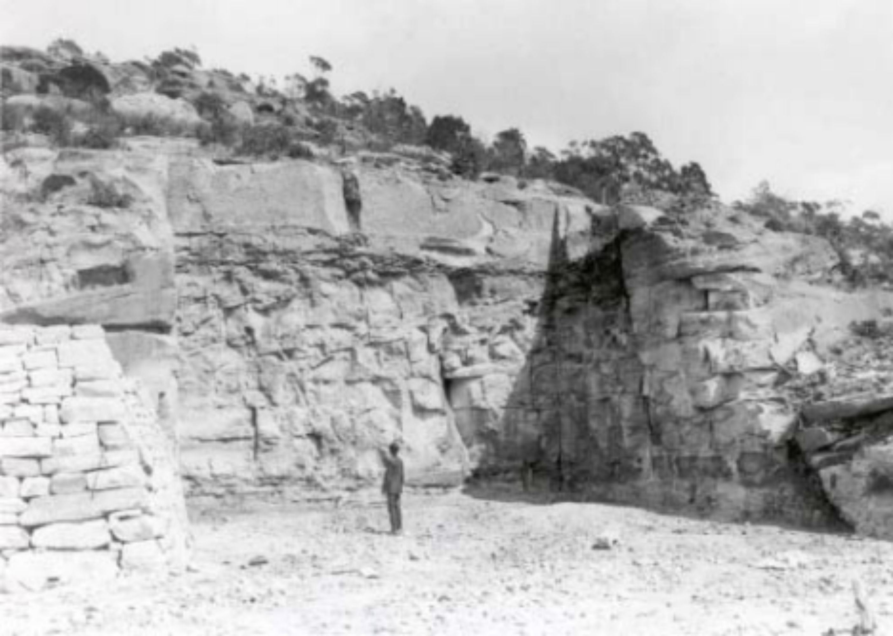

Large cutting at site of new magazine, Bantry Bay, May 1913.

## Excavation

The image above shows the extent of the reclamation and the excavation of the embrasures for the magazines. The excavation involved an enormous amount of rock removal which was then used to create a new sea wall and reclamation of flat concourse areas in front of the magazines. The excavation, reclamation and sea wall, the light rail and drainage, the reservoir and two timber wharves were completed in 1913.32 A surveyor’s plan drawn in 1931 indicates the original line of the hill and the extent of reclamation of flat concourse and excavation for the magazines was extensive.The excavation of the hillside was necessary to provide blast containment for each magazine. Each magazine is situated inside an excavated stone embrasure, some with dry stone retaining walls which were cut to contain a magazine approximately 13 x 9 metres. In some instances the embrasure has been widened after building the magazine to accommodate guttering and the roof. For more information, visit Bantry Bay (Garigal National Park) - draft conservation management plan Pt B [PDF]

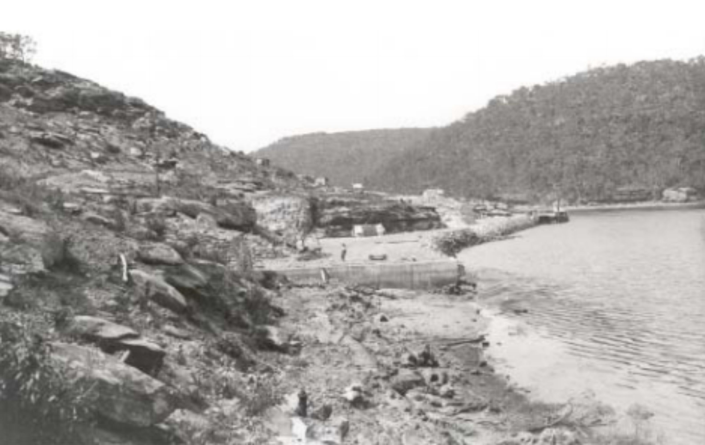

Site of new magazine station, showing the removal of trees. Bantry Bay, 1913.

The site was originally designed to accommodate nine magazines, a receiving shed and an examination room. By the time the magazines opened in 1915 they were already overstocked and three temporary magazines were added which are still intact. Buildings 9, 14 and 16 were built as temporary structures in 1916, but were retained as pressures on storage capacity was a continuing problem until the 1960s. The construction technique was of a completely different nature to the nine permanent magazines, using fibro-cement on a wooden framework for internal walls, and a flat iron roof.

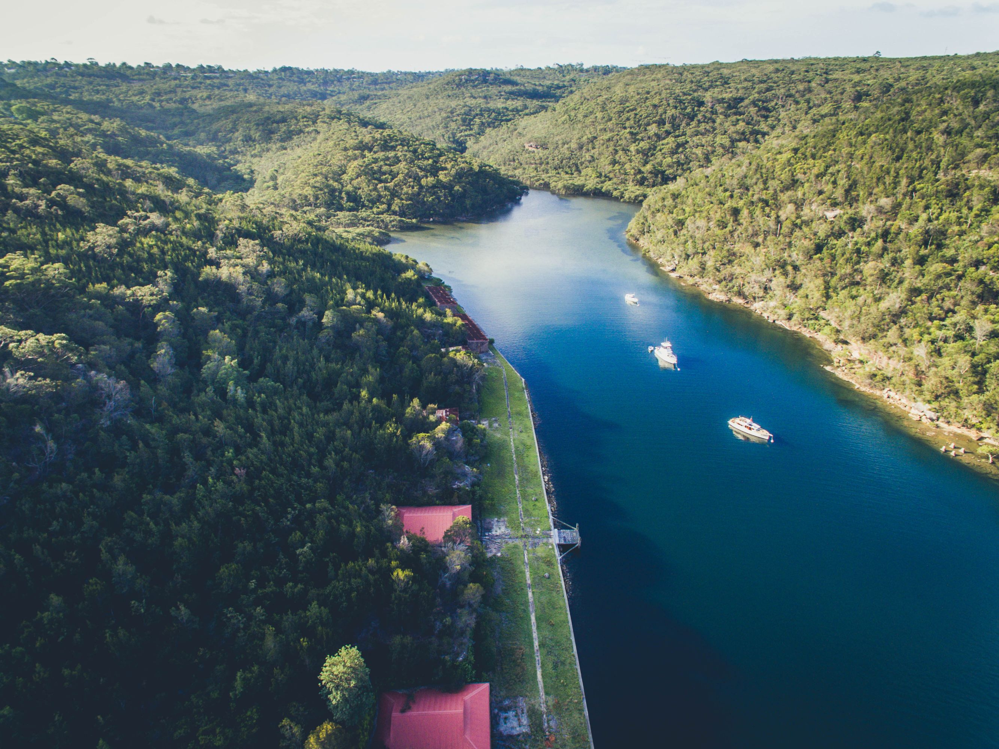

Aerial view of a few of the magazines

The close walls of the embrasure and the overhanging roof create a cool space which assists in ventilation of the magazines. A great deal of thought was put into the design of fire and explosion prevention systems, such as roof sprinklers, lightning conductors and fire fighting equipment.A light rail system ran from each jetty to the porch of each magazine. Another line ran along the seawall, past each jetty, with a turntable system at the intersection. A branch line ran in a curve from each magazine to connect to the sea wall line. The light rail system was the only means of transporting the crates from the lighters to the magazines.

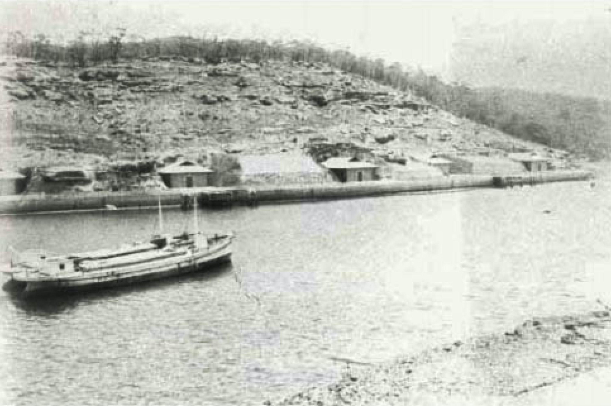

The rock face at western Bantry Bay which was completely bare, which was essential to the construction of the magazines

## The end of the operation

In 1915 the works were handed over to the state Explosives Department, which regulated the explosives industry in NSW. In 1973 operations at Bantry Bay were discontinued and the facility was closed. The NSW Government currently maintains the site and in 2003 announced it would invest A$350,000 in restoring the aging roofing. As of 2006 the site remained closed to the public due to old explosive contamination at the site. However, there are good views of the site from the eastern side of Bantry Bay, which can be accessed from the Timbergetter's track, which starts at Seaforth Oval. Walking tracks also go around the west side of the magazines, providing access from the nearby residential area of Killarney Heights. The deep water in the bay worked well for the large ships to come into the bay

## How to get there

Firstly, you need to get to Killarney Heights. Get a bus from the Chatswood interchange. The bus number should say 280, 136, 137, 270, 271, 274, 281, 282, 283, 284. The bus stops at Forestville shopping centre, alternatively named Jamieson square. The bus stop you get off at is called “Warringah Road near ferguson street”.

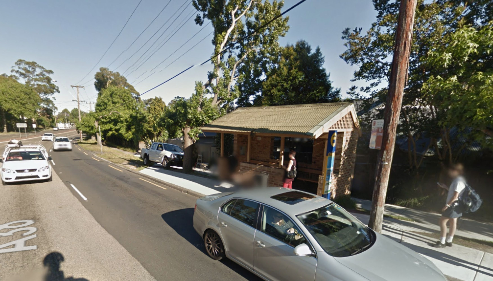

You cross Warringah Road, and then cross the road to Starkey street and you will see a memorial hall with a glass bus stop.‍

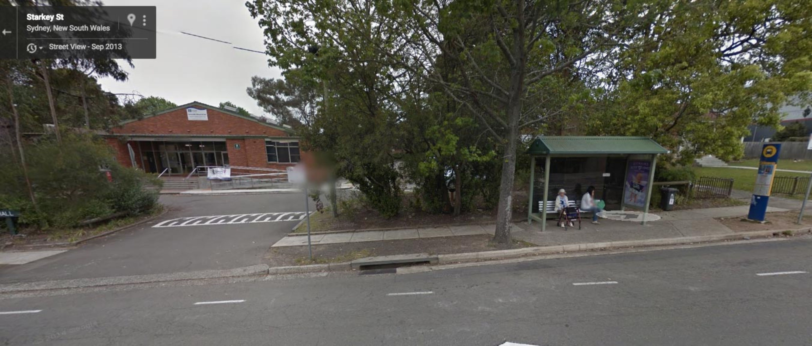

Get the 278 bus from this bus stop to killarney oval. The bus stop is easy to miss.

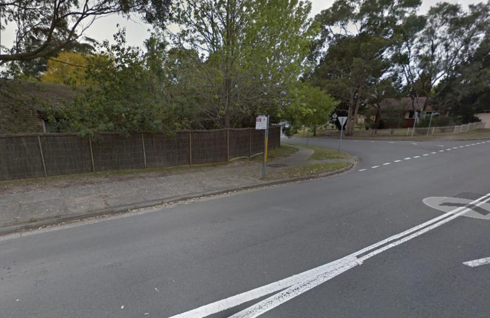

You then turn left onto Rathowen Parade, keep walking until you see Shannon Ave, and turn left. Go along Shannon Ave and turn left at Tipperary Ave.

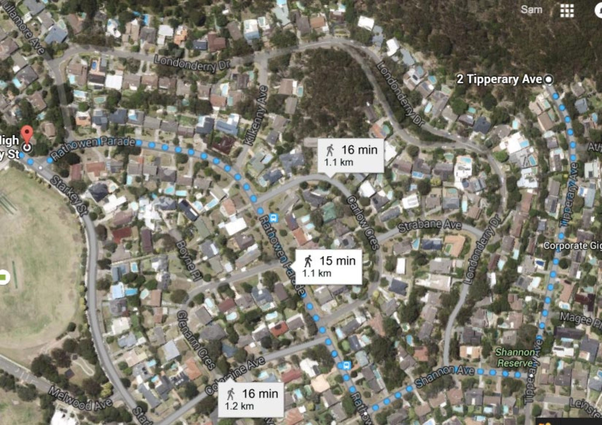

Go to Tipperary Avenue in Killarney Heights, and follow the track at the end of the road. You take all the right turns and none of the left ones. You will start to see the water and the sheds, and you turn and walk down the bush from the same place you do from the Flat Rock track. It is an easy climb down. You go through the barbed wire fence, as there is a hole.

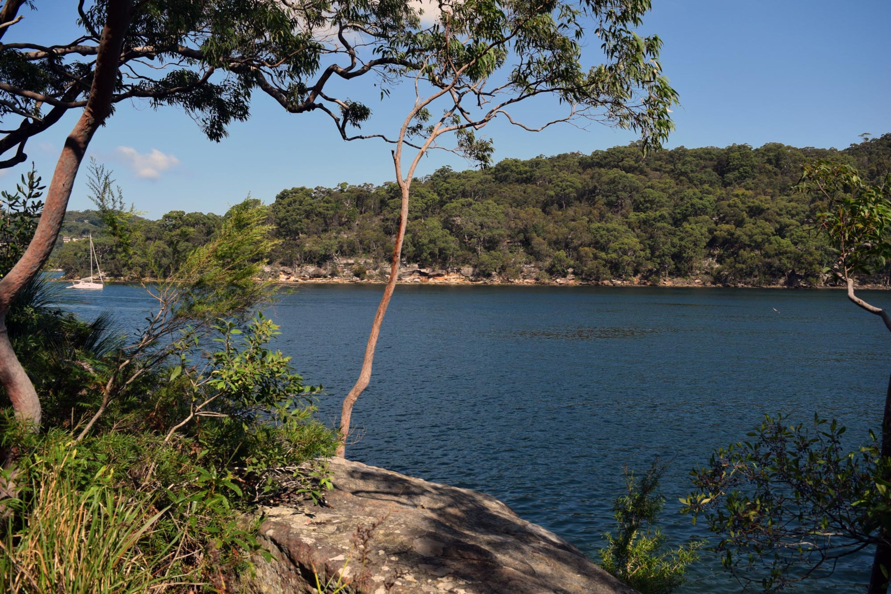

The view of the water from a lookout on the Tipperary track

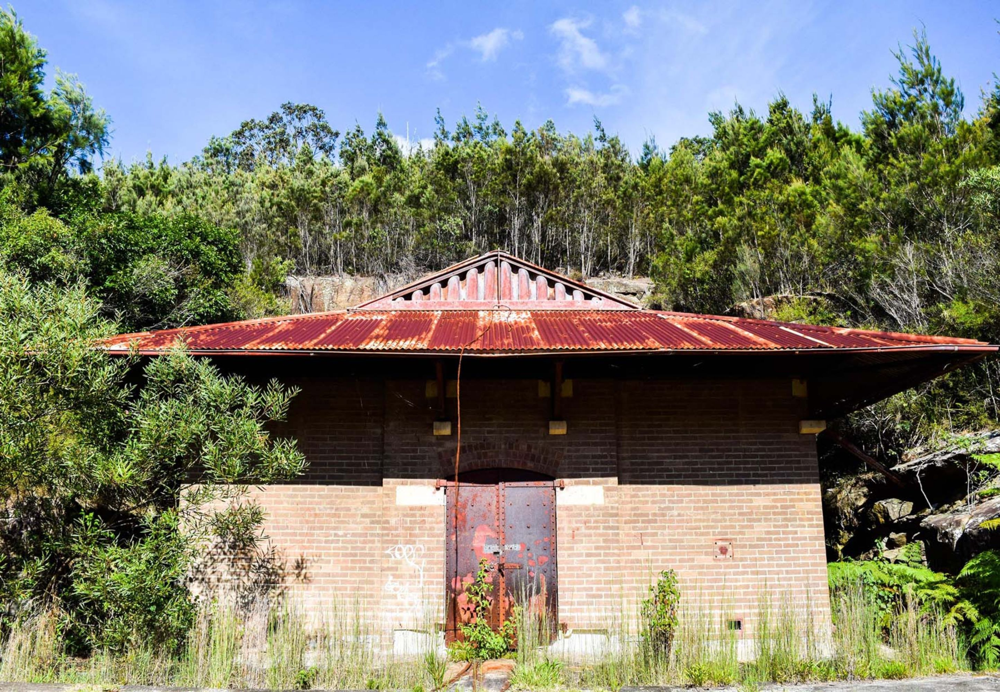

The central and largest of the Magazines

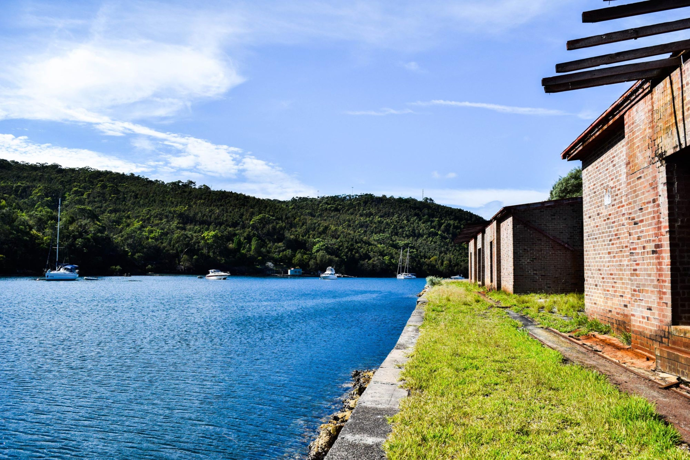

Looking towards the eastern shore

## What to do there

You will see a Magazine which is directly on the water, different to the others. You can open the door from the left side of the Magazine facing the water. If you go inside the doors to the water will be closed, but you can lift the metal bar off the doors, and push them open. Be careful opening the doors, because they require pressure and if you push and fall into the water it is very deep. The view from inside the magazine on the water is spectacular. Explore the other magazines, and climm up the rock ladders to get a better view. There is also an unused wharf to stand on. There is many areas to picnic or sit down and take in the area.

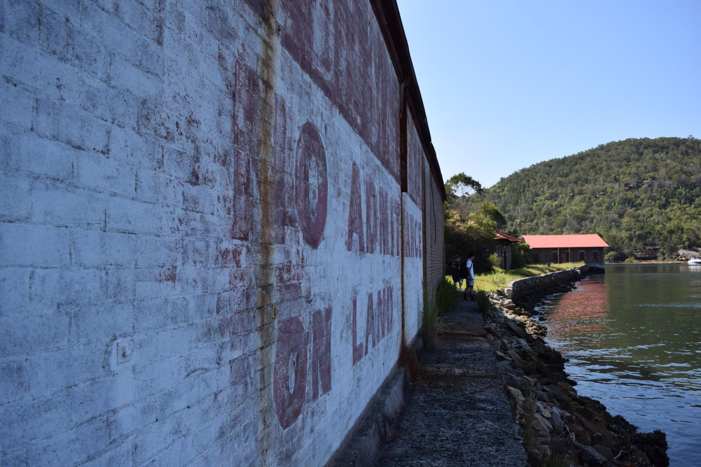

The old stencil sign which says "NO ADMITTANCE ON LAND"

The best part is, nobody will be on the western shore, they will be on the Seaforth side, or on boats. Make sure to close the doors, and leave no rubbish or make no damage to the magazines when leaving. Bantry bay is a prime fishing location. The fish that can be found are Jewfish, Snapper, Bream, Leatherjacket, Kingfish, and many others. There are also many more Peregial species of fish found here.

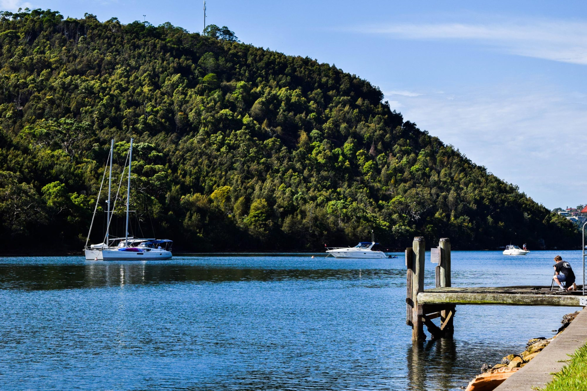

The western wharf

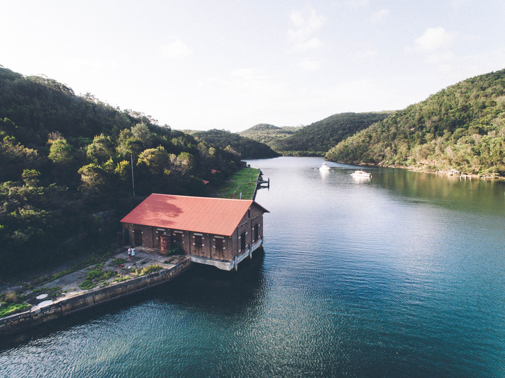

Aerial view #1

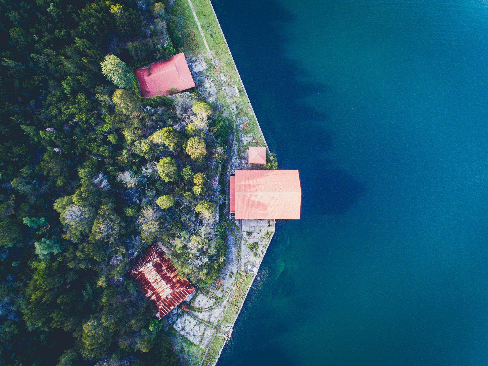

Aerial view #2