Bawley Point is a little town on the South Cost of New South Wales, Australia, in the Shoalhaven area, with a population of 698 people at the 2016 census. It's around 30 minutes south of Ulladulla, New South Wales, and 30 minutes north of Batemans Bay on the South Coast of NSW.

## **Local history**

Around 20,000 years ago, the landscape of Bawley Point was far different that it now is today. The most noticeable is the lack of ocean, which wouldn't have even been visible from the area. The sea level was a 14 kilometres further out. The climate would have been cold and dry, with ocean water captured in the massive polar ice caps. Instead of the ocean, there's large rolling plains with rocky ridges and hills, covered in trees, providing food and shelter for Australia's megafauna: giant kangaroos, wombats and diprotodons.

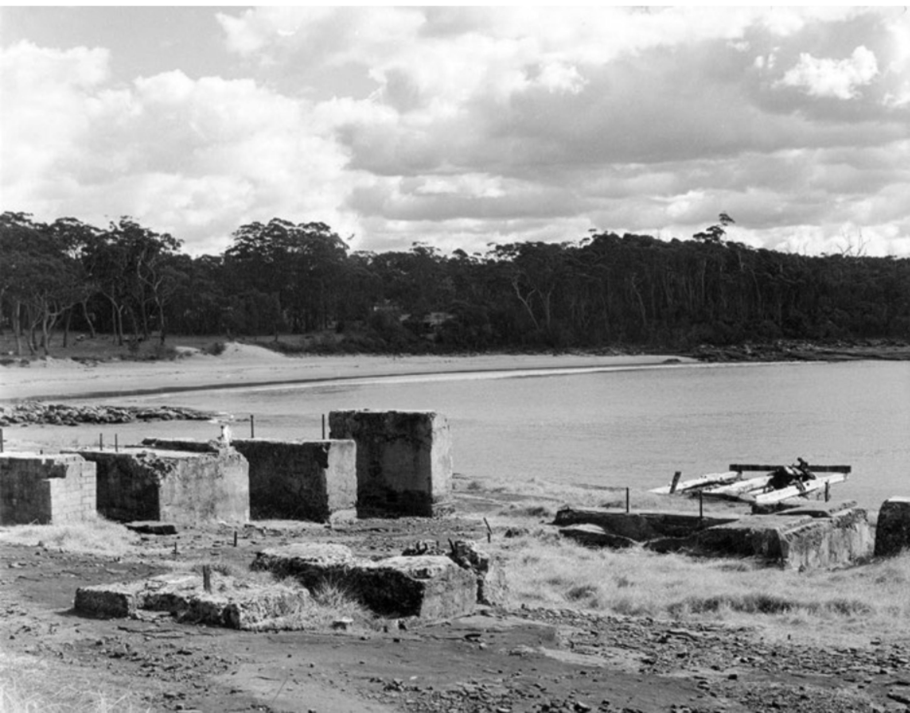

The gantry at the old timber mill in 1976

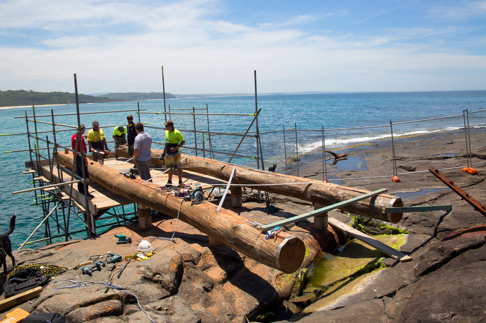

The restoration of the gantry

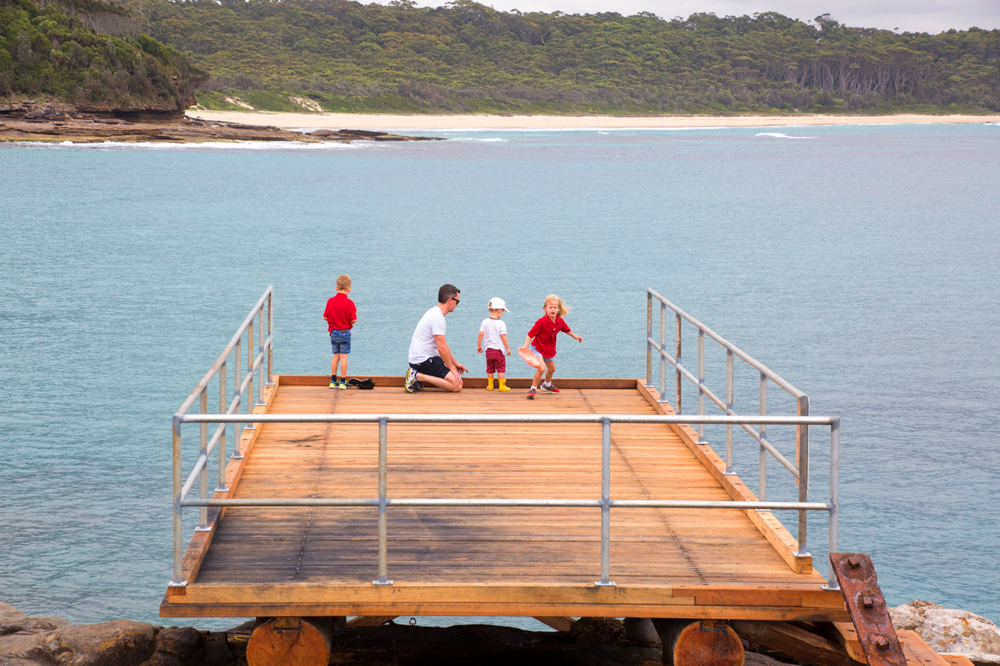
The restoration of the gantry

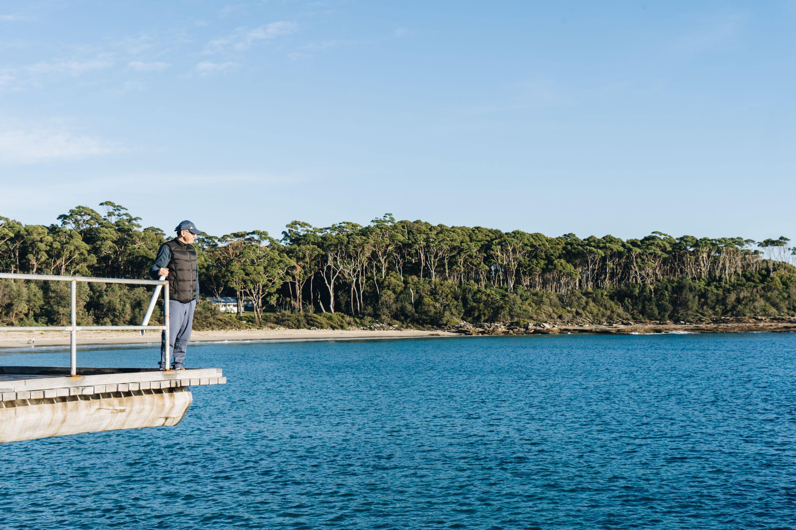
The gantry now

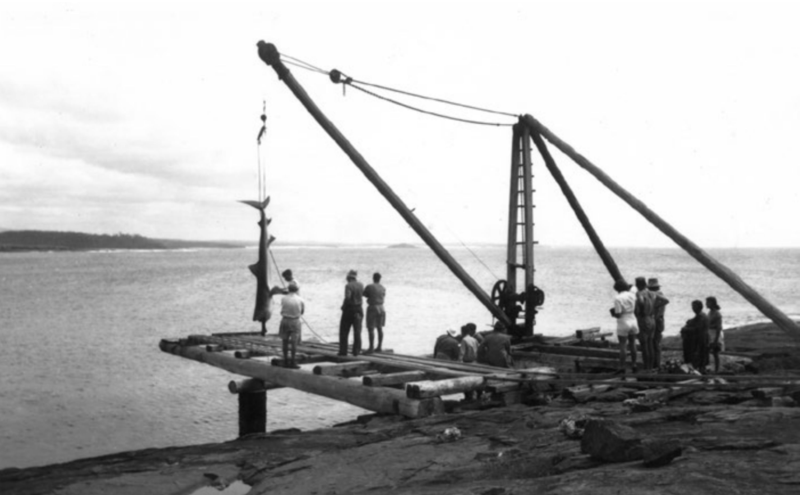

A large shark caught on the old crane mill 

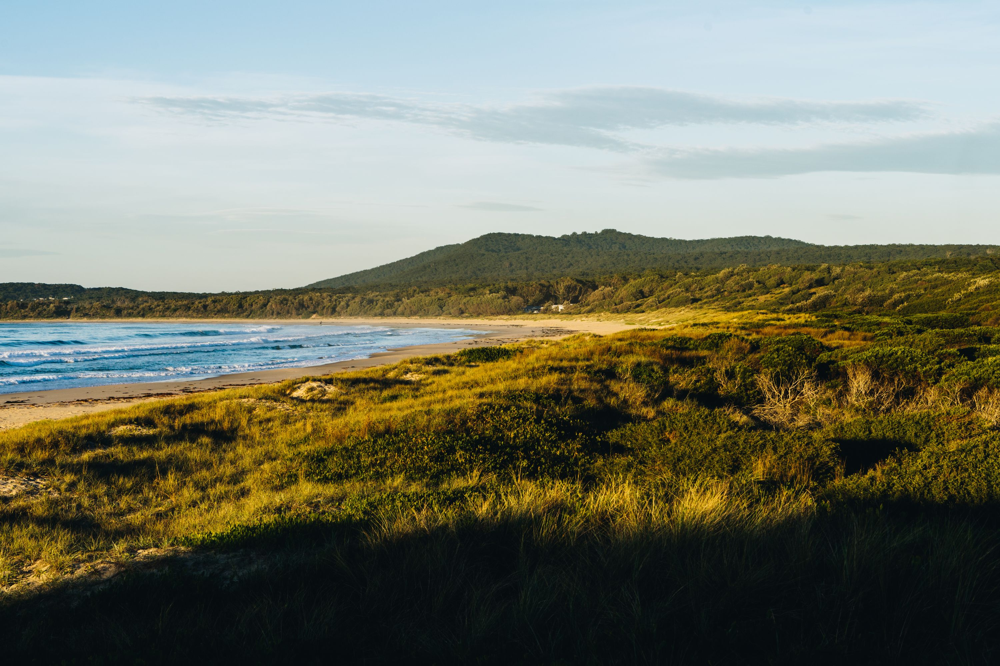

Bawley Point is known for it's good surf breaks, snorkelling, fishing and pristine beaches and is a great place to head for a holiday. There's an IGA, liquor store, cafe, bakery, pharmacy and petrol station in town, so there's no need to leave the area if you need supplies.

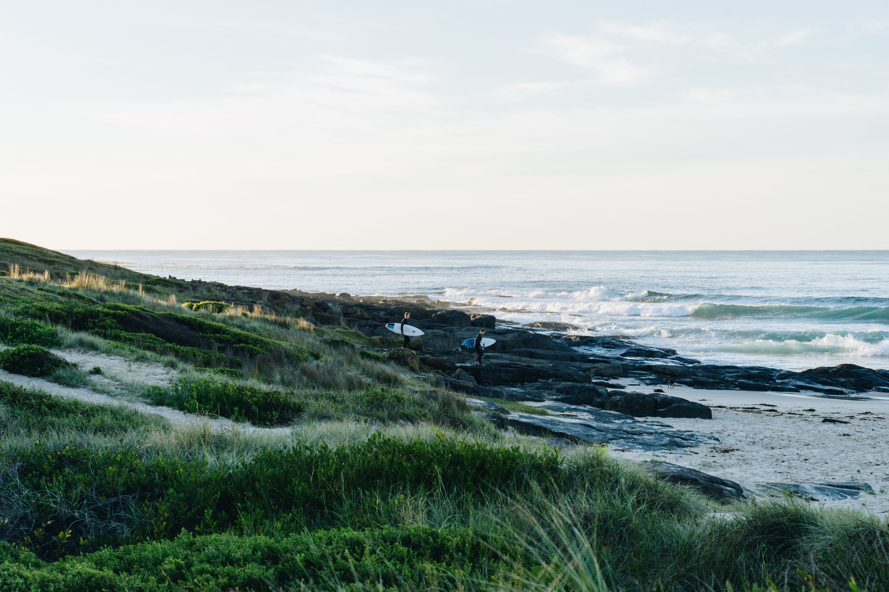

Surfers heading out to one of the best beachbreaks in the area, called Sandmines.

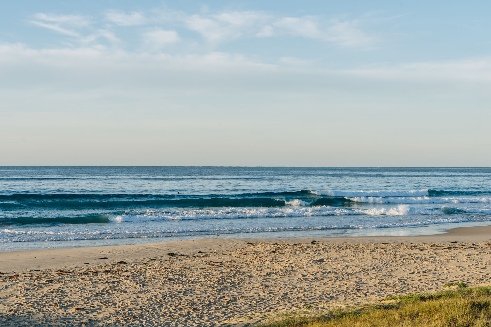

A pretty small day, but still fun waves based on the south facing aspect of the beach.

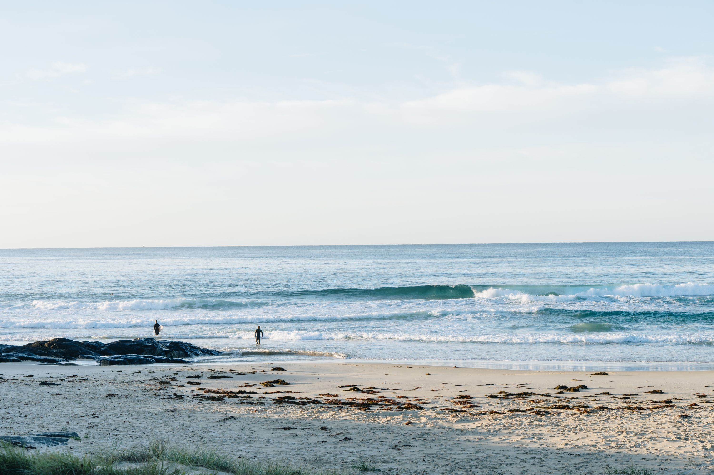

On some days out here the paddle out can be decievingly harder than it looks. 

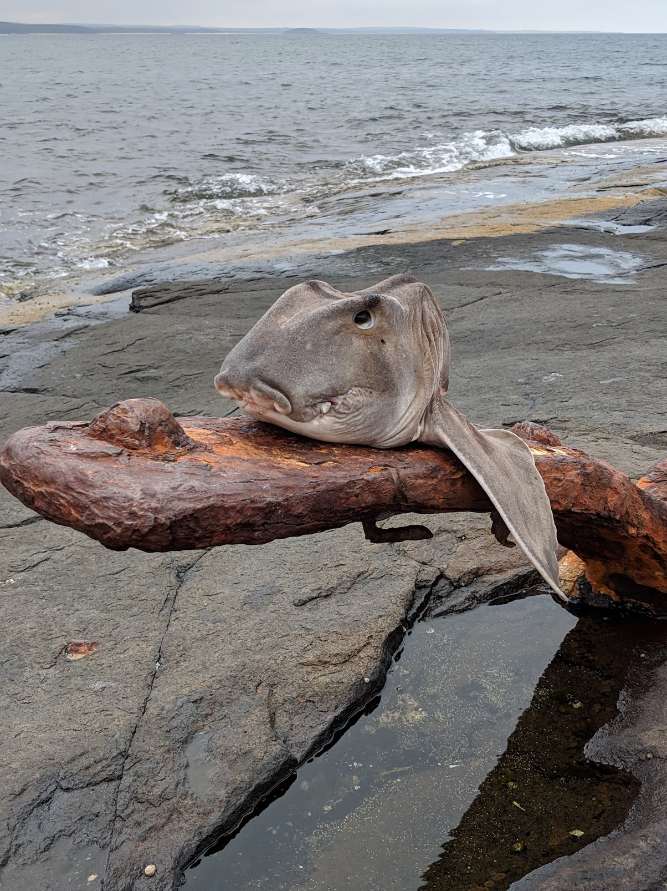

A crested horn shark that was caught off Bawley point the previous day, with its head resting on a piece of rusty metal. I assumed that the flesh was either used for food or bait as there was skin all over the rocks

Shark teeth.

These next set of images are from the Meroo lake and Meroo headland area, with multiple different walks and so many different things to see/beaches to surf at, this place is definetely a must if you're in the area.

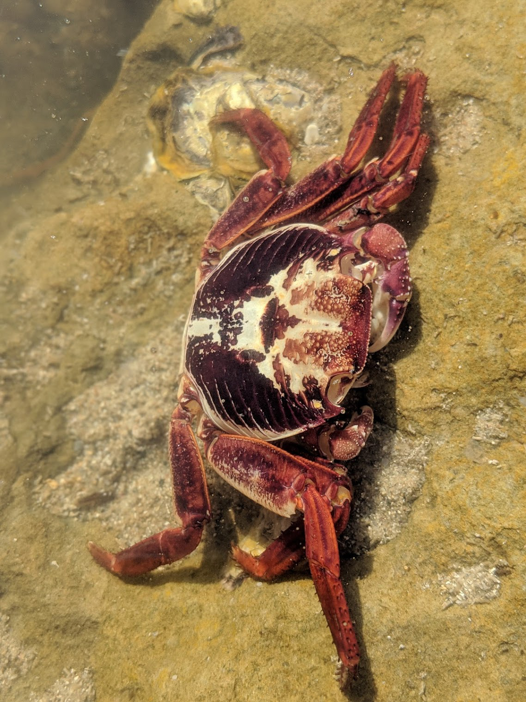

A decent sized crab in one of the rockpools at meroo beach

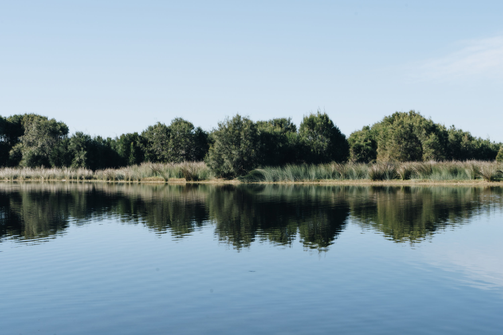

Reflections on the Meroo lake walking track, bit of a vague track and ended up bushbashing to get any proper view of the lake

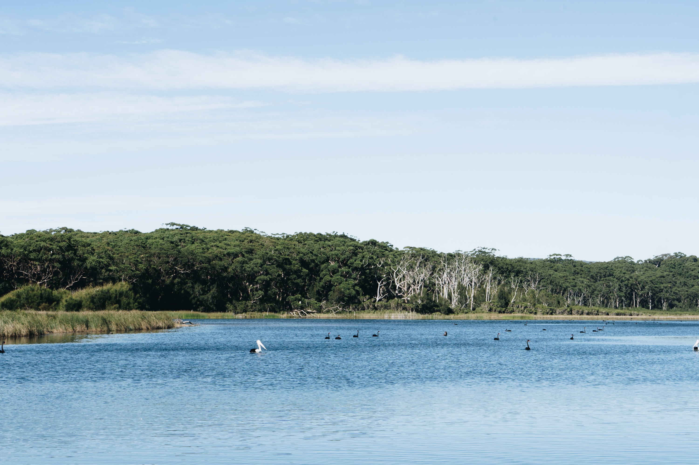

Black swan infestation and a pelican looking for breakfast!

Dead tree on the side of the lake

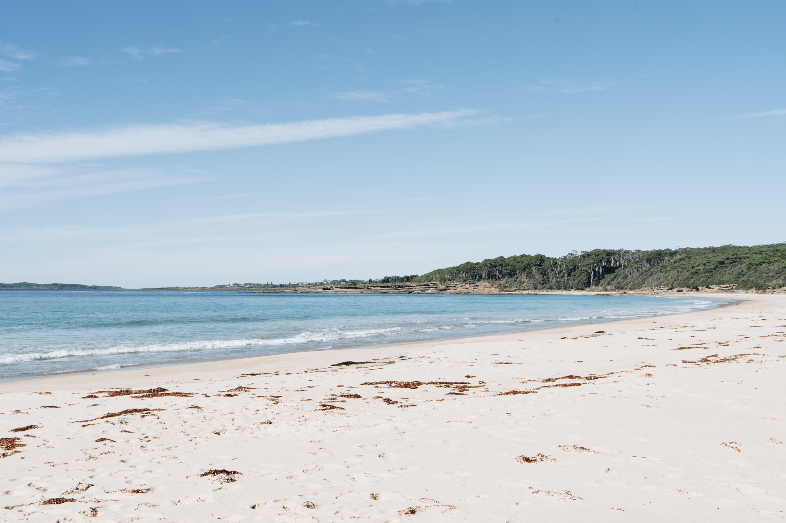

A nice beach at meroo headland, with nuggan head in the background. This would be a good surf spot when the swell is up and also easy to escape the crowds here.

Mum and dad.

The walking track towards the lookout on Meroo headland was stunningly green.

The beach on the left side of Meroo Head, at the campground, as pristine and uncrowded as it gets.

The hidden cove around the corner from the beach that you can walk around from on the rocks.

Next up is the things you can see at Pretty beach and the snapper point walking track. We had to resort to doing all the walking tracks as the waves were no good. Probably wouldn't have been very productive on this trip if the waves had actually been good.

The view from a lookout early along the Snapper point walking track.

Some of the family in the harsh sun.

Dad on his phone

Nice little rock fishing spot down on the point, shot from atop the cliff

My mom and auntie on the other side of the headland facing towards us

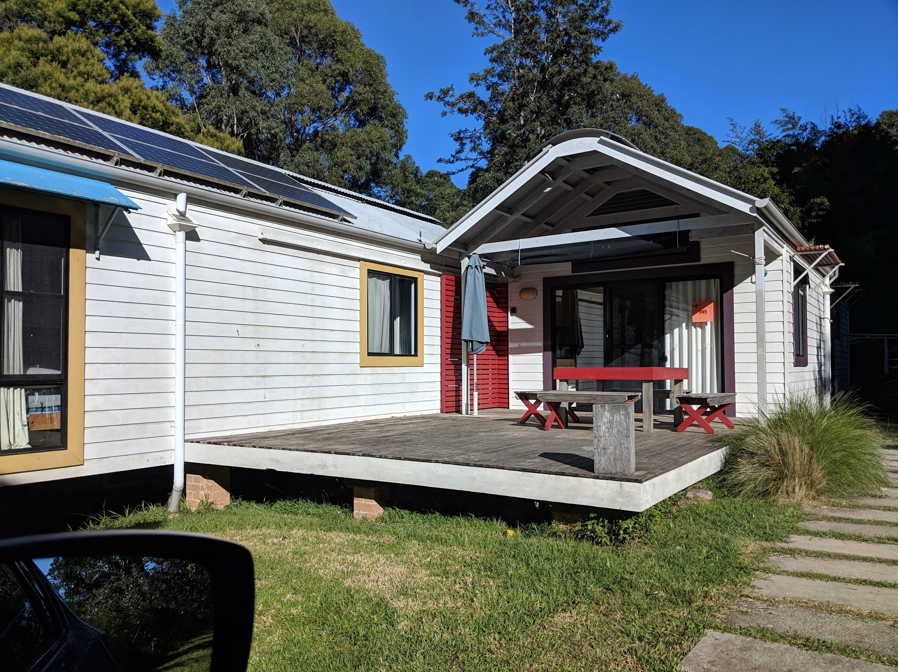

The cottage we stayed in

# **Local events**

Every month at the Kioloa Community Hall, the Murramarang markets are held, where there is a a wide selection of fresh produce and handmade goodies, books, garden fresh veggies and plants, artisan jewelry, designer furnishings, local scene greeting cards and photographs.

As well as locally fabricated basketry, soaps and creams, homemade cakes, biscuits, jams and relishes, local honey, soy candles, fresh seafood and much more. When you've finished shopping/browsing,  sit back and enjoy the live music with good food and coffee.

## **Outdoor activities**

 - [Meroo National Park](https://www.visitnsw.com/destinations/south-coast/jervis-bay-and-shoalhaven/bawley-point/attractions/meroo-national-park)

 - [Burns Bay](https://www.visitnsw.com/destinations/south-coast/jervis-bay-and-shoalhaven/bawley-point/attractions/burns-bay)
 - [Murramarang Aboriginal Area walking track](https://www.visitnsw.com/destinations/south-coast/jervis-bay-and-shoalhaven/bawley-point/attractions/murramarang-aboriginal-area-walking-track)

- [Pretty Beach and Snapper Point walking track](https://www.visitnsw.com/destinations/south-coast/jervis-bay-and-shoalhaven/bawley-point/attractions/pretty-beach-snapper-point-walking-track)

- [Pretty Beach to Durras Mountain walking track](https://www.visitnsw.com/destinations/south-coast/jervis-bay-and-shoalhaven/bawley-point/attractions/pretty-beach-durras-mountain-walking-track)

- [Guillotines](https://www.visitnsw.com/destinations/south-coast/jervis-bay-and-shoalhaven/bawley-point/attractions/guillotines-surf-break)

## **Weather**

The weather in Bawley Point, is very similar to Sydney, fairly warm throughout the year, but mildly cold in winters and autumn mornings. Th
e water can get down to about 15-16c in winter but in summer 23c. The best time for surfing in Bawley point, is usually winter for big groundswells, however sometimes the summers can have good waves with a North East swell direction.
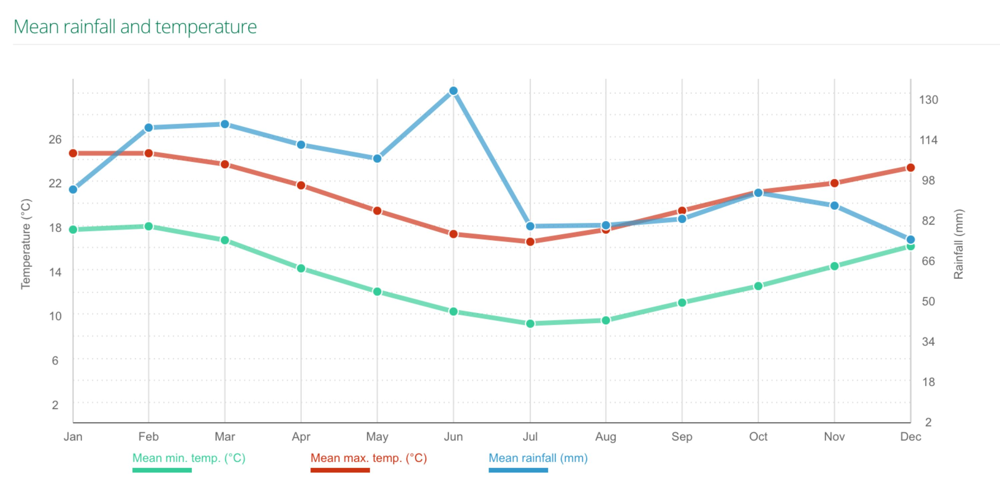

Weather averages

## Best places to eat

#### Bean at Burrill Cafe
Corner Princes Hwy and, Balmoral Rd, Burrill Lake NSW 2539

This cafe is about a 17 minute drive from Bawley Point, it had great food and I would definetely go back there again.

#### Hayden's Pies
2/166 PRINCES HWY, ULLADULLA

While this shop is in Ulladulla, they have some of the best pies in Australia, you'll want to buy two as I personally think that one isn't filling enough. Try the morrocan pie, it's definetely the best