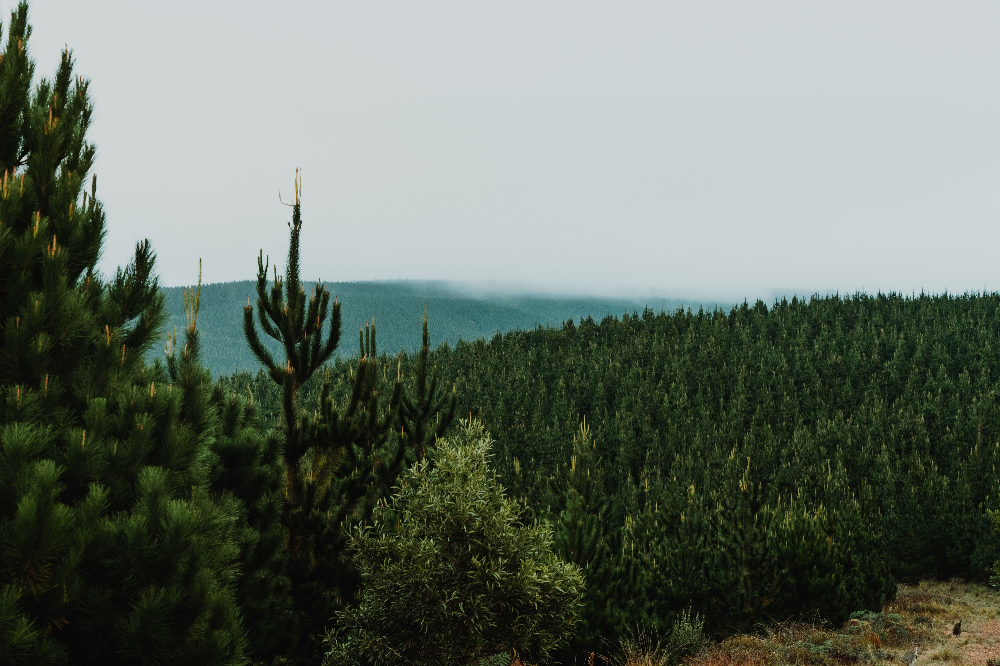

Edith is a locality in the Central West region of New South Wales, Australia. The locality is in the City of Lithgow local government area, 148 kilometres west of Sydney.

Originally, I had planned to head to Blue Hill Quarry, in Edith NSW to try hunt for some smoky quartz crystals. Blue Hill Quarry is located 13km south of Oberon. To dig there you need a current state forest fossicking permit which you can find online if you just search up forestry nsw fosicking license.

A google maps view of how deep the actual quarry is into the forest

To get to blue hill quarry, travel 5km from Oberon along the road to the Jenolan Caves then turn right onto Shooters Hill Rd. After 6.2km you will see Butter Factory Lane on your left. Continue on Shooters Hill Rd for another 1km and turn left onto a forestry road. After 300m turn right and then after a further 400m you will be at the quarry. The GPS coordinates are 6256897N 55766834E. You can barely get there with a 2wd. I have a commodore and couldn't get up the last steep section of the road and got bogged. So I parked at the bottom and just walked up the hill towards the quarry.

Driving never gets boring when you're going through forests like these!

The key to finding crystals is to first locate a quartz vein running through the quarry. These veins average about 30cm in width. The next step is to look for cavities in the vein filled with clay & crystals. The cavities are varying in size, and usually, you'll find bigger crystals in the bigger cavities. Locating the cavities is hard work and you need to be very careful not to break and chip the crystals when opening a cavity as I quickly learned.

A view from atop one of the hills of the quarry. This area produced no crystals at all, and had very firm rock. I had the most luck where those trees were in the back of the quarry. If you actually walk up and over the hill you'll see where the holes have been dug and the good stuff awaits in those holes.

Some nice smoky quartz specimens found here in the past. I found this image on [mindat.org](http://mindat.org), a mineral mapping and data website.

I didn't have too much luck with the crystals I found, but I still found some cool stuff, definetely worth the effort.

A small clear quartz crystal

A large smoky quartz rock/crystal

Another small clear quartz crystal

A few different rocks that I found

A nice smoky quartz crystal, unfortunately it was chipped when I found it

An interesting smoky quartz crystal with a sharp and smooth point on the top

A cool smoky quartz sceptre

Another angle of the same rock

I left the quarry that afternoon, and went into Oberon to sleep for the night. The town has a bit of a creepy/unfriendly vibe for some reason. I waited 1 hour 15 minutes for a pizza and then went and found a dark backstreet and slep in the back of the car.

I woke up at 5:30 the next morning and headed straight for the hampton state forest to fly my drone at sunrise and take some photos. I took so many different turns on the way to hampton to see if I could find any other cool places to fly the drone, but all the roads were too bumpy for the car or just didnt lead anywhere. The drive through the forest to the vantage point I found was so entertaining. I had to take it slow in a 2wd commodore, but it made me appreciate the view much more.

When I first arrived, the rising sun had still not touched the trees, but I had a feeling the sunrise was going to be good, as the skies were clear.

A couple wallabies hanging out on the track

Accidentally stepped on this dead fox in thongs, not good!

The first glipmpse of the morning sun hitting the trees was promising as I was setting up my drone to fly up and over the trees.

I flew over the road above from where I was flying. You can see the line of where the sun is hitting the trees and another state forest in the distance

Another angle facing a different direction on the same road; pointing towards the thick fog circling the valley toward jenolan caves

A view 120 metres up in the sky above where I was flying. You can see my car parked up in the corner, and how close the main road actually is from where I was flying from.

Another angle of the endless winding roads of the Hampton State Forest. I missed the rally car race by only a week!

One of my favourite photos from this morning. The layers are just endless and the variation of colours is very appealing to my eye.

Layers upon layers in the fog.

A different angle facing away from the sun. The tracks in the forest ahead look very steep, not sure if even a 4x4 could get up somethin like that!

Overall, it was a really fun one night/two day trip and it was nice to just get out in the forest after just being at the beach all time time in Sydney. I'll definetely be back to the Blue Hill quarry for some more digging at some point, with friends next time. And hopefully another trip to the state forest with a 4x4 to be able to go a bit faster and explore more of the rugged areas.