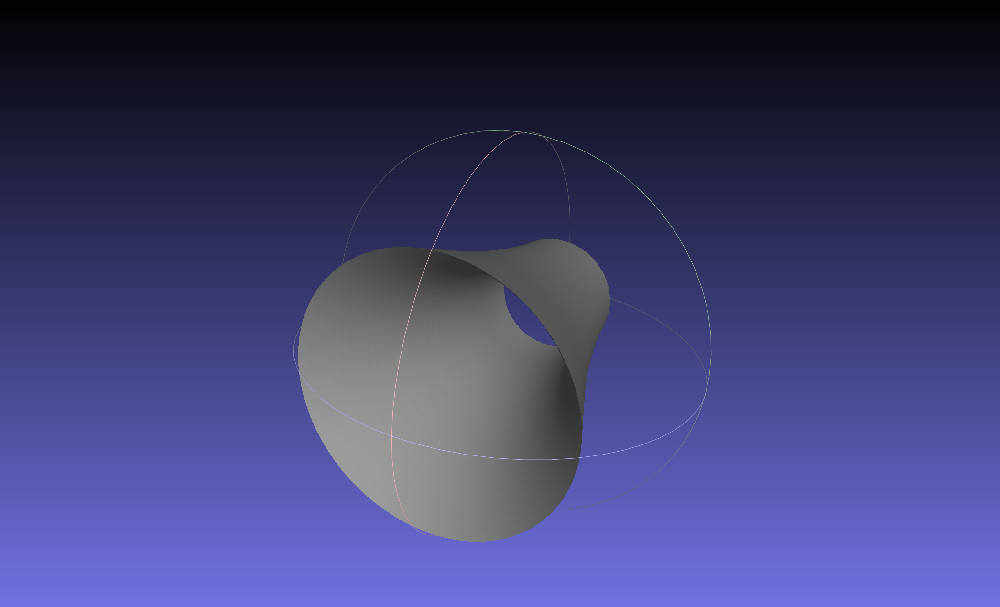
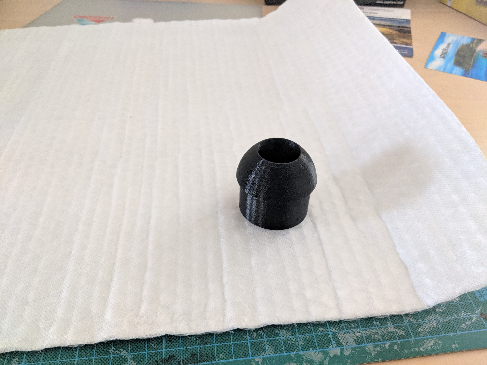
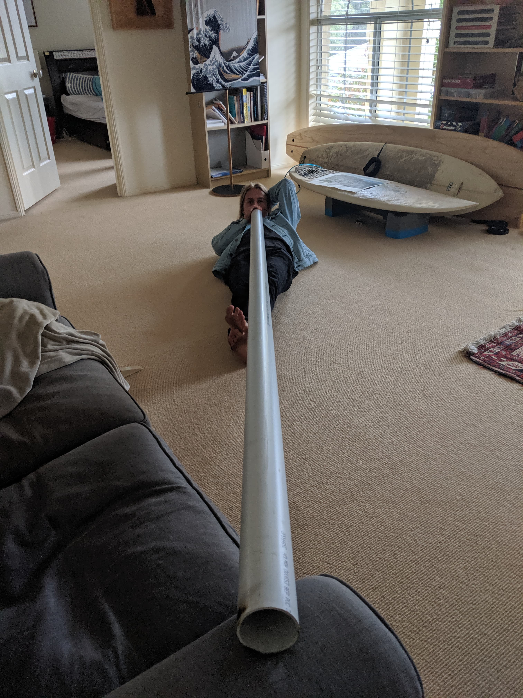

I found some vidoes on youtube of people who had created didgeridoos out of PVC pipe, but had made the mouthpiece out of wax. I decided to try and create my own one but 3d print the mouth piece for a challenge. So I designed it on CAD after measuring up my PCV pipe and it came out great.

The trumpet piece that was designed to go onto the end of the didgeridoo

The finished 3d printed mouthpiece.

Josh already addicted to playing his new didge.

Seedy.
