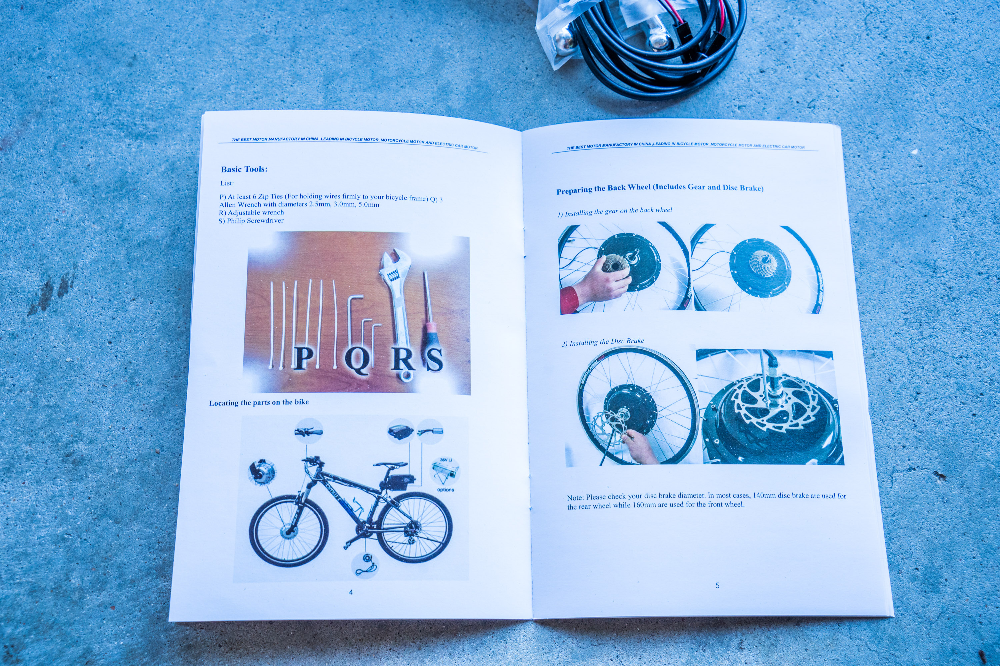
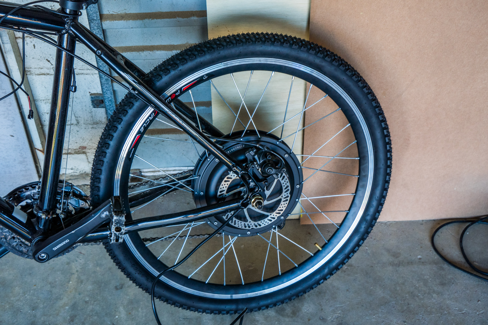
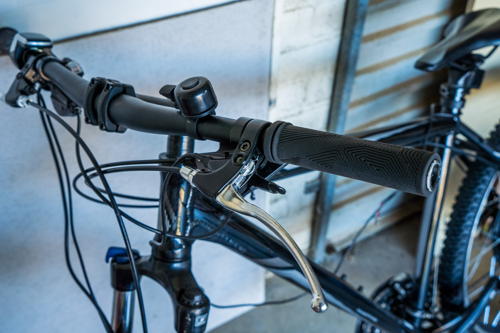
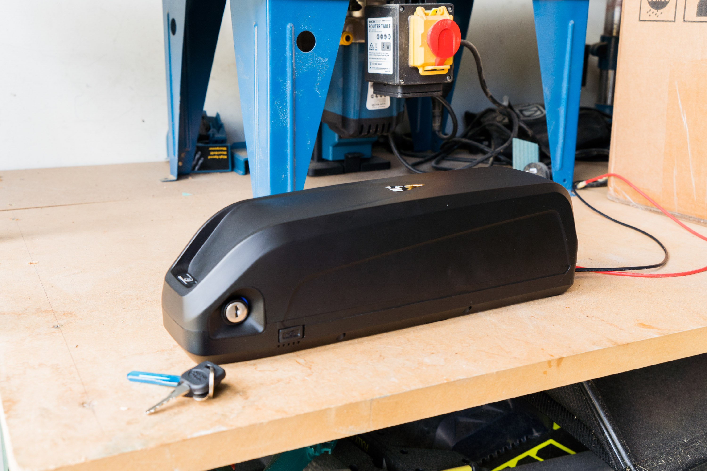
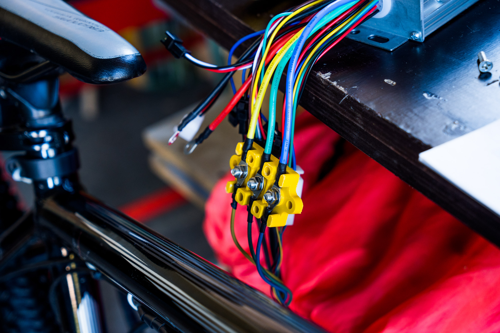

I had a sudden urge of converting my mountainbike into an electric bike after seeing my neighbours petrol zbox motor that he added onto his bike. I wanted the power and torque without all the sound and attention that the petrol motor creates, as well as the simplicity of not needing a clutch.

So I purchased a 48V 1500W Voilamart rear hub kit on Ebay for around $240 and it arrived in two days! Pretty good. 1500W of power was said to be able to get the bike to around 65km/hr max speed.

I also purchased a hailong 48V 15ah shark pack, that apparentely was able to mount into the drink bottle holder of my bike.

The box that the ebike kit came in.

The controller that is esentially the ecu/computer for the motor/throtte/power brakes.

The instuction manual was pretty shitty and not very informative, but lucky that the first couple steps were fairly easy.

The rear hub with the motor.

The disc that I had to remove off my bikes wheel to add onto the new wheel that has the motor on it.

Adding the disc onto the new wheel

The wheel pumped up and connected, was so hard to get it to fit width ways, my frame wasn't wide enough. Had to stretch it a bit.

Close up.

Installing the power brakes.

Throttle lcd screen and kill switch.

I wanted to put the PAS (Pedal Assist Sensor) on but I didn't have the tools to take the pedals off. I'll do it some other time.

The sensor

Wiring up the controller

I ended up removing the while cable ties and the cable covers for something better, but this is what I originally did.

My shark pack battery.

The plate that disconnects from the battery which is what is used to mount the battery to the frame.

The metal plate that disconnects from the plastic

Separated.

Testing to see if the drink bottle mounts could hold the battery. It's a shame because the battery would not go on.

I ended up screwing this metal plate in instead.

The plate back together.

The yellow junction connectors for the motor, I wish the kit came with another one of these as there was no way to actually connect the motor to the battery out of the box.

The battery mounted on.

I bought a metal box to mount the controller in from Jaycar. It cost around $25 and will act as a rear mudguard.

Cleaning up the wires with some tubing.

Figuring out how I can get another one of these.

The connection just didn't make sense.

Tubing to clean up wires.

Controller box with all the crap in it.

Another pic. 

Connecting up everything.

My dad cut the battery terminals off to make a connector to be able to extent the wires and then connect them to the motor because it came with no attatchment to connect them.

Adding silicone to the wires to make it watertight.

Had to buy more tubing.

Siliconed up.

Battery and motor now connected.

The slot we cut with the jigsaw to allow the thick wires to pass through into the box.

More tubing. We extended the cable too much.

Trying to cable tie to the frame to make it clean.

The connectors close up

More cable ties

Will get around to cleaning this up later after I've done some riding on it.

Finished product.

Weapon.