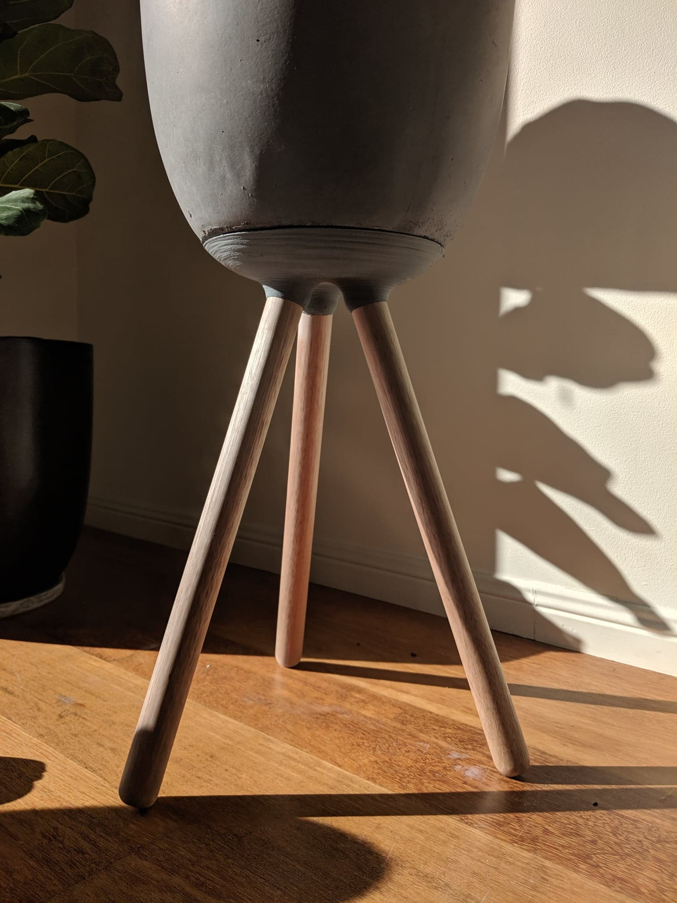

My parents wanted to have a stand for one of our fibreglass planters, but didn't want to spend $100 on buying one. So I got to work designing one to suit that specific planter on CAD, which would then be 3D printed and painted.

The initial formation.

Adding the spheres.

Giving them a bit of a fillet.

Revolving out a little pool on the inside for the water to be able to sit in.

The revolved top.

What the wooden legs should look like.

Filetted the bottom section to give a nice and smooth look.

I created a canvas with an image of our actual planter, to make sure that the curves of my design would suit the planter. With a little bit of fine tuning I got it to line up pretty good.

Close enough.

Another view.

Slightly odd looking.

3D printing the stand.

Finished product.

One coat of grey paint to give it a stony concrete look.

Done.

I cut the wooden lengths to around 450mm.

Looks cool!

On but not fully aligned yet.

Great success.

